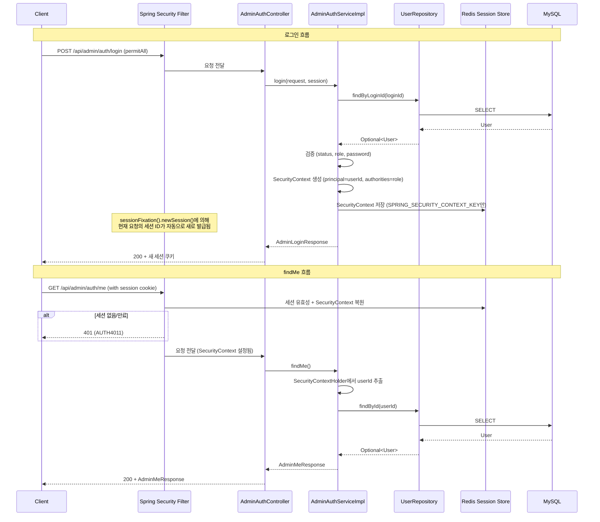
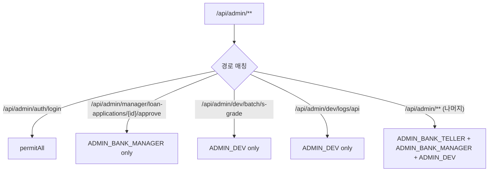
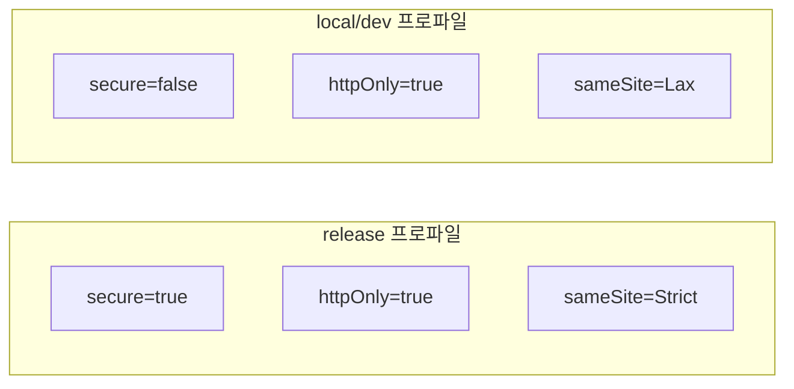
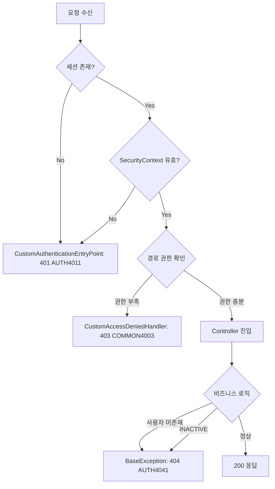

# Design Document: Admin 인증 방식 리팩토링

## Overview

sofit-admin 모듈의 관리자 인증 시스템을 리팩토링한다. 현재 구현의 핵심 문제점은 세션 속성 직접 저장(`session.setAttribute`)과 Spring Security의 `SecurityContext`가 이중으로 인증 정보를 관리하여 불일치 위험이 존재한다는 것이다.

이 리팩토링은 다음을 달성한다:
1. **Single Source of Truth**: `SecurityContextHolder`를 유일한 인증 정보 소스로 통일
2. **세션 보안 강화**: 세션 고정 공격 방지, 동시 로그인 제한, Secure 쿠키 적용
3. **역할 기반 접근 제어 세분화**: 최소 권한 원칙 적용으로 엔드포인트별 역할 제한

### 현재 문제점

| 문제 | 영향 | 해결 방향 |
|------|------|-----------|
| userId/role/loginTime 세션 직접 저장 + SecurityContext 이중 저장 | 두 소스 간 불일치 가능 | SecurityContext만 사용 |
| findMe()에서 session.getAttribute("userId") 사용 | Spring Security 메커니즘 미활용 | SecurityContextHolder에서 조회 |
| sessionFixation 미설정 | 세션 고정 공격 취약 | newSession() 적용 |
| 동시 로그인 무제한 | 계정 공유/탈취 위험 | maximumSessions(1) 적용 |
| 쿠키 보안 속성 미설정 | 쿠키 탈취 위험 | 프로파일별 Secure/HttpOnly/SameSite 적용 |
| /api/admin/** 전체 동일 권한 | 최소 권한 원칙 위반 | 엔드포인트별 역할 제한 |

## Architecture

### 리팩토링 후 인증 흐름



### 역할 기반 접근 제어 구조



### 쿠키 보안 프로파일별 설정



## Components and Interfaces

### 1. SecurityConfig (수정)

- **위치**: `com.sofit.admin.global.config`
- **변경 사항**:
  - 세션 고정 공격 방지: `sessionFixation().newSession()`
  - 동시 로그인 제한: `maximumSessions(1)` + `maxSessionsPreventsLogin(true)`
  - 역할 기반 접근 제어 세분화 (구체적 경로 규칙 우선)
  - `AccessDeniedHandler` 추가 (403 JSON 응답)

```java
@Configuration
@EnableWebSecurity
@RequiredArgsConstructor
public class SecurityConfig {

    private final CustomAuthenticationEntryPoint customAuthenticationEntryPoint;
    private final CustomAccessDeniedHandler customAccessDeniedHandler;

    @Bean
    public SecurityFilterChain securityFilterChain(HttpSecurity http) throws Exception {
        http
            .cors(cors -> {})
            .csrf(csrf -> csrf.disable())
            .authorizeHttpRequests(auth -> auth
                .requestMatchers("/swagger-ui/**", "/v3/api-docs/**").permitAll()
                .requestMatchers("/api/admin/auth/login").permitAll()
                // 세분화된 역할 규칙 (구체적 경로 우선)
                .requestMatchers("/api/admin/manager/loan-applications/*/approve").hasAuthority("ADMIN_BANK_MANAGER")
                .requestMatchers("/api/admin/dev/batch/s-grade").hasAuthority("ADMIN_DEV")
                .requestMatchers("/api/admin/dev/logs/api").hasAuthority("ADMIN_DEV")
                // 나머지 admin 경로: 모든 관리자 역할 허용
                .requestMatchers("/api/admin/**").hasAnyAuthority("ADMIN_BANK_TELLER", "ADMIN_BANK_MANAGER", "ADMIN_DEV")
                .anyRequest().authenticated()
            )
            .exceptionHandling(ex -> ex
                .authenticationEntryPoint(customAuthenticationEntryPoint)
                .accessDeniedHandler(customAccessDeniedHandler))
            .sessionManagement(session -> session
                .sessionCreationPolicy(SessionCreationPolicy.IF_REQUIRED)
                .sessionFixation().newSession()
                .maximumSessions(1)
                .maxSessionsPreventsLogin(true));
        return http.build();
    }
}
```

### 2. CustomAccessDeniedHandler (신규)

- **위치**: `com.sofit.admin.global.config`
- **역할**: 권한 부족 시 HTTP 403 + JSON 응답 반환

```java
@Component
public class CustomAccessDeniedHandler implements AccessDeniedHandler {
    @Override
    public void handle(HttpServletRequest request, HttpServletResponse response,
                       AccessDeniedException accessDeniedException) throws IOException {
        response.setStatus(HttpServletResponse.SC_FORBIDDEN);
        response.setContentType("application/json;charset=UTF-8");
        // {"isSuccess": false, "code": "COMMON4003", "message": "권한이 없습니다.", "result": null}
    }
}
```

### 3. AdminAuthServiceImpl (수정)

- **위치**: `com.sofit.admin.domain.auth.service`
- **변경 사항**:
  - `login()`: `session.setAttribute("userId"/role/loginTime)` 제거. 세션 고정 공격 방지는 SecurityConfig의 `sessionFixation().newSession()`이 자동 처리하므로 서비스에서 `session.invalidate()`를 직접 호출하지 않음
  - `findMe()`: `HttpSession` 파라미터 제거, `SecurityContextHolder`에서 userId 추출

```java
@Service
@RequiredArgsConstructor
public class AdminAuthServiceImpl implements AdminAuthService {

    private final UserRepository userRepository;
    private final PasswordEncoder passwordEncoder;

    @Override
    public AdminLoginResponse login(AdminLoginRequest request, HttpSession session) {
        User user = userRepository.findByLoginId(request.getLoginId())
                .orElseThrow(() -> new BaseException(AdminAuthErrorCode.LOGIN_FAILED));
        if (user.getStatus() == UserStatus.INACTIVE) throw new BaseException(AdminAuthErrorCode.LOGIN_FAILED);
        if (user.getRole() == UserRole.USER) throw new BaseException(AdminAuthErrorCode.LOGIN_FAILED);
        if (!passwordEncoder.matches(request.getPassword(), user.getPasswordHash()))
            throw new BaseException(AdminAuthErrorCode.LOGIN_FAILED);

        // SecurityContext 설정 (단일 인증 정보 소스)
        // 세션 고정 공격 방지는 SecurityConfig의 sessionFixation().newSession()이 자동 처리
        // → 현재 요청에 연결된 세션 ID를 새로 발급하여 공격자가 미리 심어둔 세션 ID를 무효화
        UsernamePasswordAuthenticationToken authentication =
                new UsernamePasswordAuthenticationToken(
                        user.getUserId(), null,
                        List.of(new SimpleGrantedAuthority(user.getRole().name())));
        SecurityContext securityContext = SecurityContextHolder.createEmptyContext();
        securityContext.setAuthentication(authentication);
        SecurityContextHolder.setContext(securityContext);
        session.setAttribute(HttpSessionSecurityContextRepository.SPRING_SECURITY_CONTEXT_KEY, securityContext);

        return AdminAuthConverter.toLoginResponse(user);
    }

    @Override
    public AdminMeResponse findMe() {
        // SecurityContextHolder에서 userId 추출
        Authentication authentication = SecurityContextHolder.getContext().getAuthentication();
        if (authentication == null || authentication.getPrincipal() == null) {
            throw new BaseException(AdminAuthErrorCode.SESSION_EXPIRED);
        }

        Long userId;
        try {
            userId = (Long) authentication.getPrincipal();
        } catch (ClassCastException e) {
            throw new BaseException(AdminAuthErrorCode.SESSION_EXPIRED);
        }

        User user = userRepository.findById(userId)
                .orElseThrow(() -> new BaseException(AdminAuthErrorCode.USER_NOT_FOUND));
        if (user.getStatus() == UserStatus.INACTIVE) {
            throw new BaseException(AdminAuthErrorCode.USER_NOT_FOUND);
        }

        return AdminAuthConverter.toMeResponse(user);
    }
}
```

### 4. AdminAuthService (인터페이스 수정)

```java
public interface AdminAuthService {
    AdminLoginResponse login(AdminLoginRequest request, HttpSession session);
    AdminMeResponse findMe();  // HttpSession 파라미터 제거
}
```

### 5. AdminAuthController (수정)

```java
@RestController
@RequestMapping("/api/admin/auth")
@RequiredArgsConstructor
public class AdminAuthController implements AdminAuthControllerDocs {

    private final AdminAuthService adminAuthService;

    @PostMapping("/login")
    @Override
    public ApiResponse<AdminLoginResponse> login(@Valid @RequestBody AdminLoginRequest request,
                                                  HttpSession session) {
        AdminLoginResponse response = adminAuthService.login(request, session);
        return ApiResponse.onSuccess(AdminAuthSuccessCode.LOGIN_SUCCESS, response);
    }

    @GetMapping("/me")
    @Override
    public ApiResponse<AdminMeResponse> findMe() {  // HttpSession 파라미터 제거
        AdminMeResponse response = adminAuthService.findMe();
        return ApiResponse.onSuccess(AdminAuthSuccessCode.ME_SUCCESS, response);
    }
}
```

### 6. AdminAuthControllerDocs (수정)

```java
@Tag(name = "관리자 인증")
public interface AdminAuthControllerDocs {
    @Operation(summary = "관리자 페이지 로그인")
    ApiResponse<AdminLoginResponse> login(AdminLoginRequest request, HttpSession session);

    @Operation(summary = "관리자 내 정보 조회")
    ApiResponse<AdminMeResponse> findMe();  // HttpSession 파라미터 제거
}
```

### 7. CookieConfig (신규 - 프로파일별 분리)

- **위치**: `com.sofit.admin.global.config`
- **역할**: 프로파일에 따라 세션 쿠키 속성 설정

```java
@Configuration
public class CookieConfig {

    @Bean
    @Profile("release")
    public CookieSerializer releaseCookieSerializer() {
        DefaultCookieSerializer serializer = new DefaultCookieSerializer();
        serializer.setUseSecureCookie(true);
        serializer.setUseHttpOnlyCookie(true);
        serializer.setSameSite("Strict");
        return serializer;
    }

    @Bean
    @Profile({"local", "dev"})
    public CookieSerializer devCookieSerializer() {
        DefaultCookieSerializer serializer = new DefaultCookieSerializer();
        serializer.setUseSecureCookie(false);
        serializer.setUseHttpOnlyCookie(true);
        serializer.setSameSite("Lax");
        return serializer;
    }
}
```

### 8. AdminAuthErrorCode (수정)

```java
public enum AdminAuthErrorCode implements BaseErrorCode {
    LOGIN_FAILED(HttpStatus.BAD_REQUEST, "AUTH4001", "아이디 또는 비밀번호가 올바르지 않습니다."),
    CONCURRENT_LOGIN(HttpStatus.CONFLICT, "AUTH4091", "이미 다른 기기에서 로그인되어 있습니다."),
    SESSION_EXPIRED(HttpStatus.UNAUTHORIZED, "AUTH4011", "세션이 만료되었습니다. 다시 로그인해 주세요."),
    ACCESS_DENIED(HttpStatus.FORBIDDEN, "COMMON4003", "권한이 없습니다."),
    USER_NOT_FOUND(HttpStatus.NOT_FOUND, "AUTH4041", "요청한 리소스를 찾을 수 없습니다.");
}
```

## Data Models

### SecurityContext 내 Authentication 구조

리팩토링 후 인증 정보는 `SecurityContext`에만 저장된다.

| 필드 | 타입 | 설명 |
|------|------|------|
| principal | Long (userId) | 로그인한 관리자의 PK |
| credentials | null | 비밀번호 미저장 |
| authorities | List<SimpleGrantedAuthority> | 역할 (예: "ADMIN_BANK_TELLER") |

### 세션 저장 구조 (Redis) - 리팩토링 후

| 키 | 타입 | 설명 |
|----|------|------|
| SPRING_SECURITY_CONTEXT | SecurityContext | Spring Security 인증 정보 (유일한 저장소) |

**제거되는 세션 속성:**
- ~~userId~~ → SecurityContext.authentication.principal에서 조회
- ~~role~~ → SecurityContext.authentication.authorities에서 조회
- ~~loginTime~~ → 제거 (필요 시 SecurityContext 확장)

### 쿠키 설정 (프로파일별)

| 속성 | release | local/dev |
|------|---------|-----------|
| secure | true | false |
| httpOnly | true | true |
| sameSite | Strict | Lax |


## Correctness Properties

*A property is a characteristic or behavior that should hold true across all valid executions of a system—essentially, a formal statement about what the system should do. Properties serve as the bridge between human-readable specifications and machine-verifiable correctness guarantees.*

### Property 1: 로그인 후 SecurityContext Authentication 구성 정확성

*For any* 유효한 관리자 사용자(userId: Long, role: ADMIN_BANK_TELLER | ADMIN_BANK_MANAGER | ADMIN_DEV), 로그인 성공 후 SecurityContextHolder의 Authentication에서 principal은 해당 userId(Long)와 동일하고, authorities는 해당 역할의 name() 값을 포함하는 SimpleGrantedAuthority 하나만 존재해야 한다.

**Validates: Requirements 1.2, 1.3**

### Property 2: SecurityContext에서 userId 추출 후 사용자 조회 일관성

*For any* Long 타입의 userId가 SecurityContext의 Authentication principal로 설정되어 있을 때, findMe() 호출 시 해당 userId로 UserRepository.findById()가 호출되며, 반환된 사용자 정보가 응답에 정확히 반영된다.

**Validates: Requirements 1.4, 2.2, 3.2**

### Property 3: 비정상 principal 타입에 대한 예외 발생

*For any* Long 타입이 아닌 객체(String, Integer, Object 등)가 SecurityContext의 Authentication principal로 설정되어 있을 때, findMe() 호출 시 BaseException(SESSION_EXPIRED)이 발생한다.

**Validates: Requirements 2.5**

## Error Handling

### 에러 코드 정의

| 에러 코드 | HTTP 상태 | 코드 | 메시지 | 발생 조건 |
|-----------|-----------|------|--------|-----------|
| LOGIN_FAILED | 400 | AUTH4001 | 아이디 또는 비밀번호가 올바르지 않습니다. | 로그인 실패 (ID 미존재, INACTIVE, USER 역할, 비밀번호 불일치) |
| CONCURRENT_LOGIN | 409 | AUTH4091 | 이미 다른 기기에서 로그인되어 있습니다. | 동시 로그인 제한 초과 |
| SESSION_EXPIRED | 401 | AUTH4011 | 세션이 만료되었습니다. 다시 로그인해 주세요. | 세션 만료, Authentication 없음, principal null/비정상 타입 |
| USER_NOT_FOUND | 404 | AUTH4041 | 요청한 리소스를 찾을 수 없습니다. | 사용자 미존재, INACTIVE 상태 |
| ACCESS_DENIED | 403 | COMMON4003 | 권한이 없습니다. | 역할 부족으로 접근 차단 |

### 에러 처리 흐름



### 동시 로그인 차단 에러 처리

Spring Security의 `maxSessionsPreventsLogin(true)` 설정에 의해 동시 로그인이 차단될 때, `SessionAuthenticationException`이 발생한다. 이를 `CustomAuthenticationEntryPoint` 또는 별도 핸들러에서 처리하여 `AUTH4091` 에러 코드로 응답한다.

### 세션 고정 공격 방지 동작 방식

세션 고정 공격 방지는 **Spring Security의 `sessionFixation().newSession()` 설정이 자동으로 처리**한다. 서비스 코드에서 `session.invalidate()`를 직접 호출하지 않는다.

여기서 '기존 세션'이란 **현재 로그인 요청을 보낸 클라이언트의 HTTP 요청에 연결된 세션**을 의미한다 (동일 userId의 다른 세션이 아님). 공격 시나리오:
1. 공격자가 세션 ID를 미리 생성/탈취
2. 피해자에게 해당 세션 ID를 심어둠
3. 피해자가 그 세션 ID로 로그인 → Spring Security가 자동으로 새 세션 ID 발급
4. 공격자의 기존 세션 ID는 무효화됨

새 세션 생성에 실패하는 경우는 서버 내부 오류로 처리한다 (HTTP 500).

## Testing Strategy

### 단위 테스트 (JUnit 5 + Mockito)

1. **AdminAuthServiceImpl 테스트**
   - 로그인 성공: SecurityContext에 올바른 Authentication 설정 확인
   - 로그인 성공: session.setAttribute("userId"/role/loginTime) 미호출 확인
   - 로그인 실패: 각 실패 조건별 BaseException 발생 확인
   - findMe() 성공: SecurityContext에서 userId 추출 → 사용자 조회 → 응답 반환
   - findMe() 실패: Authentication null, principal null, principal 타입 불일치, 사용자 미존재, INACTIVE

2. **CustomAccessDeniedHandler 테스트**
   - 403 응답 JSON 포맷 확인 (isSuccess, code, message)

3. **CookieConfig 테스트**
   - release 프로파일: secure=true, httpOnly=true, sameSite=Strict
   - dev 프로파일: secure=false, httpOnly=true, sameSite=Lax

### 프로퍼티 기반 테스트 (JUnit 5 + jqwik)

- **최소 100회 반복** 실행
- 각 테스트에 설계 문서 Property 참조 태그 포함

1. **Property 1 테스트**: 로그인 후 SecurityContext Authentication 구성 정확성
   - 생성기: 임의의 Long userId + 관리자 역할(3종 중 택 1)
   - 검증: Authentication.principal == userId, authorities에 역할 name() 포함
   - 태그: `Feature: admin-auth-refactor, Property 1: 로그인 후 SecurityContext Authentication 구성 정확성`

2. **Property 2 테스트**: SecurityContext에서 userId 추출 후 사용자 조회 일관성
   - 생성기: 임의의 Long userId + 유효한 User 엔티티(ACTIVE 상태, 관리자 역할)
   - 검증: findMe() 반환값의 userId가 SecurityContext에 설정된 값과 동일
   - 태그: `Feature: admin-auth-refactor, Property 2: SecurityContext에서 userId 추출 후 사용자 조회 일관성`

3. **Property 3 테스트**: 비정상 principal 타입에 대한 예외 발생
   - 생성기: Long이 아닌 임의의 객체 (String, Integer, Double, Object 등)
   - 검증: findMe() 호출 시 BaseException(SESSION_EXPIRED) 발생
   - 태그: `Feature: admin-auth-refactor, Property 3: 비정상 principal 타입에 대한 예외 발생`

### 통합 테스트 (MockMvc + Spring Security Test)

1. **세션 고정 공격 방지**
   - 로그인 전후 세션 ID 변경 확인
   - 기존 세션 ID로 요청 시 401 응답 확인

2. **동시 로그인 제한**
   - 동일 계정 두 번째 로그인 시도 시 차단 확인
   - 기존 세션 만료 후 재로그인 허용 확인

3. **역할 기반 접근 제어**
   - 각 역할별 허용/차단 경로 조합 테스트
   - 403 응답 JSON 포맷 확인

4. **쿠키 보안 속성**
   - 프로파일별 쿠키 속성 확인 (release vs dev)
