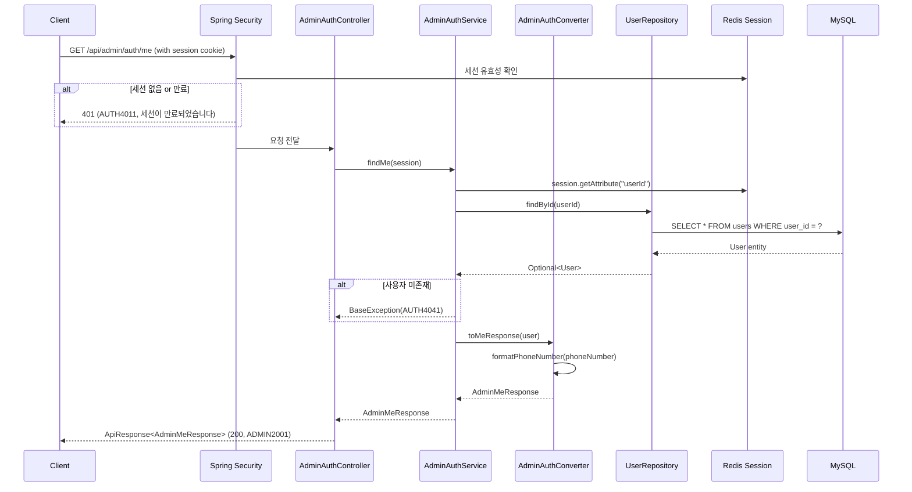

# Design Document: 관리자(은행원) 정보 조회 API

## Overview

로그인한 관리자(은행원)가 자신의 프로필 정보를 조회하는 `GET /api/admin/auth/me` API를 설계한다. 세션 기반 인증을 통해 관리자를 식별하고, User 엔티티에서 이름, 로그인 아이디, 전화번호, 역할을 조회하여 전화번호 하이픈 포맷팅 처리 후 응답한다.

기존 `AdminAuthController`에 메서드를 추가하는 방식으로 구현하며, 프로젝트의 ControllerDocs 인터페이스 패턴, Converter 기반 Entity→DTO 변환 규칙을 따른다.

## Architecture



### 레이어 구조

```
AdminAuthController (기존 컨트롤러에 메서드 추가)
    ↓ implements AdminAuthControllerDocs (Swagger 분리)
    ↓
AdminAuthService (interface) → AdminAuthServiceImpl (구현체)
    ↓
AdminAuthConverter — Entity → DTO 변환, 전화번호 포맷팅
    ↓
UserRepository — 공통 모듈에 위치
```

## Components and Interfaces

### 1. AdminAuthControllerDocs (인터페이스 - 기존 수정)

- **위치**: `com.sofit.admin.domain.auth.controller`
- **변경**: `findMe()` 메서드 Swagger 문서 추가
- **어노테이션**: `@Operation`, `@ApiResponses` (200, 401, 404)

### 2. AdminAuthController (기존 수정)

- **위치**: `com.sofit.admin.domain.auth.controller`
- **변경**: `GET /me` 엔드포인트 추가
- **의존성**: `AdminAuthService`

```java
@GetMapping("/me")
@Override
public ApiResponse<AdminMeResponse> findMe(HttpSession session) {
    AdminMeResponse response = adminAuthService.findMe(session);
    return ApiResponse.onSuccess(AdminAuthSuccessCode.ME_SUCCESS, response);
}
```

### 3. AdminAuthService (인터페이스 - 기존 수정) / AdminAuthServiceImpl (구현체 - 기존 수정)

- **위치**: `com.sofit.admin.domain.auth.service`
- **변경**: `findMe(HttpSession session)` 메서드 추가
- **로직**:
  1. 세션에서 `userId` 추출
  2. `UserRepository.findById(userId)`로 사용자 조회
  3. 사용자 미존재 시 `BaseException(AdminAuthErrorCode.USER_NOT_FOUND)` throw
  4. 사용자 상태가 INACTIVE이면 `BaseException(AdminAuthErrorCode.USER_NOT_FOUND)` throw (미존재와 동일 처리)
  5. `AdminAuthConverter.toMeResponse(user)` 호출하여 응답 반환

### 4. AdminAuthConverter (기존 수정)

- **위치**: `com.sofit.admin.domain.auth.converter`
- **변경**: `toMeResponse(User user)` 메서드 추가
- **핵심 로직**:
  - `formatPhoneNumber(String)`: 전화번호 하이픈 포맷팅 (11자리 → `NNN-NNNN-NNNN`)
  - `toMeResponse(User)`: 엔티티 → AdminMeResponse 변환

### 5. AdminMeResponse (신규 record)

- **위치**: `com.sofit.admin.domain.auth.dto.response`
- **역할**: 관리자 정보 조회 응답 DTO

```java
public record AdminMeResponse(
    String name,
    String loginId,
    String phoneNumber,
    String role
) {}
```

### 6. AdminAuthSuccessCode (기존 수정)

- **변경**: `ME_SUCCESS(HttpStatus.OK, "ADMIN2001", "관리자 정보 조회에 성공했습니다.")` 추가

### 7. AdminAuthErrorCode (기존 수정)

- **변경**:
  - `SESSION_EXPIRED(HttpStatus.UNAUTHORIZED, "AUTH4011", "세션이 만료되었습니다. 다시 로그인해 주세요.")` 추가
  - `USER_NOT_FOUND(HttpStatus.NOT_FOUND, "AUTH4041", "요청한 리소스를 찾을 수 없습니다.")` 추가

## Data Models

### User 엔티티 (기존, sofit-common)

| 필드 | 타입 | 설명 |
|------|------|------|
| userId | Long | PK, auto increment |
| loginId | String(50) | 로그인 아이디 (unique) |
| name | String(50) | 이름 |
| phoneNumber | String(15) | 전화번호 (하이픈 없이 저장, 11자리) |
| role | UserRole | USER, ADMIN_BANK_TELLER 등 |
| status | UserStatus | ACTIVE, INACTIVE |

### AdminMeResponse (신규)

| 필드 | 타입 | 설명 |
|------|------|------|
| name | String | 관리자 이름 (예: "김은행") |
| loginId | String | 로그인 아이디 (예: "bank_teller") |
| phoneNumber | String | 하이픈 포함 전화번호 (예: "010-2222-2222") |
| role | String | 역할 (예: "ADMIN_BANK_TELLER") |

### 세션 데이터 (Redis)

| 키 | 타입 | 설명 |
|----|------|------|
| userId | Long | 로그인한 관리자의 PK |
| role | String | 관리자 역할 |
| loginTime | LocalDateTime | 로그인 시각 |

## Error Handling

### 에러 시나리오 및 응답

| 시나리오 | HTTP 상태 | 에러 코드 | 메시지 | 처리 위치 |
|----------|-----------|-----------|--------|-----------|
| 세션 없음/만료 | 401 | AUTH4011 | 세션이 만료되었습니다. 다시 로그인해 주세요. | Spring Security + CustomAuthenticationEntryPoint |
| 사용자 미존재 | 404 | AUTH4041 | 요청한 리소스를 찾을 수 없습니다. | AdminAuthServiceImpl |
| 탈퇴 계정 (INACTIVE) | 404 | AUTH4041 | 요청한 리소스를 찾을 수 없습니다. | AdminAuthServiceImpl |

### 에러 처리 흐름

1. **세션 없음/만료**: Spring Security의 `anyRequest().authenticated()` 설정에 의해 세션 없는 요청은 자동으로 401 처리. `AuthenticationEntryPoint`를 커스텀하여 JSON 형식의 에러 응답(AUTH4011) 반환.
2. **사용자 미존재**: `AdminAuthServiceImpl`에서 `UserRepository.findById()` 결과가 empty일 때 `BaseException(AdminAuthErrorCode.USER_NOT_FOUND)` throw.
3. **탈퇴 계정**: `AdminAuthServiceImpl`에서 `user.getStatus() == INACTIVE` 확인 시 `BaseException(AdminAuthErrorCode.USER_NOT_FOUND)` throw. 미존재와 동일한 에러 코드(AUTH4041)로 처리하여 계정 존재 여부를 노출하지 않음.

### 전화번호 포맷팅 엣지 케이스

- 전화번호가 null 또는 빈 문자열 → 빈 문자열 반환
- 전화번호가 11자리 → `NNN-NNNN-NNNN` 형식
- 전화번호가 10자리 → `NN-NNNN-NNNN` 형식
- 전화번호가 10/11자리가 아닌 경우 → 원본 그대로 반환

## Testing Strategy

### 단위 테스트 (JUnit 5 + Mockito)

1. **AdminAuthConverter 테스트**
   - 전화번호 포맷팅: 11자리, 10자리, null, 빈 문자열, 비정상 길이
   - Entity → AdminMeResponse 변환 정합성 확인

2. **AdminAuthServiceImpl 테스트**
   - 정상 조회 시나리오
   - 사용자 미존재 시 BaseException(USER_NOT_FOUND) 발생 확인
   - 세션에서 userId 추출 로직 검증

3. **AdminAuthController 테스트**
   - MockMvc를 사용한 `GET /api/admin/auth/me` 엔드포인트 테스트
   - 성공 응답 형식 확인 (200, ADMIN2001)
   - 인증 실패 시 401 응답

### 프로퍼티 기반 테스트 (JUnit 5 + jqwik)

1. **Property 1**: 유효한 전화번호 포맷팅 라운드트립
   - 생성기: 10자리 또는 11자리 숫자 문자열
   - 검증: 하이픈 제거 시 원본과 동일, 형식 패턴 매칭

2. **Property 2**: 유효하지 않은 길이의 전화번호 원본 보존
   - 생성기: 길이가 10, 11이 아닌 임의의 문자열
   - 검증: 포맷팅 결과 == 원본

## Security Considerations

- `GET /api/admin/auth/me`는 인증된 요청만 접근 가능 (Spring Security `anyRequest().authenticated()`)
- 세션 쿠키 기반 인증으로 별도 토큰 불필요
- 비밀번호, 주민번호 등 민감 정보는 응답에 포함하지 않음
- `CustomAuthenticationEntryPoint`를 통해 인증 실패 시 일관된 JSON 에러 응답 제공

## Dependencies

- **sofit-common**: User 엔티티, UserRepository, BaseException, ApiResponse, BaseErrorCode, BaseSuccessCode
- **Spring Security**: 세션 기반 인증, AuthenticationEntryPoint
- **Spring Session + Redis**: 세션 저장 및 관리
- **Swagger (springdoc-openapi)**: API 문서화

## Correctness Properties

*A property is a characteristic or behavior that should hold true across all valid executions of a system—essentially, a formal statement about what the system should do. Properties serve as the bridge between human-readable specifications and machine-verifiable correctness guarantees.*

### Property 1: 유효한 전화번호 포맷팅 라운드트립

*For any* 10자리 또는 11자리 숫자 문자열, 포맷팅 결과에서 하이픈을 제거하면 원본 문자열과 동일하며, 결과 형식은 11자리의 경우 `NNN-NNNN-NNNN`, 10자리의 경우 `NN-NNNN-NNNN` 패턴을 만족한다.

**Validates: Requirements 2.1, 2.2, 2.3**

### Property 2: 유효하지 않은 길이의 전화번호 원본 보존

*For any* 10자리 또는 11자리가 아닌 문자열(null과 빈 문자열 제외), 포맷팅 결과는 원본 문자열과 동일하다.

**Validates: Requirements 2.5**
