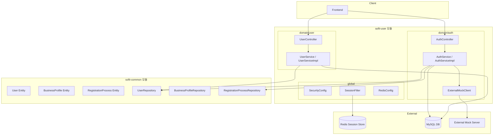
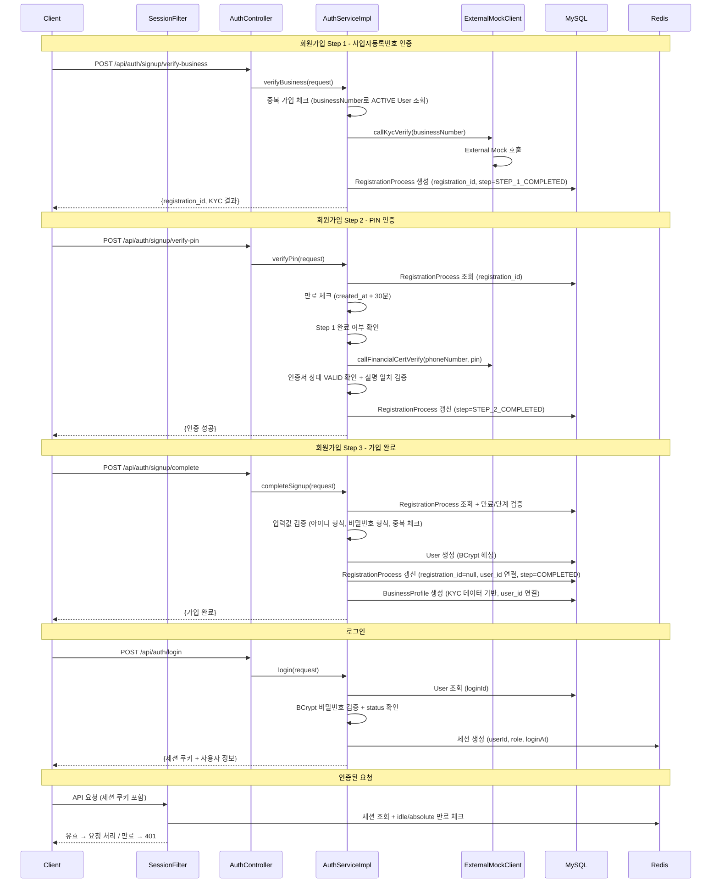

# Design Document: 인증 및 사용자 관리

## Overview

SoFit 대출 플랫폼의 인증 및 사용자 관리 기능을 설계한다. 기존 kyc-pin-auth 스펙에서 구현된 AuthController, AuthService, ExternalMockClient를 멀티스텝 회원가입 플로우에 맞게 수정하고, 로그인/로그아웃/회원탈퇴 기능을 추가한다.

### 핵심 설계 결정

1. **임시 저장소**: 회원가입 중간 인증 결과를 별도의 `registration_process` 테이블에서 관리. RegistrationProcess 엔티티가 멀티스텝 플로우를 추적하고, 가입 완료 시 BusinessProfile을 별도 생성한다. Redis 대신 DB를 사용하여 인증 결과의 영속성을 보장한다.
2. **만료 체크 방식**: 스케줄러가 아닌 요청 시점에 `created_at + 30분` 경과 여부를 확인하는 lazy expiration 방식을 채택. 인프라 복잡도를 줄이고 정확한 시점 제어가 가능하다.
3. **세션 관리**: Spring Session + Redis를 사용한 세션 기반 인증. 슬라이딩 세션(30분 idle) + 절대 만료(12시간)를 조합한다.
4. **ADMIN 계정**: 회원가입 플로우 없이 시드 데이터로 관리. 로그인만 가능하다.
5. **Soft Delete**: 회원탈퇴 시 물리 삭제 없이 `status=INACTIVE`, `inactivated_at` 기록.

## Architecture



### 요청 흐름



## Components and Interfaces

### 1. Controller Layer

#### AuthController (수정)

기존 엔드포인트를 회원가입 멀티스텝 플로우에 맞게 변경하고, 로그인/로그아웃 엔드포인트를 추가한다.

| 메서드 | 엔드포인트 | 설명 | 인증 필요 |
|--------|-----------|------|-----------|
| POST | `/api/auth/signup/verify-business` | Step 1: 사업자등록번호 인증 | ❌ |
| POST | `/api/auth/signup/verify-pin` | Step 2: PIN 인증 | ❌ |
| POST | `/api/auth/signup/complete` | Step 3: 가입 완료 | ❌ |
| POST | `/api/auth/login` | 로그인 | ❌ |
| POST | `/api/auth/logout` | 로그아웃 | ✅ |

#### UserController (신규)

| 메서드 | 엔드포인트 | 설명 | 인증 필요 |
|--------|-----------|------|-----------|
| DELETE | `/api/users/me` | 회원탈퇴 | ✅ (USER만) |

### 2. Service Layer

#### AuthService (interface 수정)

```java
public interface AuthService {
    // 회원가입 Step 1: 사업자등록번호 인증
    VerifyBusinessResponse verifyBusiness(VerifyBusinessRequest request);

    // 회원가입 Step 2: PIN 인증
    VerifyPinResponse verifyPin(VerifyPinRequest request);

    // 회원가입 Step 3: 가입 완료
    SignupCompleteResponse completeSignup(SignupCompleteRequest request);

    // 로그인
    LoginResponse login(LoginRequest request, HttpSession session);

    // 로그아웃
    void logout(HttpSession session);
}
```

#### UserService (interface 신규)

```java
public interface UserService {
    // 회원탈퇴
    void withdraw(Long userId, HttpSession session);
}
```

### 3. Filter Layer

#### SessionValidationFilter (신규)

Spring Security 필터 체인에 추가하여 세션의 절대 만료 시간(12시간)을 검증한다. Spring Session의 기본 idle timeout(30분)은 Redis TTL로 자동 관리되므로, 이 필터는 절대 만료만 담당한다.

```java
// 세션에 저장된 loginAt + 12시간 < 현재 시각이면 세션 무효화
```

### 4. Configuration

#### RedisConfig (신규)

```java
@Configuration
@EnableRedisIndexedHttpSession(maxInactiveIntervalInSeconds = 1800) // 30분 idle timeout
public class RedisSessionConfig {

    // FindByIndexNameSessionRepository를 통해 userId로 세션 역조회 가능
    // 회원탈퇴 시 해당 사용자의 모든 활성 세션 삭제에 사용

    @Bean
    public CookieSerializer cookieSerializer() {
        DefaultCookieSerializer serializer = new DefaultCookieSerializer();
        serializer.setCookieName("SESSION");
        serializer.setUseHttpOnlyCookie(true);
        serializer.setUseSecureCookie(true);
        serializer.setSameSite("Lax");
        serializer.setCookiePath("/");
        return serializer;
    }
}
```

**세션 역조회 (userId → 세션 목록):**

```java
// UserServiceImpl에서 회원탈퇴 시 모든 활성 세션 삭제
private final FindByIndexNameSessionRepository<? extends Session> sessionRepository;

public void withdraw(Long userId, HttpSession currentSession) {
    // 1. User 상태 변경
    user.inactivate();

    // 2. 해당 사용자의 모든 활성 세션 삭제
    Map<String, ? extends Session> sessions =
        sessionRepository.findByPrincipalName(userId.toString());
    sessions.keySet().forEach(sessionRepository::deleteById);
}
```

> **참고**: `@EnableRedisIndexedHttpSession`은 `@EnableRedisHttpSession`과 달리 principal name 기반 인덱스를 Redis에 추가로 관리한다. 로그인 시 세션에 `PRINCIPAL_NAME_INDEX_NAME` 속성을 설정해야 역조회가 동작한다.
```

#### SecurityConfig (수정)

```java
// 변경 사항:
// 1. BCryptPasswordEncoder Bean 등록
// 2. 역할 기반 접근 제어 추가
// 3. 인증 필요 엔드포인트 설정
// 4. SessionValidationFilter 등록
```

### 5. Request/Response DTOs

#### Request DTOs

```java
// 기존 수정: 회원가입 Step 1
public class VerifyBusinessRequest {
    @NotBlank
    @Pattern(regexp = "^\\d{10}$")
    private String businessNumber;
}

// 기존 수정: 회원가입 Step 2
public class VerifyPinRequest {
    @NotBlank
    private String registrationId;  // UUID

    @NotBlank
    @Pattern(regexp = "^\\d{6}$")
    private String pin;

    @NotBlank
    @Pattern(regexp = "^\\d{11}$")
    private String phoneNumber;
}

// 신규: 회원가입 Step 3
public class SignupCompleteRequest {
    @NotBlank
    private String registrationId;

    @NotBlank
    @Pattern(regexp = "^[a-z0-9]{4,20}$")
    private String loginId;

    @NotBlank
    @Pattern(regexp = "^(?=.*[a-zA-Z])(?=.*\\d)(?=.*[!@#$%^&*]).{8,20}$")
    private String password;

    @NotBlank
    private String name;

    @NotBlank
    @Pattern(regexp = "^\\d{7}$")
    private String residentNumber;  // 생년월일 6자리 + 성별코드 1자리

    @NotBlank
    @Pattern(regexp = "^\\d{11}$")
    private String phoneNumber;
}

// 신규: 로그인
public class LoginRequest {
    @NotBlank
    private String loginId;

    @NotBlank
    private String password;
}
```

#### Response DTOs

```java
// 회원가입 Step 1 응답
public record VerifyBusinessResponse(
    String registrationId,
    String businessNumber,
    String representativeName,
    String businessName,
    String businessType,
    String openDate
) {}

// 회원가입 Step 2 응답
public record VerifyPinResponse(
    String registrationId,
    boolean verified,
    LocalDateTime verifiedAt
) {}

// 회원가입 Step 3 응답
public record SignupCompleteResponse(
    Long userId,
    String loginId,
    String name,
    String role
) {}

// 로그인 응답
public record LoginResponse(
    Long userId,
    String name,
    String role
) {}
```

### 6. Exception & Code (확장)

#### AuthErrorCode (확장)

| 코드 | HTTP Status | 메시지 | 상황 |
|------|-------------|--------|------|
| AUTH4001 | 400 | PIN 번호가 올바르지 않습니다. | PIN 불일치 |
| AUTH4002 | 401 | 아이디 또는 비밀번호가 올바르지 않습니다. | 로그인 실패 |
| AUTH4003 | 400 | 이미 가입된 사업자등록번호입니다. | 중복 가입 |
| AUTH4004 | 404 | 일치하는 사업자등록번호를 찾을 수 없습니다. | KYC 실패 |
| AUTH4005 | 404 | 등록된 금융인증서를 찾을 수 없습니다. | 인증서 미등록 |
| AUTH4006 | 400 | 입력값 형식이 올바르지 않습니다. | 유효성 검증 실패 |
| AUTH4007 | 400 | 이전 단계가 완료되지 않았습니다. | 단계 미완료 |
| AUTH4008 | 400 | 인증 정보가 만료되었습니다. | registration_id 만료 |
| AUTH4009 | 409 | 이미 사용 중인 아이디입니다. | 아이디 중복 |
| AUTH4010 | 400 | 금융인증서 검증에 실패했습니다. | 인증서 상태/실명 불일치 |
| AUTH4011 | 403 | 탈퇴한 계정입니다. | INACTIVE 계정 로그인 시도 |
| AUTH5001 | 502 | 외부 인증 서버와 통신 중 오류가 발생했습니다. | External Mock 통신 오류 |

#### AuthSuccessCode (확장)

| 코드 | 메시지 | 상황 |
|------|--------|------|
| AUTH2001 | 사업자등록번호 인증에 성공했습니다. | Step 1 성공 |
| AUTH2002 | 금융인증서 PIN 인증에 성공했습니다. | Step 2 성공 |
| AUTH2003 | 회원가입이 완료되었습니다. | Step 3 성공 |
| AUTH2004 | 로그인에 성공했습니다. | 로그인 성공 |
| AUTH2005 | 로그아웃되었습니다. | 로그아웃 성공 |
| AUTH2006 | 회원탈퇴가 완료되었습니다. | 탈퇴 성공 |

## Data Models

### RegistrationProcess Entity (신규)

회원가입 멀티스텝 플로우를 추적하는 별도의 임시 테이블. 가입 완료 시 KYC 데이터를 기반으로 BusinessProfile이 별도 생성된다.

```java
@Entity
@Table(name = "registration_process")
@Getter
@NoArgsConstructor(access = AccessLevel.PROTECTED)
public class RegistrationProcess extends BaseEntity {

    @Id
    @GeneratedValue(strategy = GenerationType.IDENTITY)
    @Column(name = "registration_process_id")
    private Long id;

    // 회원가입 프로세스 임시 식별자 (완료 후 null로 설정)
    @Column(name = "registration_id", length = 36, unique = true)
    private String registrationId;

    // 가입 완료 후 연결되는 User (가입 전에는 null)
    @ManyToOne(fetch = FetchType.LAZY)
    @JoinColumn(name = "user_id")
    private User user;

    // 회원가입 단계 상태
    @Enumerated(EnumType.STRING)
    @Column(name = "step", nullable = false)
    private RegistrationStep step;

    // KYC 인증 결과 (사업자 정보)
    @Column(name = "business_number", length = 10)
    private String businessNumber;

    @Column(name = "business_name", length = 50)
    private String businessName;

    @Column(name = "representative_name", length = 50)
    private String representativeName;

    @Column(name = "open_date", length = 10)
    private String openDate;

    @Column(name = "business_type", length = 50)
    private String businessType;

    // PIN 인증 결과
    @Column(name = "pin_verified")
    private Boolean pinVerified;

    @Column(name = "pin_verified_at")
    private LocalDateTime pinVerifiedAt;

    // 팩토리 메서드: Step 1 완료 시 생성
    public static RegistrationProcess createForStep1(String registrationId, ExternalKycResponse kycResult) { ... }

    // Step 2 완료 처리
    public void completeStep2(LocalDateTime verifiedAt) { ... }

    // 가입 완료 처리
    public void completeRegistration(User user) { ... }

    // 만료 처리
    public void expire() { ... }

    // 만료 여부 확인 (created_at + 30분)
    public boolean isExpired() { ... }
}
```

### RegistrationStep Enum (신규)

회원가입 플로우 단계 추적용. 각 단계 완료 후에만 저장하므로 IN_PROGRESS 상태는 불필요하다.

```java
public enum RegistrationStep {
    STEP_1_COMPLETED,
    STEP_2_COMPLETED,
    COMPLETED,
    EXPIRED
}
```

### User Entity (수정)

기존 User 엔티티에 필드를 추가한다.

```java
@Entity
@Table(name = "users")
@Getter
@NoArgsConstructor(access = AccessLevel.PROTECTED)
public class User extends BaseEntity {

    @Id
    @GeneratedValue(strategy = GenerationType.IDENTITY)
    private Long id;

    @Column(name = "login_id", nullable = false, unique = true, length = 50)
    private String loginId;

    @Column(name = "password_hash", nullable = false, length = 255)
    private String passwordHash;

    @Column(name = "name", nullable = false, length = 50)
    private String name;

    @Column(name = "phone_number", nullable = false, length = 15)
    private String phoneNumber;

    @Column(name = "resident_number", nullable = false, length = 7)
    private String residentNumber;

    @Enumerated(EnumType.STRING)
    @Column(name = "role", nullable = false)
    private UserRole role;

    @Enumerated(EnumType.STRING)
    @Column(name = "status", nullable = false)
    private UserStatus status;

    @Column(name = "inactivated_at")
    private LocalDateTime inactivatedAt;

    // 정적 팩토리 메서드: 회원가입 시 사용
    public static User createUser(String loginId, String passwordHash, String name,
                                   String phoneNumber, String residentNumber) {
        User user = new User();
        user.loginId = loginId;
        user.passwordHash = passwordHash;
        user.name = name;
        user.phoneNumber = phoneNumber;
        user.residentNumber = residentNumber;
        user.role = UserRole.USER;
        user.status = UserStatus.ACTIVE;
        return user;
    }

    // 회원탈퇴 처리
    public void inactivate() {
        this.status = UserStatus.INACTIVE;
        this.inactivatedAt = LocalDateTime.now();
    }
}
```

### UserRole Enum (수정)

```java
public enum UserRole {
    USER,
    ADMIN_BANK_TELLER,
    ADMIN_BANK_MANAGER,
    ADMIN_DEV
}
```

### 세션 저장 데이터 구조

Redis에 저장되는 세션 속성:

| Key | Type | 설명 |
|-----|------|------|
| SPRING_SECURITY_CONTEXT | SecurityContext | Spring Security 인증 정보 |
| PRINCIPAL_NAME_INDEX_NAME | String | userId (역조회 인덱스용, FindByIndexNameSessionRepository) |
| userId | Long | 사용자 ID |
| role | String | 사용자 역할 |
| loginAt | LocalDateTime | 로그인 시각 (절대 만료 계산용) |

> **로그인 시 세션 설정 예시:**
> ```java
> session.setAttribute("userId", user.getId());
> session.setAttribute("role", user.getRole().name());
> session.setAttribute("loginAt", LocalDateTime.now());
> session.setAttribute(FindByIndexNameSessionRepository.PRINCIPAL_NAME_INDEX_NAME, user.getId().toString());
> ```


## Correctness Properties

*A property is a characteristic or behavior that should hold true across all valid executions of a system—essentially, a formal statement about what the system should do. Properties serve as the bridge between human-readable specifications and machine-verifiable correctness guarantees.*

### Property 1: 입력 유효성 검증 정확성

*For any* 문자열 입력에 대해, businessNumber는 정확히 10자리 숫자(`^\d{10}$`)인 경우에만, PIN은 정확히 6자리 숫자(`^\d{6}$`)인 경우에만, loginId는 4~20자 영문 소문자+숫자(`^[a-z0-9]{4,20}$`)인 경우에만, password는 8~20자이며 영문/숫자/특수문자 각 1자 이상인 경우에만, phoneNumber는 정확히 11자리 숫자인 경우에만, residentNumber는 정확히 7자리 숫자인 경우에만 검증을 통과하고, 그 외 모든 입력은 거부되어야 한다.

**Validates: Requirements 2.3, 3.6, 4.5, 4.6, 4.7, 4.8**

### Property 2: 회원가입 임시 토큰 만료

*For any* RegistrationProcess 레코드에 대해, created_at으로부터 30분이 경과한 시점에서 registration_id를 사용한 단계 진행 요청이 들어오면, step이 EXPIRED로 변경되고 만료 에러가 반환되어야 한다. 30분 이내라면 정상 처리되어야 한다.

**Validates: Requirements 1.5**

### Property 3: 회원가입 단계 순서 보장

*For any* RegistrationProcess의 step 상태에 대해, Step 2 요청은 step이 STEP_1_COMPLETED인 경우에만 진행되고, Step 3 요청은 step이 STEP_2_COMPLETED인 경우에만 진행되어야 한다. 이전 단계가 완료되지 않은 상태에서의 요청은 항상 이전 단계 미완료 에러를 반환해야 한다.

**Validates: Requirements 3.1, 3.5, 4.1, 4.9**


### Property 4: KYC 인증 성공 시 데이터 영속화

*For any* 유효한 사업자등록번호에 대해 External Mock이 성공 응답(status=ACTIVE)을 반환하면, RegistrationProcess 레코드가 생성되어 registration_id(UUID v4 형식), businessNumber, representativeName, businessName, openDate, businessType이 모두 저장되고, step이 STEP_1_COMPLETED로 설정되어야 한다.

**Validates: Requirements 1.1, 2.2**

### Property 5: PIN 인증 및 금융인증서 검증

*For any* Step 1이 완료된 RegistrationProcess에 대해, External Mock이 PIN 인증 성공을 반환하고 금융인증서 상태가 VALID이며 인증서 실명이 KYC 대표자명과 일치하면, pinVerified=true와 pinVerifiedAt이 설정되고 step이 STEP_2_COMPLETED로 갱신되어야 한다. 인증서 상태가 VALID가 아니거나 실명이 불일치하면 에러가 반환되어야 한다.

**Validates: Requirements 3.2, 3.3, 3.8**

### Property 6: 회원가입 완료 상태 전이

*For any* Step 2가 완료된 유효한 가입 요청에 대해, User가 role=USER, status=ACTIVE로 생성되고, RegistrationProcess의 user_id가 연결되며, registration_id가 null로 설정되고 step이 COMPLETED로 갱신되어야 한다. 이미 존재하는 loginId로 가입 시도 시 아이디 중복 에러가 반환되어야 한다.

**Validates: Requirements 1.4, 4.2, 4.3, 4.4**

### Property 7: 비밀번호 BCrypt 해싱 라운드트립

*For any* 유효한 비밀번호 문자열에 대해, BCrypt로 해싱한 후 BCryptPasswordEncoder.matches(원본, 해시)가 항상 true를 반환해야 하며, 다른 문자열에 대해서는 항상 false를 반환해야 한다.

**Validates: Requirements 4.11, 5.1**


### Property 8: 로그인 성공 시 세션 속성 저장

*For any* ACTIVE 상태의 사용자에 대해 올바른 loginId와 비밀번호로 로그인하면, 세션에 userId, role, loginAt이 저장되고 응답에 userId, name, role이 포함되어야 한다.

**Validates: Requirements 5.2, 5.3**

### Property 9: 로그인 실패 응답 동일성 (Timing Attack 방지)

*For any* 로그인 실패 요청에 대해, 사용자 미존재와 비밀번호 불일치 두 경우 모두 동일한 에러 코드(AUTH4002)와 동일한 메시지를 반환해야 한다. 두 경우를 구분할 수 있는 정보가 응답에 포함되어서는 안 된다.

**Validates: Requirements 5.4, 5.5**

### Property 10: 역할 기반 접근 제어

*For any* 인증된 사용자와 엔드포인트 조합에 대해, ADMIN_BANK_TELLER는 `/api/admin/loan-applications/**`만, ADMIN_BANK_MANAGER는 `/api/admin/loan-applications/**`와 `/api/admin/products/**`만, ADMIN_DEV는 `/api/admin/users/**`와 `/api/admin/logs/**`만 접근 가능하고, USER는 `/api/admin/**` 전체에 접근 불가하며, 허용되지 않은 접근은 항상 403을 반환해야 한다.

**Validates: Requirements 6.2, 6.3, 6.4, 6.5, 6.6**

### Property 11: 로그아웃 세션 무효화

*For any* 유효한 세션으로 로그아웃 요청 시, 해당 세션이 삭제되고, 이후 동일 세션 ID로 인증 필요 API 요청 시 항상 401이 반환되어야 한다.

**Validates: Requirements 7.1, 7.5**

### Property 12: 회원탈퇴 상태 전이

*For any* ACTIVE 상태의 USER가 탈퇴 요청 시, status가 INACTIVE로 변경되고 inactivatedAt이 기록되며, 해당 사용자의 모든 활성 세션이 삭제되어야 한다.

**Validates: Requirements 8.1, 8.2, 8.3**

### Property 13: 절대 세션 만료 (12시간)

*For any* 세션에 대해, loginAt으로부터 12시간이 경과하면 활동 여부와 관계없이 세션이 무효화되고 401이 반환되어야 한다. 12시간 이내이고 idle timeout(30분) 이내라면 정상 처리되어야 한다.

**Validates: Requirements 9.4, 9.6**

### Property 14: 중복 사업자등록번호 가입 방지

*For any* 사업자등록번호에 대해, 해당 번호로 이미 ACTIVE 상태의 User가 존재하면 Step 1 인증 요청이 항상 중복 가입 에러를 반환해야 한다.

**Validates: Requirements 2.6**


## Error Handling

### 예외 처리 전략

| 계층 | 처리 방식 |
|------|-----------|
| Controller | `@Valid` + Bean Validation → `MethodArgumentNotValidException` |
| Service | `throw new BaseException(AuthErrorCode.XXX)` |
| Filter | 세션 만료 시 직접 401 응답 작성 |
| External | `RestClientException` catch → `BaseException(AUTH5001)` |

### 에러 응답 매핑

| ErrorCode | HTTP | 메시지 | 발생 상황 |
|-----------|------|--------|-----------|
| AUTH4001 | 400 | PIN 번호가 올바르지 않습니다. | PIN 불일치 |
| AUTH4002 | 401 | 아이디 또는 비밀번호가 올바르지 않습니다. | 로그인 실패 (미존재/불일치 동일) |
| AUTH4003 | 400 | 이미 가입된 사업자등록번호입니다. | 중복 가입 시도 |
| AUTH4004 | 404 | 일치하는 사업자등록번호를 찾을 수 없습니다. | KYC 실패 |
| AUTH4005 | 404 | 등록된 금융인증서를 찾을 수 없습니다. | 인증서 미등록 |
| AUTH4006 | 400 | 입력값 형식이 올바르지 않습니다. | 유효성 검증 실패 |
| AUTH4007 | 400 | 이전 단계가 완료되지 않았습니다. | 단계 미완료 |
| AUTH4008 | 400 | 인증 정보가 만료되었습니다. | registration_id 30분 만료 |
| AUTH4009 | 409 | 이미 사용 중인 아이디입니다. | loginId 중복 |
| AUTH4010 | 400 | 금융인증서 검증에 실패했습니다. | 인증서 상태/실명 불일치 |
| AUTH4011 | 403 | 탈퇴한 계정입니다. | INACTIVE 계정 로그인 |
| AUTH5001 | 502 | 외부 인증 서버와 통신 중 오류가 발생했습니다. | External Mock 통신 오류 |
| COMMON4001 | 401 | 인증이 필요합니다. | 세션 없음/만료 |
| COMMON4003 | 403 | 권한이 없습니다. | 역할 불일치 |

### 보안 고려사항

1. **Timing Attack 방지**: 로그인 실패 시 사용자 미존재와 비밀번호 불일치를 동일한 에러로 반환
2. **BCrypt**: 비밀번호 해싱에 BCrypt 사용 (기본 strength=10)
3. **세션 쿠키 보안**: HttpOnly, Secure, SameSite=Lax 속성 적용
4. **주민번호 최소 저장**: 앞 7자리만 저장 (생년월일 + 성별코드)

## Testing Strategy

### 테스트 프레임워크

- **단위 테스트**: JUnit 5 + Mockito
- **Property-Based Testing**: jqwik (Java PBT 라이브러리)
- **통합 테스트**: Spring Boot Test + @SpringBootTest

### Property-Based Tests (jqwik)

각 Correctness Property에 대해 최소 100회 반복 실행하는 property test를 작성한다.

| Property | 테스트 대상 | 생성 전략 |
|----------|------------|-----------|
| Property 1 | 입력 유효성 검증 | 유효/무효 문자열 생성 (길이, 문자 종류 변형) |
| Property 2 | 만료 체크 | 다양한 시간 차이 생성 (29분, 30분, 31분 등) |
| Property 3 | 단계 순서 | RegistrationStep enum 값 조합 |
| Property 7 | BCrypt 라운드트립 | 임의 비밀번호 문자열 생성 |
| Property 9 | 로그인 실패 동일성 | 존재/미존재 사용자 + 올바른/틀린 비밀번호 조합 |
| Property 14 | 중복 가입 방지 | 임의 사업자등록번호 생성 |

태그 형식: `Feature: auth-user-management, Property {number}: {property_text}`

### Unit Tests (JUnit 5 + Mockito)

- AuthServiceImpl 각 메서드의 성공/실패 시나리오
- UserServiceImpl 탈퇴 로직
- SessionValidationFilter 절대 만료 검증
- AuthConverter 변환 로직
- RegistrationProcess 엔티티 상태 전이 메서드

### Integration Tests

- SecurityConfig 역할 기반 접근 제어 (MockMvc)
- Redis 세션 생성/조회/삭제
- 전체 회원가입 플로우 (Step 1 → 2 → 3)
- 로그인 → API 호출 → 로그아웃 플로우

### 파일 구조

```
sofit-user/src/test/java/com/sofit/user/
├── domain/auth/
│   ├── service/
│   │   ├── AuthServiceImplTest.java          # 단위 테스트
│   │   └── AuthServicePropertyTest.java      # Property 테스트
│   ├── controller/
│   │   └── AuthControllerIntegrationTest.java # 통합 테스트
│   └── entity/
│       └── RegistrationProcessTest.java   # 엔티티 로직 테스트
├── domain/user/
│   ├── service/
│   │   └── UserServiceImplTest.java
│   └── controller/
│       └── UserControllerIntegrationTest.java
└── global/
    └── filter/
        └── SessionValidationFilterTest.java
```
