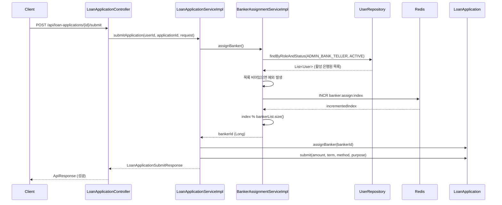
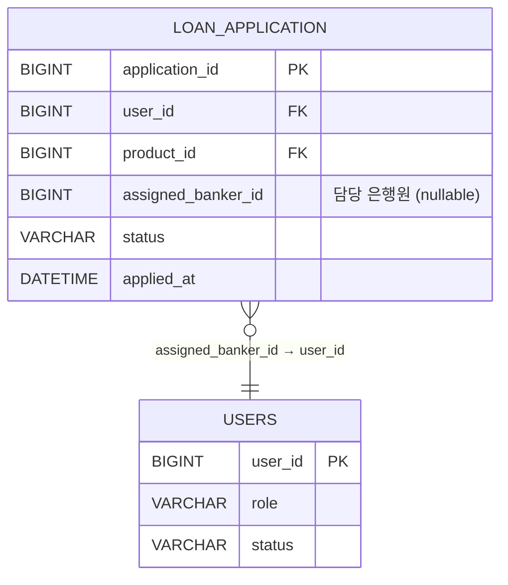

# Design Document: 담당 은행원 자동 배정 (Banker Auto-Assignment)

## Overview

대출 신청 최종 제출(submit) 시 담당 은행원을 라운드로빈 방식으로 자동 배정하는 기능이다.
서버 이중화(AWS) 환경에서도 균등 배정을 보장하기 위해 Redis INCR 기반의 원자적 카운터를 사용하며,
활성 상태(ACTIVE)인 은행원(ADMIN_BANK_TELLER) 목록에서 순환 배정한다.

### 핵심 설계 결정

1. **Redis INCR 기반 인덱스**: 다중 서버 환경에서 원자적 증가를 보장하여 동시 요청 시에도 고유한 인덱스 할당
2. **userId 오름차순 정렬**: 동일한 은행원 목록에 대해 항상 동일한 순서를 보장하여 결정론적 배정
3. **트랜잭션 일체화**: 배정 실패 시 submit 전체를 롤백하여 데이터 정합성 유지
4. **sofit-user 모듈 내 구현**: 배정 로직은 대출 신청 submit 흐름의 일부이므로 sofit-user에 위치

## Architecture



### 모듈 배치

| 컴포넌트 | 모듈 | 패키지 |
|---------|------|--------|
| BankerAssignmentService (interface) | sofit-user | `com.sofit.user.domain.loan.service` |
| BankerAssignmentServiceImpl | sofit-user | `com.sofit.user.domain.loan.service` |
| LoanApplication (엔티티 확장) | sofit-common | `com.sofit.common.entity.loan` |
| UserRepository (메서드 추가) | sofit-common | `com.sofit.common.repository.user` |
| LoanErrorCode (에러 코드 추가) | sofit-user | `com.sofit.user.domain.loan.exception` |

## Components and Interfaces

### 1. BankerAssignmentService (Interface)

```java
package com.sofit.user.domain.loan.service;

public interface BankerAssignmentService {
    /**
     * 라운드로빈 방식으로 활성 은행원을 배정하고 userId를 반환한다.
     * @return 배정된 은행원의 userId
     * @throws BaseException NO_AVAILABLE_BANKER - 활성 은행원이 없는 경우
     */
    Long assignBanker();
}
```

### 2. BankerAssignmentServiceImpl

```java
package com.sofit.user.domain.loan.service;

@Service
@RequiredArgsConstructor
public class BankerAssignmentServiceImpl implements BankerAssignmentService {

    private static final String ROUND_ROBIN_KEY = "banker:assign:index";

    private final UserRepository userRepository;
    private final StringRedisTemplate redisTemplate;

    @Override
    public Long assignBanker() {
        // 1. 활성 은행원 목록 조회 (userId ASC 정렬)
        List<User> activeBankers = userRepository
            .findByRoleAndStatus(UserRole.ADMIN_BANK_TELLER, UserStatus.ACTIVE);

        if (activeBankers.isEmpty()) {
            throw new BaseException(LoanErrorCode.NO_AVAILABLE_BANKER);
        }

        // 2. userId 오름차순 정렬 (DB 정렬 보장 + 방어적 정렬)
        activeBankers.sort(Comparator.comparing(User::getUserId));

        // 3. Redis INCR로 인덱스 증가 (원자적)
        Long index = redisTemplate.opsForValue().increment(ROUND_ROBIN_KEY);

        // 4. modulo 연산으로 대상 결정
        int targetIndex = (int) (index % activeBankers.size());

        return activeBankers.get(targetIndex).getUserId();
    }
}
```

### 3. LoanApplication 엔티티 확장

```java
// 추가 필드
@Column(name = "assigned_banker_id")
private Long assignedBankerId;

// 추가 비즈니스 메서드
public void assignBanker(Long bankerId) {
    if (bankerId == null) {
        throw new IllegalArgumentException("bankerId must not be null");
    }
    this.assignedBankerId = bankerId;
}
```

### 4. UserRepository 메서드 추가

```java
List<User> findByRoleAndStatus(UserRole role, UserStatus status);
```

### 5. LoanApplicationServiceImpl 수정

`submitApplication` 메서드에서 `submit()` 호출 전에 `bankerAssignmentService.assignBanker()`를 호출하고,
반환된 bankerId를 `application.assignBanker(bankerId)`로 설정한다.

```java
@Override
@Transactional
public LoanApplicationSubmitResponse submitApplication(Long userId, Long applicationId,
                                                       LoanApplicationSubmitRequest request) {
    // 1. 본인 소유 확인
    LoanApplication application = loanApplicationRepository
            .findByApplicationIdAndUser_UserId(applicationId, userId)
            .orElseThrow(() -> new BaseException(LoanErrorCode.APPLICATION_NOT_FOUND));

    // 2. DRAFT 상태 확인
    if (application.getStatus() != ApplicationStatus.DRAFT) {
        throw new BaseException(LoanErrorCode.APPLICATION_NOT_DRAFT);
    }

    // 3. 담당 은행원 배정 (실패 시 예외 → 트랜잭션 롤백)
    Long bankerId = bankerAssignmentService.assignBanker();
    application.assignBanker(bankerId);

    // 4. 제출 처리 (status → SUBMITTED, appliedAt 기록)
    application.submit(
            request.getRequestedAmount(),
            request.getRequestedTerm(),
            request.getRepaymentMethod(),
            request.getPurpose()
    );

    return LoanApplicationConverter.toSubmitResponse(application);
}
```

### 6. LoanErrorCode 추가

```java
NO_AVAILABLE_BANKER(HttpStatus.INTERNAL_SERVER_ERROR, "LOAN5001", "배정 가능한 은행원이 없습니다.");
```

## Data Models

### LoanApplication 테이블 변경

```sql
ALTER TABLE loan_application
ADD COLUMN assigned_banker_id BIGINT NULL COMMENT '담당 은행원 userId';
```

### Redis 키 구조

| 키 | 타입 | TTL | 설명 |
|----|------|-----|------|
| `banker:assign:index` | String (숫자) | 없음 (영구) | 라운드로빈 배정 카운터 |

### 엔티티 관계



## Correctness Properties

*A property is a characteristic or behavior that should hold true across all valid executions of a system — essentially, a formal statement about what the system should do. Properties serve as the bridge between human-readable specifications and machine-verifiable correctness guarantees.*

### Property 1: 라운드로빈 결정론적 배정

*For any* 활성 은행원 목록(비어있지 않음)과 임의의 인덱스 값에 대해, userId 오름차순 정렬 후 `index % size` 위치의 은행원이 항상 선택되어야 하며, 동일한 목록과 인덱스에 대해 항상 동일한 은행원이 반환되어야 한다.

**Validates: Requirements 2.3, 2.4**

### Property 2: 배정 결과 유효성

*For any* 배정 요청에 대해, 반환된 bankerId는 반드시 현재 ACTIVE 상태이고 ADMIN_BANK_TELLER 역할인 은행원의 userId 집합에 포함되어야 한다.

**Validates: Requirements 1.1, 2.1, 2.5**

### Property 3: 상태-배정 불변 조건

*For any* LoanApplication에 대해, 상태가 DRAFT이면 assignedBankerId는 null이어야 하고, 상태가 SUBMITTED이면 assignedBankerId는 null이 아니어야 한다.

**Validates: Requirements 1.3, 5.4**

### Property 4: assignBanker 설정 정확성

*For any* non-null Long 값 bankerId에 대해, `assignBanker(bankerId)` 호출 후 `getAssignedBankerId()`는 해당 bankerId와 동일한 값을 반환해야 한다.

**Validates: Requirements 5.2**

## Error Handling

| 상황 | 예외 | HTTP 상태 | 에러 코드 | 메시지 |
|------|------|-----------|-----------|--------|
| 활성 은행원 0명 | BaseException | 500 | LOAN5001 | 배정 가능한 은행원이 없습니다. |
| Redis 연결 실패 | RedisConnectionFailureException → 전파 | 500 | COMMON5000 | 서버 에러, 관리자에게 문의 바랍니다. |
| assignBanker(null) 호출 | IllegalArgumentException | - | - | bankerId must not be null |

### 트랜잭션 롤백 시나리오

1. `BankerAssignmentService.assignBanker()`에서 예외 발생 → `@Transactional` 롤백 → LoanApplication 상태 DRAFT 유지
2. Redis INCR 실패 → 예외 전파 → 트랜잭션 롤백
3. `assignBanker(null)` 호출 (방어 코드) → IllegalArgumentException → 트랜잭션 롤백

### 주의사항

- Redis INCR은 트랜잭션 롤백 대상이 아님: DB 롤백이 발생해도 Redis 카운터는 이미 증가된 상태. 이는 의도된 동작으로, 카운터 값의 연속성보다 균등 배정이 중요하므로 gap이 발생해도 무방하다.

## Testing Strategy

### Property-Based Testing (PBT)

- **라이브러리**: JUnit 5 + jqwik (Java property-based testing)
- **최소 반복 횟수**: 100회
- **태그 형식**: `Feature: banker-auto-assignment, Property {number}: {property_text}`

각 correctness property에 대해 하나의 property-based test를 작성한다:

| Property | 테스트 대상 | 생성 전략 |
|----------|------------|-----------|
| Property 1 | BankerAssignmentServiceImpl 내부 로직 | 임의의 User 리스트(1~50명) + 임의의 Long 인덱스 값 |
| Property 2 | BankerAssignmentServiceImpl.assignBanker() | 다양한 크기의 활성 은행원 목록 (Mock Redis) |
| Property 3 | LoanApplication 상태 전환 | 임의의 LoanApplication 생성 후 submit/assignBanker 호출 조합 |
| Property 4 | LoanApplication.assignBanker() | 임의의 non-null Long 값 |

### Unit Tests (Example-Based)

| 테스트 케이스 | 검증 내용 |
|--------------|-----------|
| submit 성공 시 assignedBankerId 저장 | 배정된 bankerId가 엔티티에 반영되는지 |
| 활성 은행원 0명 시 예외 | NO_AVAILABLE_BANKER 예외 발생 |
| assignBanker(null) 시 예외 | IllegalArgumentException 발생 |
| Redis 예외 시 전파 | RedisConnectionFailureException이 상위로 전파 |
| 응답 포맷 확인 | 배정 실패 시 HTTP 500 + 에러 코드 포함 응답 |

### Integration Tests

| 테스트 케이스 | 검증 내용 |
|--------------|-----------|
| Redis INCR 동작 | 키 미존재 시 1 반환, 연속 호출 시 증가 |
| TTL 미설정 확인 | banker:assign:index 키의 TTL이 -1 |
| 트랜잭션 롤백 | 배정 실패 시 DB 상태 DRAFT 유지 |
| findByRoleAndStatus 쿼리 | 올바른 필터링 결과 반환 |
| 동시 요청 시 고유 인덱스 | 멀티스레드 환경에서 중복 인덱스 없음 |

### 테스트 의존성 (build.gradle 추가)

```groovy
// Property-Based Testing
testImplementation 'net.jqwik:jqwik:1.8.2'

// Embedded Redis (통합 테스트용)
testImplementation 'it.ozimov:embedded-redis:0.7.3'
```
