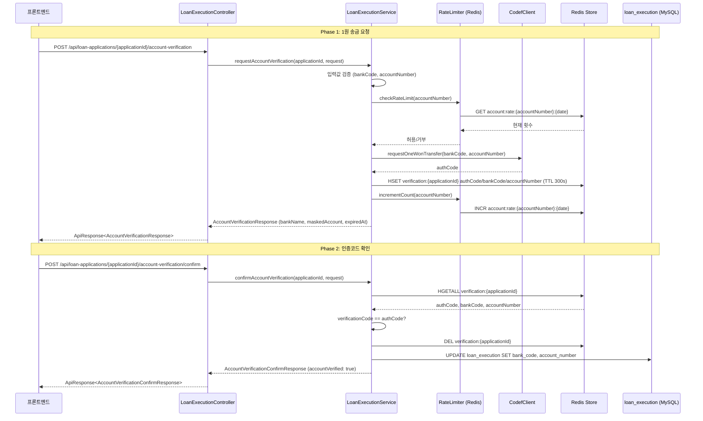

# Design Document: 코데프 1원 이체 계좌 인증

## Overview

코데프(CODEF) API를 활용한 1원 이체 방식의 계좌 인증 기능을 설계한다. 사용자가 대출 실행 계좌를 등록할 때 본인 명의 계좌인지 확인하기 위해, 1원 송금 요청과 인증코드 확인의 두 단계로 인증 흐름을 구성한다.

### 핵심 설계 결정

1. **기존 LoanExecutionController/Service에 통합**: 별도 AccountVerificationController를 만들지 않고, 기존 대출 실행 컨트롤러/서비스에 계좌 인증 API를 추가한다.
2. **Redis Hash 구조 사용**: 인증코드(authCode)와 함께 bankCode, accountNumber를 하나의 Redis Hash에 저장하여 TTL 기반 만료를 일괄 관리한다. confirm 시 Request Body 없이 Redis에서 계좌 정보를 꺼내 DB에 저장하므로 데이터 무결성이 보장된다.
3. **Rate Limiter Redis 기반 구현**: 계좌번호당 일일 요청 횟수를 Redis INCR + TTL(자정까지 남은 시간)로 관리하여 별도 스케줄러 없이 자동 초기화한다.
4. **RestClient 사용**: Spring Boot 환경에서 코데프 API 호출을 위해 RestClient를 사용한다.
5. **applicationId는 PathVariable**: 기존 LoanExecutionController 패턴(`/api/loan-applications/{applicationId}/...`)과 일관되게 PathVariable로 전달한다.
6. **기존 LoanExecution 엔티티 활용**: sofit-common에 이미 존재하는 LoanExecution 엔티티(execution_id, application_id, execution_amount, account_number, bank_code)를 그대로 사용한다.

## Architecture



### 레이어 구조 (기존 파일에 추가)

```
sofit-user/src/main/java/com/sofit/user/domain/loan/
├── controller/
│   ├── LoanExecutionController.java          ← 계좌 인증 API 2개 추가
│   └── LoanExecutionControllerDocs.java      ← Swagger 문서 추가
├── dto/
│   ├── request/
│   │   ├── AccountVerificationRequest.java   ← 신규
│   │   └── AccountVerificationConfirmRequest.java ← 신규
│   └── response/
│       ├── AccountVerificationResponse.java  ← 신규
│       └── AccountVerificationConfirmResponse.java ← 신규
├── service/
│   ├── LoanExecutionService.java             ← 메서드 2개 추가
│   └── LoanExecutionServiceImpl.java         ← 구현 추가
├── client/
│   └── CodefClient.java                      ← 신규
└── util/
    └── AccountMaskingUtil.java               ← 신규
```

## Components and Interfaces

### 1. LoanExecutionController (기존 파일에 추가)

기존 대출 실행 결과 조회 API에 계좌 인증 API 2개를 추가한다.

```java
@RestController
@RequestMapping("/api/loan-applications")
@RequiredArgsConstructor
public class LoanExecutionController implements LoanExecutionControllerDocs {

    private final LoanExecutionService loanExecutionService;
    private static final Long TEMP_USER_ID = 1L;

    // 기존: GET /{applicationId}/execution - 대출 실행 결과 조회

    // 추가: POST /{applicationId}/account-verification - 1원 송금 요청
    @PostMapping("/{applicationId}/account-verification")
    public ApiResponse<AccountVerificationResponse> requestAccountVerification(
        @PathVariable Long applicationId,
        @Valid @RequestBody AccountVerificationRequest request);

    // 추가: POST /{applicationId}/account-verification/confirm - 인증코드 확인
    @PostMapping("/{applicationId}/account-verification/confirm")
    public ApiResponse<AccountVerificationConfirmResponse> confirmAccountVerification(
        @PathVariable Long applicationId,
        @Valid @RequestBody AccountVerificationConfirmRequest request);
}
```

### 2. LoanExecutionService (기존 인터페이스에 메서드 추가)

```java
public interface LoanExecutionService {
    // 기존
    LoanExecutionResultResponse findExecutionResult(Long userId, Long applicationId);

    // 추가
    AccountVerificationResponse requestAccountVerification(Long applicationId, AccountVerificationRequest request);
    AccountVerificationConfirmResponse confirmAccountVerification(Long applicationId, AccountVerificationConfirmRequest request);
}
```

### 3. CodefClient (신규)

코데프 데모 서버와 HTTP 통신을 담당하는 클라이언트.

```java
@Component
public class CodefClient {
    // 코데프 API 호출 (1원 이체 요청)
    // URL: https://development.codef.io/v1/kr/bank/a/account/transfer-authentication
    // Timeout: 연결 30초, 읽기 30초
    public String requestOneWonTransfer(String organization, String account);
}
```

### 4. AccountMaskingUtil (신규)

계좌번호 마스킹 유틸리티.

```java
public class AccountMaskingUtil {
    // "1234567890" → "1234-****-90"
    public static String mask(String accountNumber);
}
```

### 5. AccountVerificationRateLimiter (신규, Redis 기반)

```java
@Component
public class AccountVerificationRateLimiter {
    // 일일 요청 횟수 확인 (5회 미만인지)
    public boolean isAllowed(String accountNumber);
    // 요청 횟수 증가
    public void increment(String accountNumber);
}
```

## Data Models

### Request DTOs (신규)

```java
// 1원 송금 요청
public class AccountVerificationRequest {
    @NotBlank(message = "은행코드는 필수입니다")
    private String bankCode;

    @NotBlank(message = "계좌번호는 필수입니다")
    @Pattern(regexp = "^[0-9]{7,20}$", message = "계좌번호는 숫자 7~20자리여야 합니다")
    private String accountNumber;
}

// 인증코드 확인 요청
public class AccountVerificationConfirmRequest {
    @NotBlank(message = "인증번호는 필수입니다")
    @Pattern(regexp = "^[0-9]{4}$", message = "인증번호는 4자리 숫자여야 합니다")
    private String verificationCode;
}
```

### Response DTOs (신규)

```java
// 1원 송금 응답
public record AccountVerificationResponse(
    String bankName,
    String maskedAccountNumber,
    String accountHolder,
    String expiredAt  // ISO 8601: "2024-01-15T14:30:00"
) {}

// 인증 확인 응답
public record AccountVerificationConfirmResponse(
    boolean accountVerified
) {}
```

### Redis 저장 구조

```
# 인증 정보 (Hash, TTL 300초)
Key: verification:{applicationId}
Fields:
  - authCode: "1234"
  - bankCode: "004"
  - accountNumber: "1234567890"

# Rate Limit (String, TTL: 자정까지 남은 초)
Key: account:rate:{accountNumber}:{yyyyMMdd}
Value: 요청 횟수 (Integer)
```

### 코데프 API 요청/응답

```json
// Request Body
{
  "organization": "0004",
  "account": "1234567890",
  "inPrintType": "0",
  "inPrintContent": ""
}

// Response Body (성공)
{
  "result": {
    "code": "CF-00000",
    "message": "성공"
  },
  "data": {
    "authCode": "1234"
  }
}
```

### LoanExecution 엔티티 (기존 — 수정 없음)

sofit-common에 이미 존재하는 엔티티를 그대로 활용한다.

```java
@Entity
@Table(name = "loan_execution")
@Getter
@NoArgsConstructor(access = AccessLevel.PROTECTED)
public class LoanExecution {
    @Id
    @GeneratedValue(strategy = GenerationType.IDENTITY)
    @Column(name = "execution_id")
    private Long executionId;

    @OneToOne(fetch = FetchType.LAZY)
    @JoinColumn(name = "application_id", nullable = false, unique = true)
    private LoanApplication application;

    @Column(name = "execution_amount", nullable = false)
    private Long executionAmount;

    @Column(name = "account_number", nullable = false, length = 30)
    private String accountNumber;

    @Column(name = "bank_code", nullable = false, length = 10)
    private String bankCode;
}
```

계좌 인증 성공 시 기존 LoanExecution 레코드의 `account_number`와 `bank_code`를 UPDATE한다.

### Error Codes (LoanErrorCode에 추가)

| 코드 | HTTP Status | 메시지 |
|------|-------------|--------|
| ACCOUNT4001 | 400 | 유효하지 않은 계좌번호입니다. |
| ACCOUNT4002 | 429 | 일일 요청 한도(5회)를 초과했습니다. |
| ACCOUNT4003 | 400 | 인증번호가 일치하지 않습니다. |
| ACCOUNT4004 | 400 | 인증 시간이 만료되었습니다. 다시 요청해주세요. |
| ACCOUNT4005 | 400 | 유효하지 않은 은행코드입니다. |
| ACCOUNT5001 | 502 | 계좌 인증 서비스에 일시적인 오류가 발생했습니다. |

### Success Codes (LoanSuccessCode에 추가)

| 코드 | HTTP Status | 메시지 |
|------|-------------|--------|
| ACCOUNT_VERIFICATION_OK | 200 | 1원 송금 요청에 성공했습니다. |
| ACCOUNT_VERIFICATION_CONFIRM_OK | 200 | 계좌 인증에 성공했습니다. |

## Correctness Properties

### Property 1: 계좌번호 마스킹 형식 보존

*For any* 9자리 이상 20자리 이하의 숫자로만 구성된 계좌번호에 대해, 마스킹 함수를 적용하면 결과는 반드시 "{앞4자리}-****-{9번째 자리부터 끝까지}" 형식이어야 하며, 앞 4자리와 9번째 이후 자리는 원본과 동일해야 한다.

**Validates: Requirements 7.1, 7.2**

### Property 2: 유효하지 않은 계좌번호 거부

*For any* 문자열이 숫자가 아닌 문자를 포함하거나, 길이가 7자리 미만이거나 20자리를 초과하는 경우, 계좌번호 검증 함수는 해당 입력을 항상 거부해야 한다.

**Validates: Requirements 1.5, 4.3**

### Property 3: 유효하지 않은 인증번호 거부

*For any* 문자열이 정확히 4자리 숫자 형식이 아닌 경우(길이가 4가 아니거나, 숫자가 아닌 문자를 포함), 인증번호 검증 함수는 해당 입력을 항상 거부해야 한다.

**Validates: Requirements 4.4, 5.7**

### Property 4: 유효하지 않은 은행코드 거부

*For any* 문자열이 시스템에 등록된 은행 기관코드 목록에 존재하지 않는 경우, 은행코드 검증 함수는 해당 입력을 항상 거부해야 한다.

**Validates: Requirements 4.5**

### Property 5: Rate Limiter 허용/거부 불변식

*For any* 계좌번호와 해당 계좌의 당일 요청 횟수 n에 대해, n < 5이면 Rate Limiter는 요청을 허용하고, n >= 5이면 요청을 거부해야 한다.

**Validates: Requirements 1.7, 3.1, 3.2**

### Property 6: Rate Limiter 카운터 정확성

*For any* 계좌번호와 초기 카운터 값 n에 대해, 코데프 API 호출이 성공하면 카운터는 n+1이 되고, 실패하면 카운터는 n으로 유지되어야 한다.

**Validates: Requirements 3.3, 3.4**

### Property 7: 인증코드 일치 판정 정확성

*For any* 4자리 숫자 문자열 쌍 (verificationCode, authCode)에 대해, 두 값이 동일하면 인증은 성공(accountVerified: true)이고, 다르면 인증은 실패(ACCOUNT4003 에러)여야 한다.

**Validates: Requirements 5.2, 5.5**

### Property 8: 인증 성공 후 재사용 방지

*For any* 유효한 인증코드에 대해, 인증이 한 번 성공한 후 동일한 applicationId와 동일한 인증코드로 재시도하면 반드시 실패(ACCOUNT4004 에러)해야 한다.

**Validates: Requirements 6.3**

### Property 9: 응답에 원본 계좌번호 미포함

*For any* 유효한 계좌번호로 1원 송금 요청이 성공한 경우, 응답 객체를 JSON으로 직렬화한 문자열에 원본 계좌번호 전체가 포함되어서는 안 된다.

**Validates: Requirements 7.4**

## Error Handling

### 에러 처리 전략

| 상황 | 처리 방식 | 에러 코드 |
|------|-----------|-----------|
| 입력값 검증 실패 (@Valid) | Spring Validation → GlobalExceptionHandler | COMMON4000 |
| 계좌번호 형식 오류 (비즈니스 검증) | BaseException throw | ACCOUNT4001 |
| 은행코드 미등록 | BaseException throw | ACCOUNT4005 |
| 일일 요청 한도 초과 | BaseException throw | ACCOUNT4002 |
| 코데프 API 호출 실패/타임아웃 | BaseException throw | ACCOUNT5001 |
| 인증번호 불일치 | BaseException throw | ACCOUNT4003 |
| 인증 시간 만료 (Redis TTL) | BaseException throw | ACCOUNT4004 |
| Redis 연결 실패 | BaseException throw | ACCOUNT5001 |
| 예상치 못한 예외 | GlobalExceptionHandler | COMMON5000 |

### 코데프 API 에러 처리

- 연결 타임아웃 (30초): `ConnectTimeoutException` → ACCOUNT5001
- 읽기 타임아웃 (30초): `ReadTimeoutException` → ACCOUNT5001
- HTTP 4xx/5xx 응답: `HttpClientErrorException`/`HttpServerErrorException` → ACCOUNT5001
- 재시도 없음 (요구사항 명시)

### Redis 장애 대응

- Redis 연결 실패 시 ACCOUNT5001 에러로 처리
- Rate Limiter Redis 장애 시에도 동일하게 ACCOUNT5001 반환 (fail-closed 전략)

## Testing Strategy

### 단위 테스트 (JUnit 5 + Mockito)

| 대상 | 테스트 내용 |
|------|-------------|
| AccountMaskingUtil | 마스킹 형식, 경계값 (9자리, 20자리) |
| LoanExecutionServiceImpl (계좌 인증) | 비즈니스 로직 (Mock: CodefClient, Redis, Repository) |
| AccountVerificationRateLimiter | 허용/거부 판정, 카운터 증가 |
| CodefClient | 요청 Body 구성, 응답 파싱 (Mock: RestClient) |

### Property-Based 테스트 (JUnit 5 + jqwik)

- 라이브러리: **jqwik** (JUnit 5 플랫폼 기반 Java PBT 라이브러리)
- 최소 100회 반복 실행
- 각 테스트에 `@Tag("Feature: codef-account-verification, Property N: ...")` 태그 부착

| Property | 테스트 대상 |
|----------|-------------|
| Property 1 | AccountMaskingUtil.mask() |
| Property 2 | accountNumber 정규식 검증 로직 |
| Property 3 | verificationCode 정규식 검증 로직 |
| Property 4 | bankCode 목록 검증 로직 |
| Property 5 | AccountVerificationRateLimiter.isAllowed() |
| Property 6 | AccountVerificationRateLimiter.increment() |
| Property 7 | 인증코드 비교 로직 |
| Property 8 | 인증 성공 후 재시도 (Redis Mock) |
| Property 9 | 응답 직렬화 후 원본 계좌번호 미포함 확인 |

### 통합 테스트

| 대상 | 테스트 내용 |
|------|-------------|
| Controller 통합 | MockMvc로 API 엔드포인트 테스트 |
| Redis 통합 | Embedded Redis로 TTL, Hash 저장/조회/삭제 |
| CodefClient 통합 | WireMock으로 코데프 API 시나리오 (성공, 타임아웃, 에러) |
| 전체 흐름 | 1원 송금 → 인증 확인 → DB 저장 E2E 시나리오 |

### 테스트 의존성 (build.gradle 추가)

```groovy
// Property-Based Testing
testImplementation 'net.jqwik:jqwik:1.9.2'

// Embedded Redis (통합 테스트)
testImplementation 'com.github.codemonstur:embedded-redis:1.4.3'

// WireMock (외부 API Mock)
testImplementation 'org.wiremock:wiremock-standalone:3.10.0'
```
