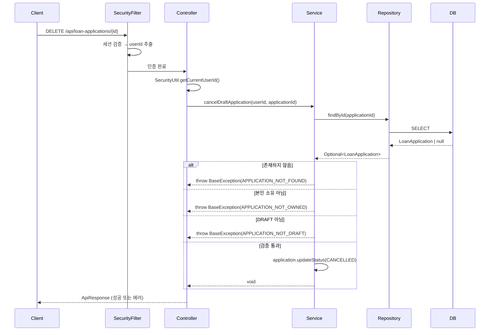
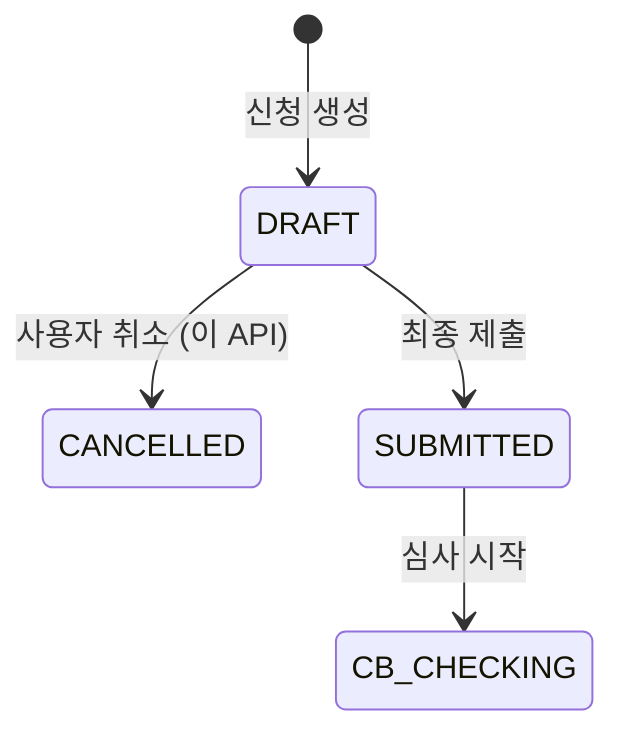

# Design Document: DRAFT 대출 신청서 취소 API

## Overview

DRAFT 상태의 대출 신청서를 소프트 삭제(status를 CANCELLED로 변경)하는 REST API를 구현한다.

- **엔드포인트**: `DELETE /api/loan-applications/{applicationId}`
- **인증**: Redis 세션 기반 (SecurityUtil을 통해 userId 추출)
- **핵심 로직**: 존재 여부 → 본인 소유 → DRAFT 상태 순서로 검증 후 status를 CANCELLED로 변경
- **설계 원칙**: 기존 프로젝트 컨벤션(Service interface + Impl, Converter, ControllerDocs 패턴) 준수

이 API는 감사 추적을 위해 실제 DB row를 삭제하지 않으며, 기존 DRAFT 조회(checkDraft)와 중복 신청 체크 로직이 CANCELLED 상태를 자동으로 제외하도록 이미 구현되어 있어 별도의 조회 로직 수정이 필요하지 않다.

## Architecture

### 요청 흐름



### 레이어 구성

| 레이어 | 클래스 | 역할 |
|--------|--------|------|
| Controller | `LoanApplicationController` | HTTP 요청 라우팅, 인증 userId 추출 |
| ControllerDocs | `LoanApplicationControllerDocs` | Swagger 문서 정의 |
| Service Interface | `LoanApplicationService` | 비즈니스 메서드 선언 |
| Service Impl | `LoanApplicationServiceImpl` | 검증 + 상태 변경 로직 |
| Repository | `LoanApplicationRepository` | JPA 데이터 접근 |
| Entity | `LoanApplication` | 도메인 엔티티 + 비즈니스 메서드 |

## Components and Interfaces

### 1. Controller Layer

기존 `LoanStepController`의 패턴을 따라 `LoanApplicationController`에 DELETE 엔드포인트를 추가한다.

```java
// LoanApplicationControllerDocs.java (Swagger 인터페이스)
@Tag(name = "대출 신청", description = "대출 신청 생성/취소/조회 API")
public interface LoanApplicationControllerDocs {
    
    @Operation(summary = "DRAFT 신청서 취소", description = "DRAFT 상태의 대출 신청서를 취소(소프트 삭제)합니다.")
    @ApiResponses(value = {
        @ApiResponse(responseCode = "200", description = "취소 성공"),
        @ApiResponse(responseCode = "400", description = "DRAFT 상태가 아닌 신청"),
        @ApiResponse(responseCode = "403", description = "본인 소유가 아닌 신청"),
        @ApiResponse(responseCode = "404", description = "존재하지 않는 신청")
    })
    ApiResponse<Void> cancelDraftApplication(@Parameter(description = "대출 신청 ID") Long applicationId);
}
```

```java
// LoanApplicationController.java (기존 컨트롤러에 메서드 추가)
@DeleteMapping("/{applicationId}")
public ApiResponse<Void> cancelDraftApplication(@PathVariable Long applicationId) {
    Long userId = SecurityUtil.getCurrentUserId();
    loanApplicationService.cancelDraftApplication(userId, applicationId);
    return ApiResponse.onSuccess(LoanSuccessCode.LOAN_DRAFT_CANCELLED, null);
}
```

### 2. Service Layer

기존 `LoanApplicationService` 인터페이스에 메서드를 추가하고, `LoanApplicationServiceImpl`에 구현한다.

```java
// LoanApplicationService.java에 추가
void cancelDraftApplication(Long userId, Long applicationId);
```

```java
// LoanApplicationServiceImpl.java 구현
@Transactional
public void cancelDraftApplication(Long userId, Long applicationId) {
    // 1. 존재 여부 검증
    LoanApplication application = loanApplicationRepository.findById(applicationId)
            .orElseThrow(() -> new BaseException(LoanErrorCode.APPLICATION_NOT_FOUND));
    
    // 2. 본인 소유 검증
    if (!application.getUser().getUserId().equals(userId)) {
        throw new BaseException(LoanErrorCode.APPLICATION_NOT_OWNED);
    }
    
    // 3. DRAFT 상태 검증
    if (application.getStatus() != ApplicationStatus.DRAFT) {
        throw new BaseException(LoanErrorCode.APPLICATION_NOT_DRAFT);
    }
    
    // 4. 소프트 삭제 (status → CANCELLED)
    application.updateStatus(ApplicationStatus.CANCELLED);
}
```

### 3. 검증 순서 설계 결정

검증 순서를 `존재 → 본인 소유 → DRAFT 상태`로 결정한 이유:

1. **존재하지 않는 리소스**에 대해서는 소유권/상태 검증이 불필요 → 404 우선 반환
2. **타인의 신청서**에 대해 상태 정보를 노출하지 않기 위해 소유권 검증을 상태 검증보다 우선 → 403 반환
3. 소유권이 확인된 후에야 **DRAFT 상태 검증** → 400 반환

이 순서는 요구사항 3.3 ("존재 여부를 응답에 노출하지 않고 동일한 403 응답")과도 부합한다.
다만 현재 구현에서는 `findById`로 먼저 조회하므로, 존재하지 않는 경우 404를 반환한다.
타인 소유 시에는 상태 정보를 노출하지 않고 403만 반환하여 정보 누수를 방지한다.

### 4. 성공 코드 추가

`LoanSuccessCode`에 새로운 코드를 추가한다:

```java
LOAN_DRAFT_CANCELLED(HttpStatus.OK, "LOAN2017", "신청서가 취소되었습니다.");
```

## Data Models

### 엔티티 변경사항

`LoanApplication` 엔티티에는 이미 `updateStatus(ApplicationStatus)` 메서드가 존재하므로 추가적인 엔티티 변경은 불필요하다.

### 상태 전이



### API 응답 형식

**성공 응답 (HTTP 200)**:
```json
{
  "isSuccess": true,
  "code": "LOAN2017",
  "message": "신청서가 취소되었습니다.",
  "result": null
}
```

**에러 응답 - 존재하지 않음 (HTTP 404)**:
```json
{
  "isSuccess": false,
  "code": "LOAN4042",
  "message": "존재하지 않는 대출 신청입니다."
}
```

**에러 응답 - 본인 소유 아님 (HTTP 403)**:
```json
{
  "isSuccess": false,
  "code": "LOAN4032",
  "message": "본인의 대출 신청만 처리할 수 있습니다."
}
```

**에러 응답 - DRAFT 아님 (HTTP 400)**:
```json
{
  "isSuccess": false,
  "code": "LOAN4002",
  "message": "DRAFT 상태가 아닌 신청은 제출할 수 없습니다."
}
```

> **Note**: `APPLICATION_NOT_DRAFT` 에러코드의 메시지는 기존에 "DRAFT 상태가 아닌 신청은 제출할 수 없습니다."로 정의되어 있다. 취소 맥락에 맞게 메시지를 "DRAFT 상태의 신청만 취소할 수 있습니다."로 변경하거나, 별도 에러코드(`APPLICATION_NOT_DRAFT_FOR_CANCEL`)를 추가할 수 있다. 기존 코드 재사용을 우선하여 현재 코드를 그대로 사용한다.

### 기존 로직과의 호환성

| 기존 메서드 | CANCELLED 처리 방식 | 변경 필요 |
|------------|---------------------|-----------|
| `checkDraft()` | status=DRAFT로 조회하므로 CANCELLED는 자동 제외 | 없음 |
| `createApplication()` | `statusNot(CANCELLED)`로 중복 체크하므로 새 신청 가능 | 없음 |
| `getResumeData()` | DRAFT 상태만 반환하므로 CANCELLED는 자동 제외 | 없음 |


## Correctness Properties

*A property is a characteristic or behavior that should hold true across all valid executions of a system—essentially, a formal statement about what the system should do. Properties serve as the bridge between human-readable specifications and machine-verifiable correctness guarantees.*

### Property 1: DRAFT 취소 시 소프트 삭제 수행

*For any* LoanApplication that is in DRAFT status and owned by the requesting user, calling cancelDraftApplication SHALL change the status to CANCELLED while the entity remains persisted in the database with all other fields unchanged.

**Validates: Requirements 1.1, 1.3, 4.1**

### Property 2: 존재하지 않는 신청에 대한 에러 반환

*For any* applicationId that does not correspond to an existing LoanApplication in the database, calling cancelDraftApplication SHALL throw a BaseException with APPLICATION_NOT_FOUND error code.

**Validates: Requirements 1.4, 2.1**

### Property 3: 타인 소유 신청 취소 차단 및 상태 보존

*For any* LoanApplication where the owning user's userId does not equal the requesting user's userId, calling cancelDraftApplication SHALL throw a BaseException with APPLICATION_NOT_OWNED error code, and the application's status SHALL remain unchanged.

**Validates: Requirements 1.5, 3.1, 3.2**

### Property 4: 비-DRAFT 상태 신청 취소 차단 및 상태 보존

*For any* LoanApplication owned by the requesting user where status is not DRAFT (i.e., SUBMITTED, CB_CHECKING, APPROVED, REJECTED, EXECUTED, CANCELLED, etc.), calling cancelDraftApplication SHALL throw a BaseException with APPLICATION_NOT_DRAFT error code, and the application's status SHALL remain unchanged.

**Validates: Requirements 1.6, 4.2**

### Property 5: CANCELLED 후 동일 상품 재신청 가능

*For any* LoanApplication that has been cancelled (status changed from DRAFT to CANCELLED), the same user SHALL be able to create a new DRAFT application for the same product without a duplicate application error.

**Validates: Requirements 5.1, 5.2**

## Error Handling

### 에러 코드 매핑

| 에러 상황 | ErrorCode Enum | HTTP Status | code | message |
|-----------|----------------|-------------|------|---------|
| 신청 미존재 | `APPLICATION_NOT_FOUND` | 404 | LOAN4042 | 존재하지 않는 대출 신청입니다. |
| 본인 소유 아님 | `APPLICATION_NOT_OWNED` | 403 | LOAN4032 | 본인의 대출 신청만 처리할 수 있습니다. |
| DRAFT 상태 아님 | `APPLICATION_NOT_DRAFT` | 400 | LOAN4002 | DRAFT 상태가 아닌 신청은 제출할 수 없습니다. |
| 미인증 | `UNAUTHORIZED` | 401 | COMMON4001 | 인증이 필요합니다. |
| PathVariable 타입 오류 | Spring 기본 처리 | 400 | COMMON4000 | 잘못된 요청입니다. |

### 에러 처리 흐름

1. **인증 실패**: Spring Security 필터에서 세션 미존재 시 401 반환 (SecurityConfig에서 처리)
2. **PathVariable 타입 변환 실패**: Spring MVC의 `MethodArgumentTypeMismatchException` → GlobalExceptionHandler에서 400 반환
3. **비즈니스 예외**: `BaseException` throw → GlobalExceptionHandler에서 적절한 HTTP 상태코드와 에러 응답 생성

### 기존 에러코드 재사용

모든 에러코드(`APPLICATION_NOT_FOUND`, `APPLICATION_NOT_OWNED`, `APPLICATION_NOT_DRAFT`)는 이미 `LoanErrorCode`에 정의되어 있으므로 새로운 에러코드 추가는 불필요하다.

## Testing Strategy

### 단위 테스트 (JUnit 5 + Mockito)

Service 레이어의 `cancelDraftApplication` 메서드를 테스트한다:

1. **성공 케이스**: DRAFT 상태, 본인 소유 신청 취소 → status가 CANCELLED로 변경됨
2. **존재하지 않는 신청**: 없는 ID → APPLICATION_NOT_FOUND 예외
3. **타인 소유**: 다른 userId → APPLICATION_NOT_OWNED 예외
4. **비-DRAFT 상태**: SUBMITTED/APPROVED 등 → APPLICATION_NOT_DRAFT 예외

### Property-Based 테스트 (JUnit 5 + jqwik)

property-based testing 라이브러리로 **jqwik**을 사용한다.

각 Correctness Property를 property-based test로 구현:

- **최소 100회 반복** 실행
- 임의의 ApplicationStatus, userId 조합을 생성하여 검증 로직의 정확성을 확인
- Service 레이어를 Mockito로 Repository를 mock하여 순수 비즈니스 로직만 테스트

**테스트 태그 형식**: `Feature: draft-cancel-api, Property {number}: {property_text}`

### 통합 테스트 (SpringBootTest)

Controller → Service → Repository 전체 흐름을 검증:

1. 실제 DB에 DRAFT 신청 생성 → DELETE 호출 → DB에서 status 확인
2. 취소 후 동일 상품 재신청 가능 여부 확인
3. 에러 응답의 HTTP 상태코드 및 body 포맷 검증
