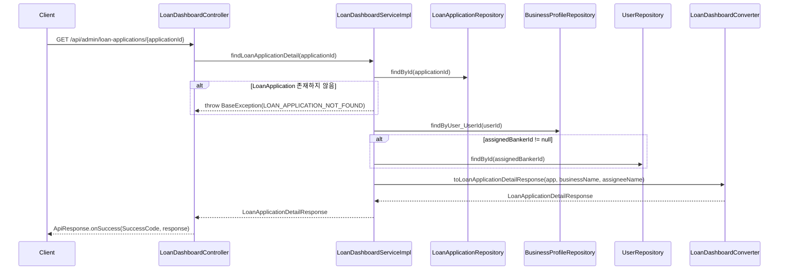
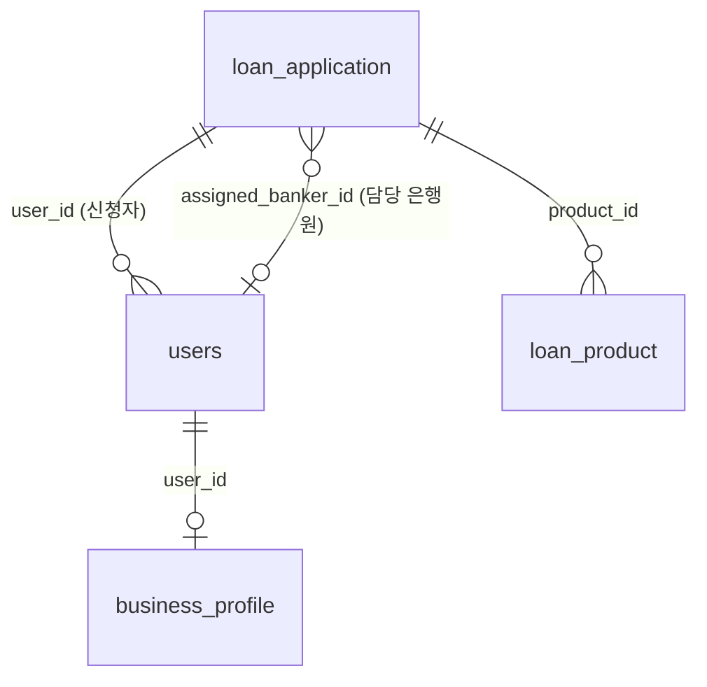

# Design Document: 대출 신청 상세 조회 API

## Overview

은행원(BANK_ADMIN)이 대출 대시보드에서 특정 신청 건을 선택했을 때, 해당 신청 건의 공통 정보를 단건으로 조회하는 REST API를 설계한다.

기존 `LoanDashboardController`가 목록 조회를 담당하고 있으므로, 상세 조회는 동일한 Controller에 엔드포인트를 추가하는 방식으로 구현한다. 기존 프로젝트의 아키텍처 패턴(Controller + ControllerDocs, Service interface + ServiceImpl, Converter, Response DTO record)을 그대로 따른다.

**핵심 설계 결정:**
- 기존 `LoanDashboardController`에 `GET /{applicationId}` 엔드포인트 추가 (동일 도메인, 동일 base path)
- 단건 조회이므로 `findById` + fetch join으로 N+1 방지
- `assigned_banker_id`가 nullable이므로 조건부 조회 로직 포함
- 날짜 포맷은 `yyyy-MM-dd` 문자열로 변환하여 반환

## Architecture



### 레이어 구조

```
com.sofit.admin.domain.loan/
├── controller/
│   ├── LoanDashboardController.java        ← 엔드포인트 추가
│   └── LoanDashboardControllerDocs.java    ← Swagger 문서 추가
├── converter/
│   └── LoanDashboardConverter.java         ← 변환 메서드 추가
├── dto/response/
│   └── LoanApplicationDetailResponse.java  ← 신규 생성
├── exception/
│   ├── LoanDashboardErrorCode.java         ← 에러 코드 추가
│   └── LoanDashboardSuccessCode.java       ← 성공 코드 추가
└── service/
    ├── LoanDashboardService.java           ← 메서드 시그니처 추가
    └── LoanDashboardServiceImpl.java       ← 구현 추가
```

## Components and Interfaces

### 1. LoanApplicationDetailResponse (Response DTO)

```java
package com.sofit.admin.domain.loan.dto.response;

public record LoanApplicationDetailResponse(
    Long applicationId,
    String applicantName,
    String businessName,
    String productName,
    String status,
    String appliedAt,
    Long assignedBankerId,
    String assigneeName
) {}
```

**설계 결정:**
- `status`: `ApplicationStatus` enum의 `.name()` 문자열로 반환 (프론트엔드에서 enum 문자열로 상태 표시)
- `appliedAt`: `yyyy-MM-dd HH:mm:ss` 형식 문자열로 변환 — DB 저장 형식 그대로 반환 (FE 요청사항)
- `assignedBankerId`, `assigneeName`: nullable (담당 은행원 미배정 시 null)

### 2. LoanDashboardService (인터페이스 확장)

```java
// 기존 인터페이스에 메서드 추가
LoanApplicationDetailResponse findLoanApplicationDetail(Long applicationId);
```

### 3. LoanDashboardServiceImpl (구현 추가)

```java
@Override
public LoanApplicationDetailResponse findLoanApplicationDetail(Long applicationId) {
    // 1. LoanApplication 조회 (fetch join으로 User, Product 함께 로딩)
    LoanApplication app = loanApplicationRepository.findById(applicationId)
        .orElseThrow(() -> new BaseException(LoanDashboardErrorCode.LOAN_APPLICATION_NOT_FOUND));

    // 2. BusinessProfile에서 businessName 조회
    String businessName = businessProfileRepository.findByUser_UserId(app.getUser().getUserId())
        .map(BusinessProfile::getBusinessName)
        .orElse(null);

    // 3. assignedBankerId가 존재하면 은행원 이름 조회
    String assigneeName = null;
    if (app.getAssignedBankerId() != null) {
        assigneeName = userRepository.findById(app.getAssignedBankerId())
            .map(User::getName)
            .orElse(null);
    }

    // 4. Converter로 DTO 변환
    return LoanDashboardConverter.toLoanApplicationDetailResponse(app, businessName, assigneeName);
}
```

**설계 결정:**
- `findById`는 JPA 기본 메서드 사용. LoanApplication의 `user`와 `product`는 `FetchType.LAZY`이므로, Converter에서 접근 시 추가 쿼리 발생. 단건 조회이므로 N+1 문제가 아닌 최대 3~4개 쿼리로 제한됨.
- 대안으로 fetch join JPQL을 추가할 수 있으나, 단건 조회에서는 성능 차이가 미미하므로 기본 `findById` 사용.
- `BusinessProfile`이 없는 경우(이론적으로 KYC 완료 후에만 대출 신청 가능하므로 발생하지 않아야 함) null 반환으로 방어적 처리.

### 4. LoanDashboardConverter (변환 메서드 추가)

```java
public static LoanApplicationDetailResponse toLoanApplicationDetailResponse(
        LoanApplication app,
        String businessName,
        String assigneeName) {

    String appliedAtFormatted = app.getAppliedAt() != null
        ? app.getAppliedAt().format(DateTimeFormatter.ofPattern("yyyy-MM-dd HH:mm:ss"))
        : null;

    return new LoanApplicationDetailResponse(
        app.getApplicationId(),
        app.getUser().getName(),
        businessName,
        app.getProduct().getProductName(),
        app.getStatus().name(),
        appliedAtFormatted,
        app.getAssignedBankerId(),
        assigneeName
    );
}
```

### 5. LoanDashboardController (엔드포인트 추가)

```java
@GetMapping("/{applicationId}")
@Override
public ApiResponse<LoanApplicationDetailResponse> findLoanApplicationDetail(
        @PathVariable Long applicationId) {
    LoanApplicationDetailResponse response = loanDashboardService.findLoanApplicationDetail(applicationId);
    return ApiResponse.onSuccess(LoanDashboardSuccessCode.LOAN_APPLICATION_DETAIL_OK, response);
}
```

### 6. LoanDashboardControllerDocs (Swagger 문서 추가)

```java
@Operation(
    summary = "대출 신청 상세 조회 (공통 정보)",
    description = "대출 신청 건의 공통 정보를 단건 조회합니다."
)
@ApiResponses(value = {
    @ApiResponse(responseCode = "200", description = "대출 신청 상세 조회 성공"),
    @ApiResponse(responseCode = "404", description = "대출 신청 건을 찾을 수 없음")
})
ApiResponse<LoanApplicationDetailResponse> findLoanApplicationDetail(
    @Parameter(description = "대출 신청 ID", example = "1") Long applicationId
);
```

### 7. Exception Codes (추가)

**LoanDashboardErrorCode:**
```java
LOAN_APPLICATION_NOT_FOUND(HttpStatus.NOT_FOUND, "COMMON4004", "요청한 리소스를 찾을 수 없습니다.");
```

**LoanDashboardSuccessCode:**
```java
LOAN_APPLICATION_DETAIL_OK(HttpStatus.OK, "LOAN2002", "대출 신청 상세 조회에 성공했습니다.");
```

**설계 결정:**
- 에러 코드 `COMMON4004`는 요구사항 2.1에서 명시한 코드를 그대로 사용
- 성공 코드는 기존 `LOAN2001`(목록 조회) 다음 번호인 `LOAN2002` 사용

## Data Models

### Response DTO 필드 매핑

| Response 필드 | 소스 | 타입 | 비고 |
|---|---|---|---|
| applicationId | LoanApplication.applicationId | Long | PK |
| applicantName | LoanApplication.user.name | String | User 엔티티 |
| businessName | BusinessProfile.businessName | String | user_id로 조회 |
| productName | LoanProduct.productName | String | product 연관관계 |
| status | LoanApplication.status.name() | String | enum → 문자열 |
| appliedAt | LoanApplication.appliedAt | String | yyyy-MM-dd HH:mm:ss 포맷 |
| assignedBankerId | LoanApplication.assignedBankerId | Long (nullable) | - |
| assigneeName | User.name (banker) | String (nullable) | assignedBankerId로 조회 |

### 관련 테이블 관계



## Correctness Properties

*A property is a characteristic or behavior that should hold true across all valid executions of a system — essentially, a formal statement about what the system should do. Properties serve as the bridge between human-readable specifications and machine-verifiable correctness guarantees.*

### Property 1: Converter 필드 매핑 정확성

*For any* 유효한 LoanApplication 엔티티(user, product 연관관계 포함), businessName 문자열, assigneeName 문자열(nullable 포함)에 대해, `toLoanApplicationDetailResponse` 변환 결과는 다음을 만족해야 한다:
- `applicationId`가 원본 엔티티의 `applicationId`와 동일
- `applicantName`이 원본 엔티티의 `user.name`과 동일
- `businessName`이 전달된 businessName 인자와 동일
- `productName`이 원본 엔티티의 `product.productName`과 동일
- `status`가 원본 엔티티의 `status.name()`과 동일
- `appliedAt`이 원본 엔티티의 `appliedAt`을 `yyyy-MM-dd HH:mm:ss` 포맷으로 변환한 값과 동일
- `assignedBankerId`가 원본 엔티티의 `assignedBankerId`와 동일
- `assigneeName`이 전달된 assigneeName 인자와 동일 (null 포함)

**Validates: Requirements 1.2, 1.3, 1.4, 1.5, 1.6, 1.7**

## Error Handling

| 상황 | Exception | ErrorCode | HTTP Status | 응답 code |
|---|---|---|---|---|
| applicationId에 해당하는 LoanApplication 없음 | BaseException | LOAN_APPLICATION_NOT_FOUND | 404 | COMMON4004 |
| applicationId 타입 불일치 (문자열, 음수 등) | MethodArgumentTypeMismatchException (Spring 자동 처리) | - | 400 | COMMON4000 |

**에러 처리 흐름:**
1. `@PathVariable Long applicationId`에 양의 정수가 아닌 값이 전달되면, Spring이 자동으로 `MethodArgumentTypeMismatchException`을 발생시키고, `GlobalExceptionHandler`에서 400 응답으로 변환
2. `findById`에서 결과가 없으면 `BaseException(LOAN_APPLICATION_NOT_FOUND)`을 throw하고, `GlobalExceptionHandler`에서 404 응답으로 변환
3. `ApiResponse`의 `@JsonInclude(NON_NULL)` 설정으로 에러 응답 시 `result` 필드가 자동으로 제외됨

## Testing Strategy

### 단위 테스트 (JUnit 5 + Mockito)

1. **Service 단위 테스트** (`LoanDashboardServiceImplTest`)
   - 정상 조회 (assignedBankerId 존재): 모든 필드가 올바르게 반환되는지 검증
   - 정상 조회 (assignedBankerId null): assigneeName이 null로 반환되는지 검증
   - 존재하지 않는 applicationId: `BaseException(LOAN_APPLICATION_NOT_FOUND)` throw 검증

2. **Converter 단위 테스트** (`LoanDashboardConverterTest`)
   - 정상 변환: 모든 필드 매핑 검증
   - appliedAt null 처리: null → null 반환 검증
   - assigneeName null 처리: null 전달 시 null 반환 검증

### Property-Based 테스트 (JUnit 5 + jqwik)

- **라이브러리**: jqwik (JUnit 5 기반 Java PBT 라이브러리)
- **최소 반복 횟수**: 100회
- **대상**: `LoanDashboardConverter.toLoanApplicationDetailResponse` 메서드
- **태그**: `Feature: loan-application-detail, Property 1: Converter 필드 매핑 정확성`

Property 1을 구현하여 임의의 LoanApplication, businessName, assigneeName 조합에 대해 Converter가 모든 필드를 정확하게 매핑하는지 검증한다.

### 통합 테스트 (MockMvc)

1. **정상 조회**: `GET /api/admin/loan-applications/{applicationId}` → 200 + ApiResponse 형식 검증
2. **존재하지 않는 ID**: → 404 + 에러 응답 형식 검증
3. **잘못된 ID 형식**: 문자열 전달 → 400 응답 검증
