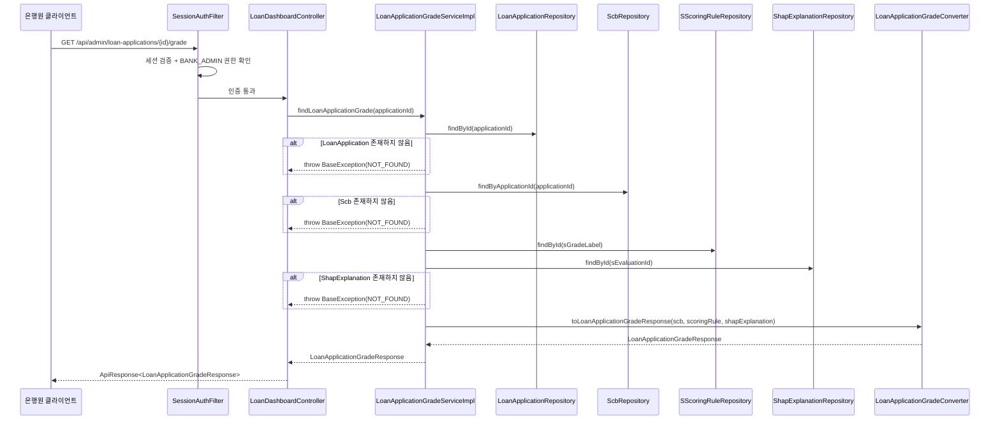
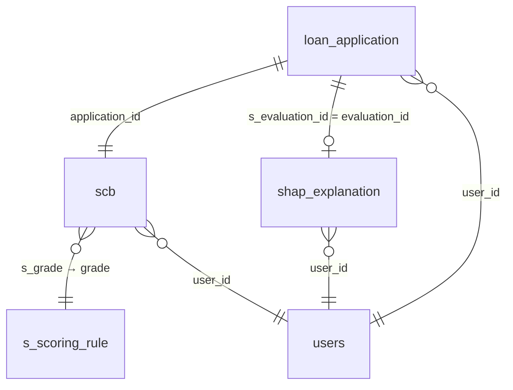

# Design Document: 대출 신청 상세보기 성장 S등급 탭 조회 API

## Overview

은행원(BANK_ADMIN)이 대출 신청 상세보기 화면의 성장 S등급 탭에서 CB 신용점수, SCB 점수, 성장 S등급, SHAP 기반 분석 결과를 조회하는 REST API를 설계한다. 기존 `LoanDashboardController`에 새 엔드포인트(`GET /api/admin/loan-applications/{applicationId}/grade`)를 추가하고, 비즈니스 로직은 별도의 `LoanApplicationGradeService`로 분리한다.

이 API는 applicationId로 LoanApplication을 식별한 후, Scb(CB/SCB 점수), SScoringRule(가산점), ShapExplanation(SHAP 분석 결과)을 조합하여 4개 섹션(cbScore, sGrade, scbInfo, shapResult)으로 구성된 응답을 반환한다.

### 설계 결정 사항

| 결정 | 근거 |
|------|------|
| Controller는 기존 `LoanDashboardController`에 추가 | 동일 리소스(`/api/admin/loan-applications`) 하위 엔드포인트이므로 REST 관점에서 자연스러움 |
| Service는 새로운 인터페이스+Impl로 분리 | 대시보드 목록 조회, 정보 탭, My Biz Data 탭과 책임이 다르므로 SRP 준수 |
| Converter는 새로운 클래스로 분리 | Scb+ShapExplanation → DTO 변환 로직이 기존 Converter와 무관한 DTO를 다룸 |
| Response DTO는 중첩 record로 구성 | cbScore, scbInfo, shapResult 각각이 독립적 섹션이므로 중첩 구조가 가독성 향상 |
| SHAP Details 파싱은 Converter의 static 메서드로 구현 | 순수 변환 로직이므로 Converter에 위치시켜 테스트 용이성 확보 |
| LinkedHashMap으로 SHAP Details 순서 유지 | 프론트엔드에서 원본 순서대로 표시해야 하므로 삽입 순서 보장 필요 |
| SHAP 점수 원본 데이터 그대로 전달 | 데이터 변환(반올림 등)은 프론트엔드의 책임이므로 백엔드는 원본 데이터를 전달 |
| Scb, SScoringRule 신규 엔티티 생성 | 기존에 없는 테이블이므로 신규 엔티티+Repository 필요 |

## Architecture



### 레이어 구조

```
sofit-admin/src/main/java/com/sofit/admin/domain/loan/
├── controller/
│   ├── LoanDashboardController.java        ← 엔드포인트 추가
│   └── LoanDashboardControllerDocs.java    ← Swagger 문서 추가
├── converter/
│   └── LoanApplicationGradeConverter.java  ← 신규 생성
├── dto/response/
│   └── LoanApplicationGradeResponse.java   ← 신규 생성
├── exception/
│   └── LoanDashboardSuccessCode.java       ← 성공 코드 추가
└── service/
    ├── LoanApplicationGradeService.java    ← 신규 생성 (인터페이스)
    └── LoanApplicationGradeServiceImpl.java ← 신규 생성 (구현체)

sofit-common/src/main/java/com/sofit/common/
├── entity/report/
│   ├── Scb.java                            ← 신규 생성
│   └── SScoringRule.java                   ← 신규 생성
└── repository/
    ├── ScbRepository.java                  ← 신규 생성
    └── SScoringRuleRepository.java         ← 신규 생성
```


## Components and Interfaces

### 1. Controller 확장

**파일**: `LoanDashboardController.java` (기존 파일에 메서드 추가)

```java
@GetMapping("/{applicationId}/grade")
@Override
public ApiResponse<LoanApplicationGradeResponse> findLoanApplicationGrade(
        @PathVariable Long applicationId) {
    LoanApplicationGradeResponse response = loanApplicationGradeService.findLoanApplicationGrade(applicationId);
    return ApiResponse.onSuccess(LoanDashboardSuccessCode.LOAN_APPLICATION_GRADE_OK, response);
}
```

**파일**: `LoanDashboardControllerDocs.java` (기존 파일에 메서드 추가)

```java
@Operation(
    summary = "대출 신청 상세 조회 (성장 S등급 탭)",
    description = "대출 신청 건의 성장 S등급 탭 데이터를 조회합니다. CB 신용점수, SCB 점수, 성장 S등급, SHAP 기반 분석 결과(강점/개선점 키워드, 피처별 SHAP 점수, AI 개선 조언)를 포함합니다."
)
@ApiResponses(value = {
    @io.swagger.v3.oas.annotations.responses.ApiResponse(responseCode = "200", description = "성장 S등급 탭 조회 성공"),
    @io.swagger.v3.oas.annotations.responses.ApiResponse(responseCode = "404", description = "대출 신청 건, SCB 정보 또는 SHAP 분석 결과를 찾을 수 없음")
})
ApiResponse<LoanApplicationGradeResponse> findLoanApplicationGrade(
    @Parameter(description = "대출 신청 ID", example = "1") Long applicationId
);
```

### 2. Service 인터페이스

**파일**: `LoanApplicationGradeService.java` (신규)

```java
package com.sofit.admin.domain.loan.service;

import com.sofit.admin.domain.loan.dto.response.LoanApplicationGradeResponse;

public interface LoanApplicationGradeService {
    LoanApplicationGradeResponse findLoanApplicationGrade(Long applicationId);
}
```

### 3. Service 구현체

**파일**: `LoanApplicationGradeServiceImpl.java` (신규)

```java
package com.sofit.admin.domain.loan.service;

import com.sofit.admin.domain.loan.converter.LoanApplicationGradeConverter;
import com.sofit.admin.domain.loan.dto.response.LoanApplicationGradeResponse;
import com.sofit.common.apiPayload.BaseException;
import com.sofit.common.apiPayload.code.GeneralErrorCode;
import com.sofit.common.entity.loan.LoanApplication;
import com.sofit.common.entity.sGrade.Scb;
import com.sofit.common.entity.sGrade.SScoringRule;
import com.sofit.common.entity.sGrade.ShapExplanation;
import com.sofit.common.entity.sGrade.enums.SGrade;
import com.sofit.common.repository.loan.LoanApplicationRepository;
import com.sofit.common.repository.sGrade.ScbRepository;
import com.sofit.common.repository.sGrade.SScoringRuleRepository;
import com.sofit.common.repository.sGrade.ShapExplanationRepository;
import lombok.RequiredArgsConstructor;
import org.springframework.stereotype.Service;
import org.springframework.transaction.annotation.Transactional;

@Service
@RequiredArgsConstructor
@Transactional(readOnly = true)
public class LoanApplicationGradeServiceImpl implements LoanApplicationGradeService {

    private final LoanApplicationRepository loanApplicationRepository;
    private final ScbRepository scbRepository;
    private final SScoringRuleRepository sScoringRuleRepository;
    private final ShapExplanationRepository shapExplanationRepository;

    @Override
    public LoanApplicationGradeResponse findLoanApplicationGrade(Long applicationId) {
        // 1. LoanApplication 조회
        LoanApplication app = loanApplicationRepository.findById(applicationId)
                .orElseThrow(() -> new BaseException(GeneralErrorCode.NOT_FOUND));

        // 2. Scb 조회 (application_id로)
        Scb scb = scbRepository.findByApplicationId(applicationId)
                .orElseThrow(() -> new BaseException(GeneralErrorCode.NOT_FOUND));

        // 3. s_grade → SGrade label 변환 → SScoringRule 조회
        SGrade sGrade = convertToSGrade(scb.getSGrade());
        SScoringRule scoringRule = sScoringRuleRepository.findById(sGrade.getLabel())
                .orElseThrow(() -> new BaseException(GeneralErrorCode.NOT_FOUND));

        // 4. ShapExplanation 조회 (s_evaluation_id로)
        Long sEvaluationId = app.getSEvaluationId();
        if (sEvaluationId == null) {
            throw new BaseException(GeneralErrorCode.NOT_FOUND);
        }
        ShapExplanation shapExplanation = shapExplanationRepository.findById(sEvaluationId)
                .orElseThrow(() -> new BaseException(GeneralErrorCode.NOT_FOUND));

        // 5. Converter로 DTO 변환
        return LoanApplicationGradeConverter.toLoanApplicationGradeResponse(
                scb, sGrade, scoringRule, shapExplanation);
    }

    private SGrade convertToSGrade(Integer sGradeValue) {
        if (sGradeValue == null || sGradeValue < 1 || sGradeValue > 10) {
            throw new BaseException(GeneralErrorCode.NOT_FOUND);
        }
        return SGrade.values()[sGradeValue - 1];
    }
}
```

### 4. Converter

**파일**: `LoanApplicationGradeConverter.java` (신규)

```java
package com.sofit.admin.domain.loan.converter;

import com.sofit.admin.domain.loan.dto.response.LoanApplicationGradeResponse;
import com.sofit.common.entity.sGrade.Scb;
import com.sofit.common.entity.sGrade.SScoringRule;
import com.sofit.common.entity.sGrade.ShapExplanation;
import com.sofit.common.entity.sGrade.enums.SGrade;

import java.util.Collections;
import java.util.LinkedHashMap;
import java.util.List;
import java.util.Map;

public class LoanApplicationGradeConverter {

    private static final int MAX_SCORE = 1000;

    private LoanApplicationGradeConverter() {
    }

    public static LoanApplicationGradeResponse toLoanApplicationGradeResponse(
            Scb scb, SGrade sGrade, SScoringRule scoringRule, ShapExplanation shapExplanation) {

        // cbScore 섹션
        LoanApplicationGradeResponse.CbScoreInfo cbScore =
                new LoanApplicationGradeResponse.CbScoreInfo(scb.getCbGrade(), MAX_SCORE);

        // scbInfo 섹션
        LoanApplicationGradeResponse.ScbInfo scbInfo =
                new LoanApplicationGradeResponse.ScbInfo(
                        scb.getScbGrade(), MAX_SCORE, scoringRule.getScoreAddition());

        // shapResult 섹션
        LoanApplicationGradeResponse.ShapResult shapResult =
                new LoanApplicationGradeResponse.ShapResult(
                        shapExplanation.getSGrade().getLabel(),
                        shapExplanation.getTargetGrade() != null
                                ? shapExplanation.getTargetGrade().getLabel() : null,
                        shapExplanation.getStrengthKeywords() != null
                                ? shapExplanation.getStrengthKeywords() : Collections.emptyList(),
                        shapExplanation.getImprovementKeywords() != null
                                ? shapExplanation.getImprovementKeywords() : Collections.emptyList(),
                        parseShapDetails(shapExplanation.getStrengthDetails()),
                        parseShapDetails(shapExplanation.getImprovementDetails()),
                        shapExplanation.getAdvice());

        return new LoanApplicationGradeResponse(cbScore, sGrade.getLabel(), scbInfo, shapResult);
    }

    /**
     * "피처명:SHAP점수" 형식의 List<String>을 Map<String, Double>로 변환한다.
     * - 콜론(:)으로 분리하여 키는 피처명, 값은 SHAP 점수(Double)
     * - 원본 데이터를 반올림 없이 그대로 전달
     * - LinkedHashMap으로 원본 순서 유지
     * - 파싱 실패 원소는 건너뜀
     */
    public static Map<String, Double> parseShapDetails(List<String> details) {
        if (details == null || details.isEmpty()) {
            return Collections.emptyMap();
        }

        Map<String, Double> result = new LinkedHashMap<>();
        for (String entry : details) {
            if (entry == null || !entry.contains(":")) {
                continue;
            }
            int colonIndex = entry.indexOf(":");
            String featureName = entry.substring(0, colonIndex);
            String scoreStr = entry.substring(colonIndex + 1);
            try {
                Double score = Double.parseDouble(scoreStr.trim());
                result.put(featureName, score);
            } catch (NumberFormatException e) {
                // 파싱 실패 시 건너뜀
            }
        }
        return result;
    }
}
```

### 5. SuccessCode 추가

**파일**: `LoanDashboardSuccessCode.java` (기존 파일에 enum 값 추가)

```java
LOAN_APPLICATION_GRADE_OK(HttpStatus.OK, "LOAN2005", "성장 S등급 탭 조회에 성공했습니다.");
```

### 6. Repository (신규)

**파일**: `ScbRepository.java` (신규)

```java
package com.sofit.common.repository;

import com.sofit.common.entity.sGrade.Scb;
import org.springframework.data.jpa.repository.JpaRepository;

import java.util.Optional;

public interface ScbRepository extends JpaRepository<Scb, Long> {

    Optional<Scb> findByApplicationId(Long applicationId);
}
```

**파일**: `SScoringRuleRepository.java` (신규)

```java
package com.sofit.common.repository;

import com.sofit.common.entity.sGrade.SScoringRule;
import org.springframework.data.jpa.repository.JpaRepository;

public interface SScoringRuleRepository extends JpaRepository<SScoringRule, String> {
}
```


## Data Models

### Response DTO

**파일**: `LoanApplicationGradeResponse.java` (신규)

```java
package com.sofit.admin.domain.loan.dto.response;

import java.util.List;
import java.util.Map;

public record LoanApplicationGradeResponse(
        CbScoreInfo cbScore,
        String sGrade,
        ScbInfo scbInfo,
        ShapResult shapResult
) {
    public record CbScoreInfo(
            Integer score,
            Integer maxScore
    ) {}

    public record ScbInfo(
            Integer score,
            Integer maxScore,
            Integer bonusPoints
    ) {}

    public record ShapResult(
            String grade,
            String targetGrade,
            List<String> strengthKeywords,
            List<String> improvementKeywords,
            Map<String, Double> strengthDetails,
            Map<String, Double> improvementDetails,
            String advice
    ) {}
}
```

### 신규 엔티티

**파일**: `Scb.java` (신규)

```java
package com.sofit.common.entity.sGrade;

import com.sofit.common.entity.BaseEntity;
import com.sofit.common.entity.user.User;
import jakarta.persistence.*;
import lombok.AccessLevel;
import lombok.Getter;
import lombok.NoArgsConstructor;

@Entity
@Table(name = "scb")
@Getter
@NoArgsConstructor(access = AccessLevel.PROTECTED)
public class Scb extends BaseEntity {

    @Id
    @GeneratedValue(strategy = GenerationType.IDENTITY)
    @Column(name = "scb_id")
    private Long scbId;

    @ManyToOne(fetch = FetchType.LAZY)
    @JoinColumn(name = "user_id", nullable = false)
    private User user;

    @Column(name = "application_id", nullable = false)
    private Long applicationId;

    @Column(name = "cb_grade")
    private Integer cbGrade;

    @Column(name = "s_grade")
    private Integer sGrade;

    @Column(name = "score_addition")
    private Integer scoreAddition;

    @Column(name = "scb_grade")
    private Integer scbGrade;
}
```

**파일**: `SScoringRule.java` (신규)

```java
package com.sofit.common.entity.sGrade;

import jakarta.persistence.*;
import lombok.AccessLevel;
import lombok.Getter;
import lombok.NoArgsConstructor;

@Entity
@Table(name = "s_scoring_rule")
@Getter
@NoArgsConstructor(access = AccessLevel.PROTECTED)
public class SScoringRule {

    @Id
    @Column(name = "grade")
    private String grade;

    @Column(name = "score_addition")
    private Integer scoreAddition;

    @Column(name = "description")
    private String description;
}
```

### 엔티티-DTO 매핑 관계

| 응답 필드 | 소스 | 타입 | 변환 로직 |
|-----------|------|------|-----------|
| cbScore.score | Scb.cbGrade | Integer | 그대로 (null 가능) |
| cbScore.maxScore | 고정값 | Integer | 1000 |
| sGrade | Scb.sGrade → SGrade.label | String | 정수(1~10) → SGrade enum → label("S1"~"S10") |
| scbInfo.score | Scb.scbGrade | Integer | 그대로 |
| scbInfo.maxScore | 고정값 | Integer | 1000 |
| scbInfo.bonusPoints | SScoringRule.scoreAddition | Integer | Scb.sGrade → SGrade label → SScoringRule 조회 |
| shapResult.grade | ShapExplanation.sGrade | String | SGrade enum → label |
| shapResult.targetGrade | ShapExplanation.targetGrade | String | SGrade enum → label (null 가능) |
| shapResult.strengthKeywords | ShapExplanation.strengthKeywords | List\<String\> | 그대로 (null → 빈 배열) |
| shapResult.improvementKeywords | ShapExplanation.improvementKeywords | List\<String\> | 그대로 (null → 빈 배열) |
| shapResult.strengthDetails | ShapExplanation.strengthDetails | Map\<String, Double\> | "피처명:점수" 파싱, 원본 값 그대로 전달, LinkedHashMap |
| shapResult.improvementDetails | ShapExplanation.improvementDetails | Map\<String, Double\> | "피처명:점수" 파싱, 원본 값 그대로 전달, LinkedHashMap |
| shapResult.advice | ShapExplanation.advice | String | 그대로 |

### 필드 매핑 상세: SHAP Details 변환 규칙

```
입력: List<String> ["매출성장률:0.345518123", "현금흐름:-0.247369456", "invalid_entry"]
                                    ↓
처리: 1) 콜론(:)으로 분리
      2) 뒷부분을 Double로 파싱 (원본 값 그대로)
      3) LinkedHashMap에 순서대로 삽입
      4) 파싱 실패 원소("invalid_entry")는 건너뜀
                                    ↓
출력: LinkedHashMap {"매출성장률": 0.345518123, "현금흐름": -0.247369456}
```

### 관련 테이블 관계




## Correctness Properties

*A property is a characteristic or behavior that should hold true across all valid executions of a system—essentially, a formal statement about what the system should do. Properties serve as the bridge between human-readable specifications and machine-verifiable correctness guarantees.*

### Property 1: Converter 전체 필드 매핑 정확성

*For any* 유효한 Scb 엔티티(cbGrade: 0~1000 또는 null, sGrade: 1~10, scbGrade: 0~1000), 유효한 SGrade enum, 유효한 SScoringRule(scoreAddition: 0 이상 정수), 유효한 ShapExplanation(sGrade, targetGrade, strengthKeywords, improvementKeywords, strengthDetails, improvementDetails, advice)에 대해, `LoanApplicationGradeConverter.toLoanApplicationGradeResponse(scb, sGrade, scoringRule, shapExplanation)`의 결과는 다음을 만족해야 한다:
- `cbScore.score`가 Scb의 `cbGrade`와 동일 (null이면 null)
- `cbScore.maxScore`가 1000
- `sGrade`가 SGrade의 `label`과 동일
- `scbInfo.score`가 Scb의 `scbGrade`와 동일
- `scbInfo.maxScore`가 1000
- `scbInfo.bonusPoints`가 SScoringRule의 `scoreAddition`과 동일
- `shapResult.grade`가 ShapExplanation의 `sGrade.getLabel()`과 동일
- `shapResult.targetGrade`가 ShapExplanation의 `targetGrade.getLabel()`과 동일 (null이면 null)
- `shapResult.strengthKeywords`가 ShapExplanation의 `strengthKeywords`와 동일 (null이면 빈 리스트)
- `shapResult.improvementKeywords`가 ShapExplanation의 `improvementKeywords`와 동일 (null이면 빈 리스트)
- `shapResult.advice`가 ShapExplanation의 `advice`와 동일

**Validates: Requirements 2.1, 2.2, 2.3, 3.1, 4.1, 4.2, 4.3, 4.4, 5.2, 5.3, 5.5, 5.6**

### Property 2: SHAP Details 파싱 라운드트립

*For any* 유효한 "피처명:SHAP점수" 형식의 문자열 리스트(피처명은 비어있지 않은 문자열, SHAP점수는 유효한 실수)에 대해, `LoanApplicationGradeConverter.parseShapDetails(list)`의 결과는 다음을 만족해야 한다:
- 결과 Map의 크기가 입력 리스트의 크기와 동일
- 결과 Map의 키 순서가 입력 리스트의 원소 순서와 동일 (LinkedHashMap)
- 각 키가 콜론 앞부분(피처명)과 동일
- 각 값이 콜론 뒷부분을 Double로 파싱한 원본 값과 동일

**Validates: Requirements 5.4, 8.1, 8.2, 8.3, 8.4**

### Property 3: SHAP Details 파싱 내결함성

*For any* 유효한 원소와 무효한 원소(콜론 미포함, 숫자 파싱 불가)가 혼합된 문자열 리스트에 대해, `LoanApplicationGradeConverter.parseShapDetails(list)`의 결과는 다음을 만족해야 한다:
- 결과 Map에는 유효한 원소만 포함
- 무효한 원소는 결과에서 제외
- 유효한 원소들의 상대적 순서가 원본 리스트에서의 순서와 동일

**Validates: Requirements 5.8, 8.5**

## Error Handling

| 상황 | HTTP 상태 | 에러 코드 | 메시지 | 처리 위치 |
|------|-----------|-----------|--------|-----------|
| 세션 없음/만료 | 401 | COMMON4001 | 인증이 필요합니다. | SessionAuthFilter (Spring Security) |
| BANK_ADMIN 권한 없음 | 403 | COMMON4003 | 권한이 없습니다. | Spring Security |
| applicationId 형식 오류 | 400 | COMMON4000 | 잘못된 요청입니다. | GlobalExceptionHandler (MethodArgumentTypeMismatchException) |
| LoanApplication 미존재 | 404 | COMMON4004 | 요청한 리소스를 찾을 수 없습니다. | LoanApplicationGradeServiceImpl |
| Scb 미존재 | 404 | COMMON4004 | 요청한 리소스를 찾을 수 없습니다. | LoanApplicationGradeServiceImpl |
| s_grade 범위 밖 (1~10 외) | 404 | COMMON4004 | 요청한 리소스를 찾을 수 없습니다. | LoanApplicationGradeServiceImpl |
| SScoringRule 미존재 | 404 | COMMON4004 | 요청한 리소스를 찾을 수 없습니다. | LoanApplicationGradeServiceImpl |
| s_evaluation_id null | 404 | COMMON4004 | 요청한 리소스를 찾을 수 없습니다. | LoanApplicationGradeServiceImpl |
| ShapExplanation 미존재 | 404 | COMMON4004 | 요청한 리소스를 찾을 수 없습니다. | LoanApplicationGradeServiceImpl |
| 서버 내부 오류 | 500 | COMMON5000 | 서버 에러, 관리자에게 문의 바랍니다. | GlobalExceptionHandler |

### 에러 처리 흐름

1. **인증/권한**: Spring Security 필터 체인에서 비즈니스 로직 진입 전에 처리 (401 → 403 순서)
2. **Path Variable 타입 오류**: Spring MVC의 타입 변환 실패 → `GlobalExceptionHandler`에서 400 응답으로 일괄 처리
3. **비즈니스 예외**: `BaseException(GeneralErrorCode.NOT_FOUND)` throw → `GlobalExceptionHandler`에서 `ApiResponse.onFailure()` 반환

### 에러 처리 우선순위

```
인증 검증 (401) → 권한 검증 (403) → applicationId 형식 검증 (400)
→ LoanApplication 존재 검증 (404) → Scb 존재 검증 (404)
→ s_grade 유효성 검증 (404) → ShapExplanation 존재 검증 (404)
```

## Testing Strategy

### 단위 테스트 (JUnit 5 + Mockito)

| 테스트 대상 | 테스트 항목 |
|------------|------------|
| LoanApplicationGradeServiceImpl | applicationId로 정상 조회 시 4개 섹션 포함 응답 반환 |
| LoanApplicationGradeServiceImpl | 존재하지 않는 applicationId → BaseException(NOT_FOUND) |
| LoanApplicationGradeServiceImpl | Scb 미존재 → BaseException(NOT_FOUND) |
| LoanApplicationGradeServiceImpl | s_grade 범위 밖 → BaseException(NOT_FOUND) |
| LoanApplicationGradeServiceImpl | s_evaluation_id null → BaseException(NOT_FOUND) |
| LoanApplicationGradeServiceImpl | ShapExplanation 미존재 → BaseException(NOT_FOUND) |
| LoanApplicationGradeConverter | 정상 데이터 → 전체 필드 변환 정확성 |
| LoanApplicationGradeConverter | cbGrade null → cbScore.score null, maxScore 1000 유지 |
| LoanApplicationGradeConverter | targetGrade null → shapResult.targetGrade null |
| LoanApplicationGradeConverter | keywords null → 빈 배열 반환 |
| LoanApplicationGradeConverter | details 빈 리스트 → 빈 Map 반환 |
| LoanApplicationGradeConverter | parseShapDetails 정상 파싱 + 원본 값 그대로 전달 |
| LoanApplicationGradeConverter | parseShapDetails 무효 원소 건너뛰기 |
| LoanApplicationGradeConverter | parseShapDetails LinkedHashMap 순서 유지 |

### Property-Based 테스트 (JUnit 5 + jqwik)

Property-based testing 라이브러리로 **jqwik**을 사용한다. 각 property 테스트는 최소 100회 반복 실행한다.

| Property | 테스트 내용 |
|----------|------------|
| Property 1 | 임의의 Scb, SGrade, SScoringRule, ShapExplanation에 대해 toLoanApplicationGradeResponse 변환 결과가 원본 필드와 일치 |
| Property 2 | 임의의 유효한 "피처명:SHAP점수" 리스트에 대해 parseShapDetails 결과가 올바른 Map으로 변환 (크기, 순서, 원본 값 유지) |
| Property 3 | 유효/무효 원소 혼합 리스트에 대해 parseShapDetails 결과에 유효 원소만 포함, 순서 유지 |

각 property 테스트에는 다음 형식의 태그를 주석으로 포함한다:
```
// Feature: loan-application-grade, Property {number}: {property_text}
```

### 통합 테스트 (MockMvc)

| 테스트 항목 | 검증 내용 |
|------------|-----------|
| 정상 조회 E2E | 인증된 BANK_ADMIN으로 유효한 applicationId 요청 → 200 + 전체 응답 구조 확인 |
| 인증 실패 | 세션 없이 요청 → 401 |
| 권한 부족 | USER 역할로 요청 → 403 |
| 잘못된 applicationId 형식 | 문자열 applicationId → 400 |
| 존재하지 않는 applicationId | 없는 ID → 404 |
| Scb 미존재 | 유효한 applicationId이나 Scb 없음 → 404 |
| ShapExplanation 미존재 | s_evaluation_id null 또는 ShapExplanation 없음 → 404 |
