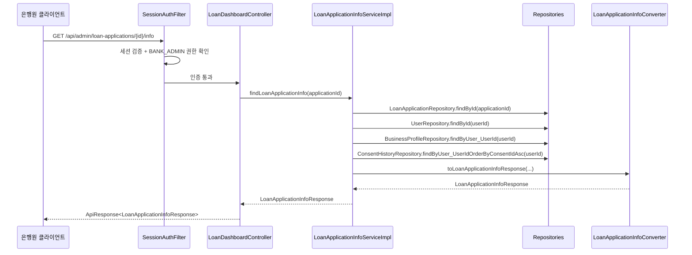

# Design Document: 대출 신청 상세보기 정보 탭 API

## Overview

은행원(BANK_ADMIN)이 대출 신청 건의 정보 탭을 조회하는 REST API를 설계한다. 기존 `LoanDashboardController`에 새 엔드포인트(`GET /api/admin/loan-applications/{applicationId}/info`)를 추가하고, 비즈니스 로직은 별도의 `LoanApplicationInfoService`로 분리하여 책임을 명확히 한다.

이 API는 단일 요청으로 5개 섹션(applicantInfo, businessInfo, applicationInfo, userInputInfo, consentHistories)을 조합하여 반환하며, 은행원이 심사 처리 시 신청 건의 전체 맥락을 한 화면에서 파악할 수 있도록 한다.

### 설계 결정 사항

| 결정 | 근거 |
|------|------|
| Controller는 기존 `LoanDashboardController`에 추가 | 동일 리소스(`/api/admin/loan-applications`) 하위 엔드포인트이므로 REST 관점에서 자연스러움 |
| Service는 새로운 인터페이스+Impl로 분리 | 대시보드 목록 조회와 정보 탭 조회는 책임이 다르므로 SRP 준수 |
| Converter는 새로운 클래스로 분리 | 변환 로직이 복잡하고 기존 Converter와 무관한 DTO를 다룸 |
| Response DTO는 중첩 record로 구성 | 5개 섹션을 하나의 응답으로 묶되, 각 섹션의 구조를 명확히 표현 |
| BusinessProfile은 항상 존재한다고 가정 | 대출 신청 자체가 BusinessProfile 존재를 전제로 하므로 null 방어 불필요 |

## Architecture



### 레이어 구조

```
Controller Layer (LoanDashboardController)
    ↓ 위임
Service Layer (LoanApplicationInfoService / Impl)
    ↓ 조회
Repository Layer (LoanApplicationRepository, UserRepository, BusinessProfileRepository, ConsentHistoryRepository)
    ↓ 변환
Converter Layer (LoanApplicationInfoConverter)
    ↓ 반환
DTO Layer (LoanApplicationInfoResponse)
```

## Components and Interfaces

### 1. Controller 확장

**파일**: `LoanDashboardController.java` (기존 파일에 메서드 추가)

```java
@GetMapping("/{applicationId}/info")
@Override
public ApiResponse<LoanApplicationInfoResponse> findLoanApplicationInfo(
        @PathVariable Long applicationId) {
    LoanApplicationInfoResponse response = loanApplicationInfoService.findLoanApplicationInfo(applicationId);
    return ApiResponse.onSuccess(LoanDashboardSuccessCode.LOAN_APPLICATION_INFO_OK, response);
}
```

**파일**: `LoanDashboardControllerDocs.java` (기존 파일에 메서드 추가)

```java
@Operation(
    summary = "대출 신청 상세 조회 (정보 탭)",
    description = "대출 신청 건의 정보 탭 데이터를 조회합니다. 신청자 정보, 사업자 정보, 대출 신청 정보, 고객 입력 정보, 약관 동의 이력을 포함합니다."
)
@ApiResponses(value = {
    @io.swagger.v3.oas.annotations.responses.ApiResponse(responseCode = "200", description = "정보 탭 조회 성공"),
    @io.swagger.v3.oas.annotations.responses.ApiResponse(responseCode = "404", description = "대출 신청 건을 찾을 수 없음")
})
ApiResponse<LoanApplicationInfoResponse> findLoanApplicationInfo(
    @Parameter(description = "대출 신청 ID", example = "1") Long applicationId
);
```

### 2. Service 인터페이스

**파일**: `LoanApplicationInfoService.java` (신규)

```java
package com.sofit.admin.domain.loan.service;

import com.sofit.admin.domain.loan.dto.response.LoanApplicationInfoResponse;

public interface LoanApplicationInfoService {
    LoanApplicationInfoResponse findLoanApplicationInfo(Long applicationId);
}
```

### 3. Service 구현체

**파일**: `LoanApplicationInfoServiceImpl.java` (신규)

```java
package com.sofit.admin.domain.loan.service;

@Service
@RequiredArgsConstructor
@Transactional(readOnly = true)
public class LoanApplicationInfoServiceImpl implements LoanApplicationInfoService {

    private final LoanApplicationRepository loanApplicationRepository;
    private final UserRepository userRepository;
    private final BusinessProfileRepository businessProfileRepository;
    private final ConsentHistoryRepository consentHistoryRepository;

    @Override
    public LoanApplicationInfoResponse findLoanApplicationInfo(Long applicationId) {
        // 1. LoanApplication 조회
        LoanApplication app = loanApplicationRepository.findById(applicationId)
                .orElseThrow(() -> new BaseException(GeneralErrorCode.NOT_FOUND));

        Long userId = app.getUser().getUserId();

        // 2. User 조회
        User user = userRepository.findById(userId)
                .orElseThrow(() -> new BaseException(GeneralErrorCode.NOT_FOUND));

        // 3. BusinessProfile 조회 (대출 신청 시 필수이므로 반드시 존재)
        BusinessProfile businessProfile = businessProfileRepository.findByUser_UserId(userId)
                .orElseThrow(() -> new BaseException(GeneralErrorCode.NOT_FOUND));

        // 4. ConsentHistory 조회 (consent_id 오름차순)
        List<ConsentHistory> consentHistories = consentHistoryRepository
                .findByUser_UserIdOrderByConsentIdAsc(userId);

        // 5. Converter로 DTO 변환
        return LoanApplicationInfoConverter.toLoanApplicationInfoResponse(
                user, businessProfile, app, consentHistories);
    }
}
```

### 4. Converter

**파일**: `LoanApplicationInfoConverter.java` (신규)

```java
package com.sofit.admin.domain.loan.converter;

public class LoanApplicationInfoConverter {

    private LoanApplicationInfoConverter() {}

    public static LoanApplicationInfoResponse toLoanApplicationInfoResponse(
            User user,
            BusinessProfile businessProfile,
            LoanApplication app,
            List<ConsentHistory> consentHistories) {

        return new LoanApplicationInfoResponse(
                toApplicantInfo(user),
                toBusinessInfo(businessProfile),
                toApplicationInfo(app),
                toUserInputInfo(app),
                toConsentHistories(consentHistories)
        );
    }

    public static LoanApplicationInfoResponse.ApplicantInfo toApplicantInfo(User user) {
        return new LoanApplicationInfoResponse.ApplicantInfo(
                user.getName(),
                user.getResidentNumber(),
                user.getPhoneNumber(),
                user.getCreatedAt(),  // joinedAt = User의 createdAt
                user.getLoginId()
        );
    }

    public static LoanApplicationInfoResponse.BusinessInfo toBusinessInfo(BusinessProfile bp) {
        return new LoanApplicationInfoResponse.BusinessInfo(
                bp.getBusinessName(),
                bp.getBusinessNumber(),
                bp.getBusinessCategory(),
                bp.getBusinessType(),
                bp.getBusinessAddress(),
                bp.getOpenDate()
        );
    }

    public static LoanApplicationInfoResponse.ApplicationInfo toApplicationInfo(LoanApplication app) {
        return new LoanApplicationInfoResponse.ApplicationInfo(
                app.getRequestedAmount(),
                app.getRequestedTerm(),
                app.getPurpose() != null ? app.getPurpose().name() : null,
                app.getRepaymentMethod() != null ? app.getRepaymentMethod().name() : null
        );
    }

    public static LoanApplicationInfoResponse.UserInputInfo toUserInputInfo(LoanApplication app) {
        return new LoanApplicationInfoResponse.UserInputInfo(
                app.getUserInputAnnualIncome() != null ? app.getUserInputAnnualIncome().name() : null,
                app.getUserInputCreditScore() != null ? app.getUserInputCreditScore().name() : null,
                app.getUserInputIncomeType() != null ? app.getUserInputIncomeType().getCode() : null,
                app.getUserInputExistingLoanAmt() != null ? app.getUserInputExistingLoanAmt().name() : null
        );
    }

    public static List<LoanApplicationInfoResponse.ConsentHistoryItem> toConsentHistories(
            List<ConsentHistory> consentHistories) {
        if (consentHistories == null || consentHistories.isEmpty()) {
            return List.of();
        }
        return consentHistories.stream()
                .map(LoanApplicationInfoConverter::toConsentHistoryItem)
                .toList();
    }

    public static LoanApplicationInfoResponse.ConsentHistoryItem toConsentHistoryItem(ConsentHistory ch) {
        return new LoanApplicationInfoResponse.ConsentHistoryItem(
                ch.getTerm().getTitle(),
                ch.getTerm().getIsRequired(),
                ch.getIsConsented(),
                ch.getIsConsented() ? ch.getConsentedAt() : null
        );
    }
}
```

### 5. SuccessCode 추가

**파일**: `LoanDashboardSuccessCode.java` (기존 파일에 enum 값 추가)

```java
LOAN_APPLICATION_INFO_OK(HttpStatus.OK, "LOAN2003", "대출 신청 정보 탭 조회에 성공했습니다.");
```

### 6. Repository 메서드 추가

**파일**: `ConsentHistoryRepository.java` (기존 파일에 메서드 추가)

```java
List<ConsentHistory> findByUser_UserIdOrderByConsentIdAsc(Long userId);
```

## Data Models

### Response DTO

**파일**: `LoanApplicationInfoResponse.java` (신규)

```java
package com.sofit.admin.domain.loan.dto.response;

import java.time.LocalDate;
import java.time.LocalDateTime;
import java.util.List;

public record LoanApplicationInfoResponse(
        ApplicantInfo applicantInfo,
        BusinessInfo businessInfo,
        ApplicationInfo applicationInfo,
        UserInputInfo userInputInfo,
        List<ConsentHistoryItem> consentHistories
) {
    public record ApplicantInfo(
            String name,
            String residentNumber,
            String phoneNumber,
            LocalDateTime joinedAt,
            String loginId
    ) {}

    public record BusinessInfo(
            String businessName,
            String businessNumber,
            String businessCategory,
            String businessType,
            String businessAddress,
            LocalDate openDate
    ) {}

    public record ApplicationInfo(
            Long requestedAmount,
            Integer requestedTerm,
            String purpose,
            String repaymentMethod
    ) {}

    public record UserInputInfo(
            String annualIncome,
            String creditScore,
            String incomeType,
            String existingLoanAmount
    ) {}

    public record ConsentHistoryItem(
            String title,
            Boolean isRequired,
            Boolean isConsented,
            LocalDateTime consentedAt
    ) {}
}
```

### 엔티티-DTO 매핑 관계

| 섹션 | 소스 엔티티 | JOIN 조건 |
|------|------------|-----------|
| applicantInfo | User | LoanApplication.user_id → User.user_id |
| businessInfo | BusinessProfile | LoanApplication.user_id → BusinessProfile.user_id |
| applicationInfo | LoanApplication | applicationId로 직접 조회 |
| userInputInfo | LoanApplication | applicationId로 직접 조회 |
| consentHistories | ConsentHistory + Term | LoanApplication.user_id → ConsentHistory.user_id, ConsentHistory.term_id → Term.term_id |

### 필드 매핑 상세

| 응답 필드 | 엔티티 필드 | 변환 로직 |
|-----------|------------|-----------|
| applicantInfo.name | User.name | 그대로 |
| applicantInfo.residentNumber | User.residentNumber | 그대로 (7자리) |
| applicantInfo.phoneNumber | User.phoneNumber | 그대로 (하이픈 없음) |
| applicantInfo.joinedAt | User.createdAt (BaseEntity) | LocalDateTime → ISO 8601 |
| applicantInfo.loginId | User.loginId | 그대로 |
| businessInfo.openDate | BusinessProfile.openDate | LocalDate → ISO 8601 날짜 |
| userInputInfo.annualIncome | LoanApplication.userInputAnnualIncome | ENUM.name() |
| userInputInfo.creditScore | LoanApplication.userInputCreditScore | ENUM.name() |
| userInputInfo.incomeType | LoanApplication.userInputIncomeType | ENUM.getCode() |
| userInputInfo.existingLoanAmount | LoanApplication.userInputExistingLoanAmt | ENUM.name() |
| consentHistories[].title | Term.title | 그대로 |
| consentHistories[].isRequired | Term.isRequired | 그대로 |
| consentHistories[].isConsented | ConsentHistory.isConsented | 그대로 |
| consentHistories[].consentedAt | ConsentHistory.consentedAt | isConsented=false이면 null |

## Correctness Properties

*A property is a characteristic or behavior that should hold true across all valid executions of a system—essentially, a formal statement about what the system should do. Properties serve as the bridge between human-readable specifications and machine-verifiable correctness guarantees.*

### Property 1: applicantInfo 변환 정확성

*For any* User 엔티티에 대해, `LoanApplicationInfoConverter.toApplicantInfo(user)`의 결과는 name, residentNumber, phoneNumber, joinedAt(createdAt), loginId 5개 필드를 모두 포함하며, 각 필드 값이 원본 User 엔티티의 대응 필드 값과 동일해야 한다.

**Validates: Requirements 2.1, 2.2**

### Property 2: businessInfo 변환 정확성

*For any* BusinessProfile 엔티티에 대해, `LoanApplicationInfoConverter.toBusinessInfo(bp)`의 결과는 businessName, businessNumber, businessCategory, businessType, businessAddress, openDate 6개 필드를 포함하며, 각 필드 값이 원본 BusinessProfile 엔티티의 대응 필드 값과 동일해야 한다.

**Validates: Requirements 3.1, 3.2**

### Property 3: applicationInfo 변환 정확성

*For any* LoanApplication 엔티티에 대해, `LoanApplicationInfoConverter.toApplicationInfo(app)`의 결과는 requestedAmount, requestedTerm 값이 원본과 동일하고, purpose는 `LoanPurpose.name()`, repaymentMethod는 `RepaymentMethod.name()` 값과 동일해야 한다.

**Validates: Requirements 4.1, 4.2, 4.3**

### Property 4: userInputInfo 변환 정확성 (incomeType code 변환 포함)

*For any* LoanApplication 엔티티에 대해, `LoanApplicationInfoConverter.toUserInputInfo(app)`의 결과는 annualIncome이 `AnnualIncome.name()`, creditScore가 `CreditScoreRange.name()`, incomeType이 `IncomeType.getCode()`, existingLoanAmount가 `ExistingLoanAmount.name()` 값과 동일해야 한다.

**Validates: Requirements 5.1, 5.2, 5.3, 5.4, 5.5**

### Property 5: consentHistories 변환 정확성

*For any* ConsentHistory + Term 조합 목록에 대해, `LoanApplicationInfoConverter.toConsentHistories(list)`의 결과는 각 항목이 title(Term.title), isRequired(Term.isRequired), isConsented(ConsentHistory.isConsented), consentedAt 4개 필드를 포함하며, 원본 데이터와 일치해야 한다.

**Validates: Requirements 6.1, 6.2**

### Property 6: 미동의 시 consentedAt null 처리

*For any* ConsentHistory에서 isConsented가 false인 경우, 변환 결과의 consentedAt 필드는 반드시 null이어야 한다.

**Validates: Requirements 6.3**

### Property 7: consentHistories 정렬 보장

*For any* ConsentHistory 목록에 대해, 변환 결과의 consentHistories 배열은 consent_id 오름차순으로 정렬되어 있어야 한다.

**Validates: Requirements 6.6**

### Property 8: 날짜/시간 ISO 8601 포맷팅

*For any* LocalDateTime 또는 LocalDate 값에 대해, JSON 직렬화 결과는 각각 `yyyy-MM-ddTHH:mm:ss` 또는 `yyyy-MM-dd` ISO 8601 형식을 따라야 한다.

**Validates: Requirements 2.3, 3.3, 6.4**

## Error Handling

| 상황 | HTTP 상태 | 에러 코드 | 메시지 | 처리 위치 |
|------|-----------|-----------|--------|-----------|
| 세션 없음/만료 | 401 | COMMON4001 | 인증이 필요합니다. | SessionAuthFilter (Spring Security) |
| BANK_ADMIN 권한 없음 | 403 | COMMON4003 | 권한이 없습니다. | Spring Security |
| applicationId 형식 오류 | 400 | COMMON4000 | 잘못된 요청입니다. | GlobalExceptionHandler (MethodArgumentTypeMismatchException) |
| LoanApplication 미존재 | 404 | COMMON4004 | 요청한 리소스를 찾을 수 없습니다. | LoanApplicationInfoServiceImpl |
| User 미존재 | 404 | COMMON4004 | 요청한 리소스를 찾을 수 없습니다. | LoanApplicationInfoServiceImpl |
| BusinessProfile 미존재 | 404 | COMMON4004 | 요청한 리소스를 찾을 수 없습니다. | LoanApplicationInfoServiceImpl (대출 신청 시 필수이므로 정상적으로는 발생하지 않음) |
| ConsentHistory 0건 | - | - | consentHistories를 빈 배열로 반환 (에러 아님) | LoanApplicationInfoConverter |
| 서버 내부 오류 | 500 | COMMON5000 | 서버 에러, 관리자에게 문의 바랍니다. | GlobalExceptionHandler |

### 에러 처리 흐름

1. **인증/권한**: Spring Security 필터 체인에서 비즈니스 로직 진입 전에 처리
2. **Path Variable 타입 오류**: Spring MVC의 타입 변환 실패 → `GlobalExceptionHandler`에서 일괄 처리
3. **비즈니스 예외**: `BaseException(GeneralErrorCode.NOT_FOUND)` throw → `GlobalExceptionHandler`에서 `ApiResponse.onFailure()` 반환

## Testing Strategy

### 단위 테스트 (JUnit 5 + Mockito)

| 테스트 대상 | 테스트 항목 |
|------------|------------|
| LoanApplicationInfoServiceImpl | applicationId로 정상 조회 시 5개 섹션 포함 응답 반환 |
| LoanApplicationInfoServiceImpl | 존재하지 않는 applicationId → BaseException(NOT_FOUND) |
| LoanApplicationInfoServiceImpl | User 미존재 → BaseException(NOT_FOUND) |
| LoanApplicationInfoServiceImpl | BusinessProfile 미존재 → BaseException(NOT_FOUND) |
| LoanApplicationInfoServiceImpl | ConsentHistory 0건 → consentHistories 빈 배열 |
| LoanApplicationInfoConverter | 정상 BusinessProfile → businessInfo 변환 정확성 |
| LoanApplicationInfoConverter | isConsented=false → consentedAt null |
| LoanApplicationInfoConverter | 선택적 필드 null → null 유지 |

### Property-Based 테스트 (JUnit 5 + jqwik)

Property-based testing 라이브러리로 **jqwik**을 사용한다. 각 property 테스트는 최소 100회 반복 실행한다.

| Property | 테스트 내용 |
|----------|------------|
| Property 1 | 임의의 User에 대해 toApplicantInfo 변환 결과가 원본 필드와 일치 |
| Property 2 | 임의의 BusinessProfile에 대해 toBusinessInfo 변환 결과가 원본 필드와 일치 |
| Property 3 | 임의의 LoanApplication에 대해 toApplicationInfo 변환 결과가 ENUM.name() 규칙을 따름 |
| Property 4 | 임의의 LoanApplication에 대해 toUserInputInfo 변환 결과가 name()/getCode() 규칙을 따름 |
| Property 5 | 임의의 ConsentHistory+Term 목록에 대해 toConsentHistories 변환 결과가 원본과 일치 |
| Property 6 | isConsented=false인 임의의 ConsentHistory에 대해 consentedAt이 null |
| Property 7 | 임의 순서의 ConsentHistory 목록에 대해 결과가 consent_id 오름차순 |
| Property 8 | 임의의 LocalDateTime/LocalDate에 대해 Jackson 직렬화 결과가 ISO 8601 형식 |

각 property 테스트에는 다음 형식의 태그를 주석으로 포함한다:
```
// Feature: loan-application-info, Property {number}: {property_text}
```

### 통합 테스트

| 테스트 항목 | 검증 내용 |
|------------|-----------|
| 정상 조회 E2E | 인증된 BANK_ADMIN으로 유효한 applicationId 요청 → 200 + 전체 응답 구조 확인 |
| 인증 실패 | 세션 없이 요청 → 401 |
| 권한 부족 | USER 역할로 요청 → 403 |
| 잘못된 applicationId 형식 | 문자열 applicationId → 400 |
| 존재하지 않는 applicationId | 없는 ID → 404 |
