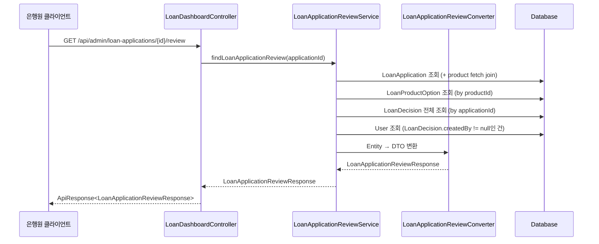

# Design Document: 대출 신청 심사 결과 탭 API

## Overview

은행원 대출 신청 상세보기의 심사 결과 탭 데이터를 조회하는 GET API를 설계합니다. 기존 `LoanDashboardController`에 새 엔드포인트(`GET /{applicationId}/review`)를 추가하고, 대출 상품 정보, 신청 정보, 시스템 승인 추천 정보, 심사 이력을 통합하여 단일 응답으로 반환합니다.

주요 설계 결정:
- **기존 Controller 확장**: 새 Controller를 만들지 않고 `LoanDashboardController`에 엔드포인트 추가
- **SystemLoanDecision 미사용**: 별도 테이블 없이 `loan_decision` 테이블의 `created_by` null 여부로 시스템/은행원 심사를 구분
- **LoanDecision 엔티티 수정**: `createdAt`, `createdBy` 필드를 추가하여 심사 이력 조회 지원
- **Converter 패턴 유지**: 기존 프로젝트 컨벤션에 따라 정적 메서드 기반 Converter 사용

## Architecture



## Components and Interfaces

### 1. Controller Layer

**LoanDashboardController** (기존 확장)
- 새 엔드포인트: `GET /{applicationId}/review`
- `LoanApplicationReviewService` 의존성 추가
- `LoanDashboardSuccessCode.LOAN_APPLICATION_REVIEW_OK` 사용

**LoanDashboardControllerDocs** (기존 확장)
- 새 엔드포인트에 대한 Swagger 문서 추가

### 2. Service Layer

**LoanApplicationReviewService** (인터페이스)
```java
public interface LoanApplicationReviewService {
    LoanApplicationReviewResponse findLoanApplicationReview(Long applicationId);
}
```

**LoanApplicationReviewServiceImpl** (구현체)
- `@Service @RequiredArgsConstructor @Transactional(readOnly = true)`
- 의존성: `LoanApplicationRepository`, `LoanProductOptionRepository`, `LoanDecisionRepository`, `UserRepository`
- 로직 흐름:
  1. `LoanApplication` 조회 (없으면 `BaseException(NOT_FOUND)`)
  2. `LoanProduct` 정보 추출 (application.getProduct())
  3. `LoanProductOption` 목록 조회
  4. `LoanDecision` 전체 목록 조회 (by applicationId)
  5. 시스템 심사 추출: `created_by == null`인 LoanDecision → Recommendation 구성
  6. 은행원 심사의 `createdBy`로 `User` 조회
  7. Converter로 DTO 변환 후 반환

### 3. Converter Layer

**LoanApplicationReviewConverter**
- `private` 생성자 (인스턴스화 방지)
- 정적 메서드:
  - `toProductInfoResponse(LoanProduct, List<LoanProductOption>)` → `ProductInfoResponse`
  - `toApplicationInfoResponse(LoanApplication)` → `ApplicationInfoResponse`
  - `toRecommendationResponse(LoanDecision)` → `RecommendationResponse` (nullable, 시스템 심사 APPROVED인 경우만)
  - `toDecisionResponse(LoanDecision, User)` → `DecisionResponse` (User는 nullable — null이면 시스템 심사)
  - `toLoanApplicationReviewResponse(...)` → `LoanApplicationReviewResponse`

### 4. Repository Layer

**LoanDecisionRepository** (기존 확장)
- 기존: `findByApplication_ApplicationId(Long applicationId)` → `Optional<LoanDecision>`
- 추가: `findAllByApplication_ApplicationIdOrderByCreatedAtAsc(Long applicationId)` → `List<LoanDecision>`

### 5. Entity Layer

**LoanDecision** (수정)
- `createdAt` (LocalDateTime) 필드 추가 — DB의 `created_at` 컬럼 매핑
- `createdBy` (Long, nullable) 필드 추가 — DB의 `created_by` 컬럼 매핑
- `created_by`가 null이면 시스템 심사, null이 아니면 은행원 심사

### 6. DTO Layer

**LoanApplicationReviewResponse** (최상위 record)
- `productInfo` (ProductInfoResponse)
- `applicationInfo` (ApplicationInfoResponse)
- `recommendation` (RecommendationResponse, nullable)
- `decisions` (List\<DecisionResponse\>)

### 7. SuccessCode

**LoanDashboardSuccessCode** (기존 확장)
- `LOAN_APPLICATION_REVIEW_OK(HttpStatus.OK, "LOAN2006", "심사 결과 탭 조회에 성공했습니다.")`

## Data Models

### LoanDecision Entity (수정 사항)

기존 `LoanDecision`에 다음 필드 추가:

```java
@Column(name = "created_at", updatable = false)
private LocalDateTime createdAt;

@Column(name = "created_by", updatable = false)
private Long createdBy;  // null이면 시스템 심사
```

### 시스템/은행원 심사 구분 로직

```java
// 시스템 심사 판별
boolean isSystemDecision = loanDecision.getCreatedBy() == null;

// Recommendation 추출: created_by == null && decision == APPROVED인 건
LoanDecision systemDecision = decisions.stream()
    .filter(d -> d.getCreatedBy() == null && d.getDecision() == Decision.APPROVED)
    .findFirst()
    .orElse(null);
```

### Response DTO 구조

```java
public record LoanApplicationReviewResponse(
    ProductInfoResponse productInfo,
    ApplicationInfoResponse applicationInfo,
    RecommendationResponse recommendation,  // nullable
    List<DecisionResponse> decisions
) {
    public record ProductInfoResponse(
        String productName,
        Long minAmount,
        Long maxAmount,
        BigDecimal minInterestRate,
        BigDecimal maxInterestRate,
        Integer minTermMonths,
        Integer maxTermMonths,
        List<String> availableRepaymentMethods,
        List<String> availablePurposes
    ) {}

    public record ApplicationInfoResponse(
        Long requestedAmount,
        Integer requestedTerm,
        String purpose,
        String repaymentMethod
    ) {}

    public record RecommendationResponse(
        Long approvedAmount,
        BigDecimal approvedRate,
        Integer approvedTerm,
        String repaymentMethod
    ) {}

    public record DecisionResponse(
        String status,
        String comment,
        String reviewerName,
        String reviewerRole,
        LocalDateTime decidedAt
    ) {}
}
```

### Decision 매핑 규칙

| 조건 | status 매핑 | comment 매핑 | reviewerName | reviewerRole | decidedAt |
|------|------------|-------------|--------------|--------------|-----------|
| created_by == null, decision == APPROVED | "SYSTEM_APPROVED" | rejectionReason | "시스템" | "SYSTEM" | createdAt |
| created_by == null, decision == REJECTED | "REJECTED" | rejectionReason | "시스템" | "SYSTEM" | createdAt |
| created_by != null | decision.name() | rejectionReason | users.name (via createdBy) | users.role.name() | createdAt |
| created_by != null, user 미존재 | decision.name() | rejectionReason | "알 수 없음" | "SYSTEM" | createdAt |

## Correctness Properties

### Property 1: ProductInfo 변환 정확성

*For any* LoanProduct와 LoanProductOption 목록에 대해, `toProductInfoResponse` 변환 결과는 원본 LoanProduct의 필드값(productName, minLimit, maxLimit, minRate, maxRate, minTerm, maxTerm)을 정확히 반영하고, availableRepaymentMethods는 옵션 목록의 repaymentMethod를 중복 제거한 집합과 일치하며, availablePurposes는 옵션 목록의 purpose를 중복 제거한 집합과 일치해야 한다.

**Validates: Requirements 4.1, 4.2, 4.3**

### Property 2: ApplicationInfo 변환 정확성

*For any* LoanApplication(nullable 필드 포함)에 대해, `toApplicationInfoResponse` 변환 결과는 원본의 requestedAmount, requestedTerm, purpose, repaymentMethod 값을 정확히 반영해야 하며, null인 필드는 null로 유지되어야 한다.

**Validates: Requirements 5.1, 5.2**

### Property 3: Recommendation 변환 정확성

*For any* created_by가 null이고 decision이 APPROVED인 LoanDecision에 대해, `toRecommendationResponse` 변환 결과는 원본의 approvedAmount, approvedRate, approvedTerm 값을 정확히 반영해야 한다.

**Validates: Requirements 6.1**

### Property 4: 시스템 심사(created_by == null) → DecisionResponse 변환 정확성

*For any* created_by가 null인 LoanDecision에 대해, DecisionResponse 변환 결과는 reviewerName이 "시스템"이고, reviewerRole이 "SYSTEM"이며, decision이 APPROVED일 때 status가 "SYSTEM_APPROVED"로 매핑되어야 한다.

**Validates: Requirements 7.3, 7.5**

### Property 5: 은행원 심사(created_by != null) → DecisionResponse 변환 정확성

*For any* created_by가 null이 아닌 LoanDecision과 대응하는 User에 대해, DecisionResponse 변환 결과는 reviewerName이 user.name과 일치하고, reviewerRole이 user.role.name()과 일치하며, status가 원본 decision.name()과 일치해야 한다.

**Validates: Requirements 7.4, 7.6**

### Property 6: Decision 시간순 정렬

*For any* LoanDecision 목록에 대해, 변환된 decisions 배열의 크기는 원본 목록과 같아야 하며, decidedAt 기준 오름차순(비감소)으로 정렬되어야 한다.

**Validates: Requirements 7.1, 7.2**

## Error Handling

| 상황 | 예외 | HTTP 상태 | 에러 코드 |
|------|------|-----------|-----------|
| 세션 없음 / 만료 | Spring Security 필터 | 401 | COMMON4001 |
| 권한 부족 (USER 역할) | Spring Security 필터 | 403 | COMMON4003 |
| applicationId 타입 변환 실패 | MethodArgumentTypeMismatchException | 400 | COMMON4000 |
| LoanApplication 미존재 | BaseException(GeneralErrorCode.NOT_FOUND) | 404 | COMMON4004 |
| LoanDecision 미존재 | 정상 처리 (recommendation = null, decisions = 빈 배열) | 200 | - |
| LoanDecision.createdBy 사용자 미존재 | 정상 처리 (reviewerName="알 수 없음", reviewerRole="SYSTEM") | 200 | - |

## Testing Strategy

### Property-Based Testing (PBT)

- **라이브러리**: JUnit 5 + jqwik (Java PBT 라이브러리)
- **최소 반복 횟수**: 100회
- **대상**: Converter 레이어의 순수 변환 로직
- **태그 형식**: `Feature: loan-application-review-tab, Property {number}: {property_text}`

각 Correctness Property에 대해 단일 property-based test를 구현합니다:
1. 임의의 Entity 데이터를 생성하는 Arbitrary 정의
2. Converter 메서드 호출
3. 결과가 property를 만족하는지 검증

### Unit Testing (Example-Based)

- **라이브러리**: JUnit 5 + Mockito
- **대상**: Service 레이어 로직
- **테스트 케이스**:
  - applicationId 미존재 시 NOT_FOUND 예외 발생
  - 시스템 심사(created_by == null) APPROVED 시 recommendation 정상 반환
  - 시스템 심사(created_by == null) REJECTED 시 recommendation = null
  - 시스템 심사 미존재 시 recommendation = null
  - LoanDecision.createdBy 사용자 미존재 시 폴백 값 적용
  - 심사 이력 미존재 시 빈 배열 반환

### Integration Testing

- **라이브러리**: Spring Boot Test + @WebMvcTest
- **대상**: Controller 레이어 + 인증/권한
- **테스트 케이스**:
  - 정상 요청 시 200 + 올바른 응답 구조
  - 세션 없이 요청 시 401
  - USER 역할로 요청 시 403
  - 잘못된 applicationId 형식 시 400
