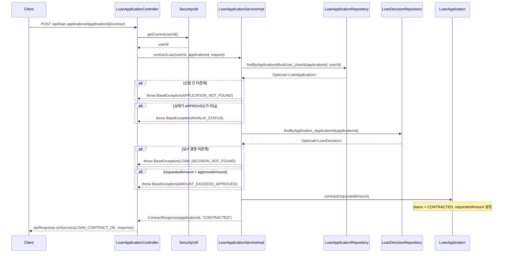

# Design Document: 약정 체결 요청 API (SOFIT-36)

## Overview

대출 심사가 승인(APPROVED)된 후, 사용자가 약정 체결을 요청하는 API를 구현합니다. 사용자는 승인된 한도 내에서 희망 금액을 입력하여 약정을 체결하며, 성공 시 대출 신청 상태가 CONTRACTED로 변경됩니다.

이 API는 기존 대출 신청 플로우의 연장선으로, APPROVED → CONTRACTED 상태 전이를 담당합니다. 승인 금액 초과 검증과 상태 유효성 검증을 통해 비즈니스 규칙을 보장합니다.

## Architecture

```mermaid
graph TD
    Client[클라이언트] -->|POST /api/loan-applications/{id}/contract| Controller[LoanApplicationController]
    Controller -->|SecurityUtil.getCurrentUserId| SecurityUtil[SecurityUtil]
    Controller -->|contractLoan| Service[LoanApplicationServiceImpl]
    Service -->|findByApplicationIdAndUser_UserId| AppRepo[LoanApplicationRepository]
    Service -->|findByApplication_ApplicationId| DecRepo[LoanDecisionRepository]
    Service -->|contract 메서드 호출| Entity[LoanApplication Entity]
    Service -->|toContractResponse| Converter[LoanApplicationConverter]
    Controller -->|ApiResponse.onSuccess| Response[ApiResponse]
```

## Sequence Diagram



## Components and Interfaces

### Component 1: LoanApplicationController

**Purpose**: 약정 체결 HTTP 엔드포인트 제공

**Interface**:
```java
@PostMapping("/loan-applications/{applicationId}/contract")
public ApiResponse<ContractResponse> contractLoan(
        @PathVariable Long applicationId,
        @Valid @RequestBody ContractRequest request);
```

**Responsibilities**:
- SecurityUtil로 현재 사용자 ID 추출
- Service 호출 후 성공 응답 반환

### Component 2: LoanApplicationService / LoanApplicationServiceImpl

**Purpose**: 약정 체결 비즈니스 로직 처리

**Interface**:
```java
// LoanApplicationService 인터페이스에 추가
ContractResponse contractLoan(Long userId, Long applicationId, ContractRequest request);
```

**Responsibilities**:
- 대출 신청 조회 및 소유권 검증
- 상태 유효성 검증 (APPROVED만 허용)
- 심사 결정 조회
- 신청 금액 ≤ 승인 금액 검증
- Entity 상태 변경 (Dirty Checking)

### Component 3: LoanApplication Entity

**Purpose**: 약정 체결 도메인 로직 캡슐화

**Interface**:
```java
public void contract(Long requestedAmount) {
    this.requestedAmount = requestedAmount;
    this.status = ApplicationStatus.CONTRACTED;
}
```

**Responsibilities**:
- 요청 금액 설정
- 상태를 CONTRACTED로 변경

### Component 4: LoanApplicationConverter

**Purpose**: Entity → ContractResponse 변환

**Interface**:
```java
public static ContractResponse toContractResponse(LoanApplication application) {
    return new ContractResponse(
            application.getApplicationId(),
            application.getStatus().name()
    );
}
```

## Data Models

### ContractRequest (Request DTO - class)

```java
public class ContractRequest {
    @NotNull(message = "신청 금액은 필수입니다.")
    private Long requestedAmount;
}
```

**Validation Rules**:
- requestedAmount는 null 불가 (@NotNull)
- requestedAmount ≤ loanDecision.approvedAmount (비즈니스 검증)

### ContractResponse (Response DTO - record)

```java
public record ContractResponse(
    Long applicationId,
    String status
) {}
```

## Error Handling

### Error Scenario 1: APPLICATION_NOT_FOUND

**Condition**: applicationId + userId 조합으로 대출 신청을 찾을 수 없을 때
**Response**: HTTP 404, code "LOAN4042"
**Recovery**: 클라이언트가 올바른 applicationId로 재요청

### Error Scenario 2: INVALID_STATUS

**Condition**: 대출 신청 상태가 APPROVED가 아닐 때
**Response**: HTTP 400, code "LOAN4002", message "약정 체결이 불가능한 상태입니다."
**Recovery**: 클라이언트가 심사 승인 완료 후 재요청

### Error Scenario 3: LOAN_DECISION_NOT_FOUND

**Condition**: 해당 applicationId에 대한 심사 결정이 존재하지 않을 때
**Response**: HTTP 404, code "LOAN4043"
**Recovery**: 시스템 데이터 정합성 문제 - 관리자 확인 필요

### Error Scenario 4: AMOUNT_EXCEEDS_APPROVED

**Condition**: 요청 금액이 승인 금액을 초과할 때
**Response**: HTTP 400, code "LOAN4003", message "신청 금액이 승인 금액을 초과합니다."
**Recovery**: 클라이언트가 승인 금액 이하로 재요청

## Testing Strategy

### Unit Testing Approach

- Service 레이어: 각 비즈니스 규칙별 단위 테스트
  - 정상 약정 체결 케이스
  - 신청 건 미존재 시 예외 발생
  - 상태 불일치 시 예외 발생
  - 심사 결정 미존재 시 예외 발생
  - 금액 초과 시 예외 발생
- Entity: contract() 메서드 동작 검증

### Property-Based Testing Approach

**Property Test Library**: JUnit 5 + jqwik (또는 수동 랜덤 테스트)

- 승인 금액 이하의 모든 양수 금액에 대해 약정 체결이 성공해야 함
- 승인 금액 초과의 모든 금액에 대해 약정 체결이 실패해야 함

## Dependencies

- Spring Boot Web (REST 엔드포인트)
- Spring Data JPA (Repository)
- Jakarta Validation (Bean Validation)
- Swagger/OpenAPI (API 문서)
- Lombok (보일러플레이트 제거)

## Correctness Properties

*A property is a characteristic or behavior that should hold true across all valid executions of a system-essentially, a formal statement about what the system should do. Properties serve as the bridge between human-readable specifications and machine-verifiable correctness guarantees.*

### Property 1: 금액 범위 검증 일관성

*For any* requestedAmount가 0보다 크고 approvedAmount 이하인 경우, 상태가 APPROVED인 대출 신청에 대해 약정 체결이 항상 성공해야 한다.

**Validates: Requirements 3.1**

### Property 2: 금액 초과 거부 일관성

*For any* requestedAmount가 approvedAmount를 초과하는 경우, 약정 체결 요청은 항상 AMOUNT_EXCEEDS_APPROVED 예외를 발생시켜야 한다.

**Validates: Requirements 3.2**

### Property 3: 상태 전이 정확성

*For any* 유효한 약정 체결 요청(requestedAmount ≤ approvedAmount, 상태 APPROVED)에 대해, 결과 상태는 항상 CONTRACTED이고 엔티티의 requestedAmount는 요청한 금액과 동일해야 한다.

**Validates: Requirements 1.2, 2.1, 2.2**

### Property 4: 비승인 상태 거부 일관성

*For any* APPROVED가 아닌 ApplicationStatus(DRAFT, SUBMITTED, CB_CHECKING, BASIC_REVIEW, SCB_CALCULATING, FINAL_REVIEW, REJECTED, CONTRACTED, EXECUTED, CANCELLED)에 대해, 약정 체결 요청은 항상 INVALID_STATUS 예외를 발생시켜야 한다.

**Validates: Requirements 4.2**
