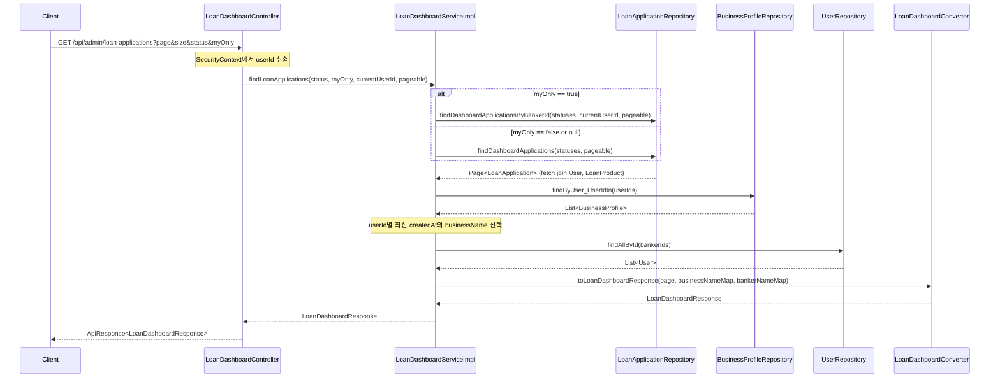
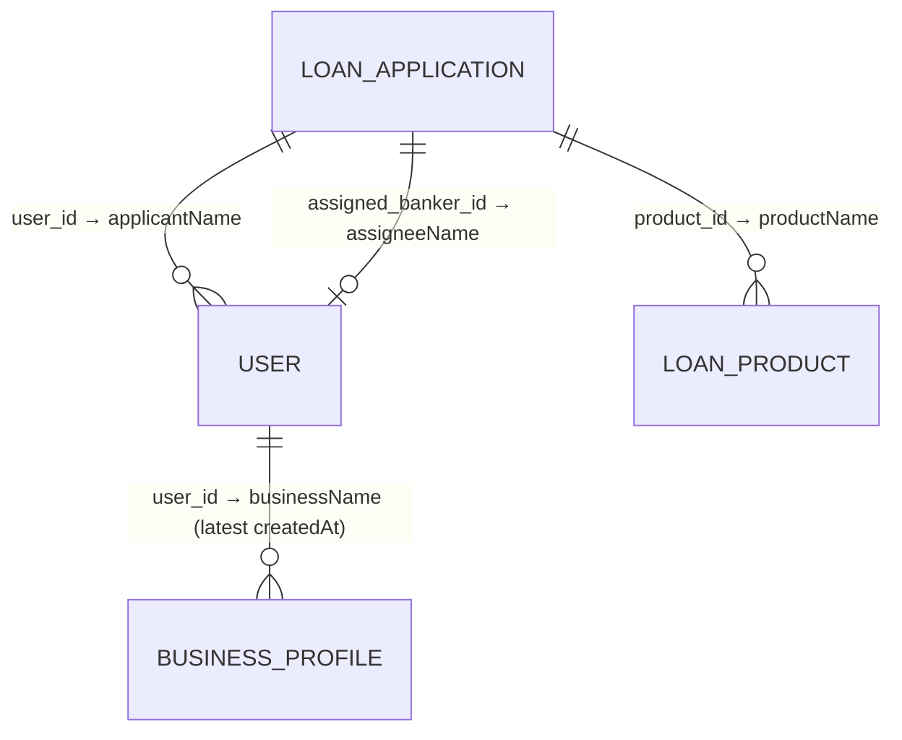

# Design Document: Loan Dashboard Refactor

## Overview

기존 대출 대시보드 API(`GET /api/admin/loan-applications`)를 수정한다. 주요 변경 사항:

1. **쿼리 파라미터 변경**: `assigneeName`, `assignedBankerId` 삭제 → `myOnly` (Boolean, 기본값 false) 추가
2. **myOnly 동작**: `true`일 때 SecurityContext에서 현재 로그인한 은행원의 userId를 추출하여 `assignedBankerId`와 매칭
3. **응답 필드명 변경**: `applications` → `contents`

기존 프로젝트 컨벤션(ControllerDocs 인터페이스 패턴, Service interface + Impl, static Converter, record DTO, ApiResponse 공통 응답)을 유지한다.

### 설계 결정 사항

| 결정 | 선택 | 근거 |
|------|------|------|
| 현재 사용자 식별 | SecurityContextHolder에서 userId 추출 | 기존 AdminAuthServiceImpl.findMe()와 동일한 패턴. Redis 세션 기반 인증이 SecurityContext에 이미 반영됨 |
| myOnly 필터 구현 | Controller에서 userId 추출 후 Service에 전달 | Service 레이어가 HttpServletRequest에 의존하지 않도록 분리 |
| Repository 메서드 | 기존 findDashboardApplicationsByBankerId 재활용 | myOnly=true일 때 userId를 bankerId로 전달하면 기존 쿼리 그대로 사용 가능 |
| 응답 필드명 변경 | record 필드명 직접 변경 | 단순 rename이므로 별도 어노테이션 불필요 |
| BusinessProfile 조회 | 최신 createdAt 1건 선택 로직 추가 | 요구사항 4.2에 따라 여러 건 중 최신 1건만 사용 |

## Architecture



### 레이어 구조 (변경 파일)

```
sofit-admin/domain/loan/
├── controller/
│   ├── LoanDashboardController.java        ← 수정 (파라미터 변경)
│   └── LoanDashboardControllerDocs.java    ← 수정 (Swagger 문서 변경)
├── converter/
│   └── LoanDashboardConverter.java         ← 수정 (필드명 변경 반영)
├── dto/
│   └── response/
│       ├── LoanDashboardResponse.java      ← 수정 (applications → contents)
│       └── LoanApplicationItemResponse.java ← 유지 (변경 없음)
└── service/
    ├── LoanDashboardService.java           ← 수정 (시그니처 변경)
    └── LoanDashboardServiceImpl.java       ← 수정 (myOnly 로직)

sofit-common/
└── repository/
    └── LoanApplicationRepository.java      ← 유지 (기존 메서드 재활용)
    └── auth/BusinessProfileRepository.java ← 유지 (기존 메서드 활용)
```

## Components and Interfaces

### Controller Layer

**LoanDashboardControllerDocs** (interface) — 수정

```java
@Operation(
    summary = "대출 신청 목록 조회",
    description = "심사 단계에 진입한 대출 신청 건을 페이징 조회합니다. 상태 필터와 본인 담당 건 필터(myOnly)를 지원합니다."
)
ApiResponse<LoanDashboardResponse> findLoanApplications(
    @Parameter(description = "페이지 번호 (0부터 시작)", example = "0") Integer page,
    @Parameter(description = "페이지 크기 (1~100)", example = "10") Integer size,
    @Parameter(description = "심사 상태 필터") String status,
    @Parameter(description = "본인 담당 건만 조회 (기본값: false)") Boolean myOnly
);
```

**LoanDashboardController** — 수정

- `assignedBankerId`, `assigneeName` 파라미터 제거
- `myOnly` (Boolean, defaultValue = "false") 파라미터 추가
- `status`를 단일 String으로 변경 (요구사항에 따라 단일 상태 필터)
- SecurityContextHolder에서 현재 userId 추출하여 Service에 전달

```java
@GetMapping
public ApiResponse<LoanDashboardResponse> findLoanApplications(
        @RequestParam(defaultValue = "0") Integer page,
        @RequestParam(defaultValue = "10") Integer size,
        @RequestParam(required = false) String status,
        @RequestParam(defaultValue = "false") Boolean myOnly) {

    // page/size 유효성 검증
    if (page < 0) {
        throw new BaseException(GeneralErrorCode.BAD_REQUEST);
    }
    if (size < 1 || size > 100) {
        throw new BaseException(GeneralErrorCode.BAD_REQUEST);
    }

    // status 파라미터 검증 및 변환
    ApplicationStatus applicationStatus = null;
    if (status != null && !status.isBlank()) {
        try {
            applicationStatus = ApplicationStatus.valueOf(status);
            if (!ALLOWED_STATUSES.contains(applicationStatus)) {
                throw new BaseException(LoanDashboardErrorCode.INVALID_STATUS_FILTER);
            }
        } catch (IllegalArgumentException e) {
            throw new BaseException(LoanDashboardErrorCode.INVALID_STATUS_FILTER);
        }
    }

    // SecurityContext에서 현재 로그인한 은행원 userId 추출
    Long currentUserId = extractCurrentUserId();

    Pageable pageable = PageRequest.of(page, size);
    LoanDashboardResponse response = loanDashboardService.findLoanApplications(
            applicationStatus, myOnly, currentUserId, pageable);
    return ApiResponse.onSuccess(LoanDashboardSuccessCode.LOAN_DASHBOARD_OK, response);
}

private Long extractCurrentUserId() {
    Authentication authentication = SecurityContextHolder.getContext().getAuthentication();
    if (authentication == null || authentication.getPrincipal() == null) {
        throw new BaseException(AdminAuthErrorCode.SESSION_EXPIRED);
    }
    try {
        return (Long) authentication.getPrincipal();
    } catch (ClassCastException e) {
        throw new BaseException(AdminAuthErrorCode.SESSION_EXPIRED);
    }
}
```

### Service Layer

**LoanDashboardService** (interface) — 시그니처 변경

```java
LoanDashboardResponse findLoanApplications(
    ApplicationStatus status, Boolean myOnly, Long currentUserId, Pageable pageable);
```

**LoanDashboardServiceImpl** — 수정

```java
@Override
public LoanDashboardResponse findLoanApplications(
        ApplicationStatus status, Boolean myOnly, Long currentUserId, Pageable pageable) {

    // 상태 필터: 단일 status가 null이면 전체 대시보드 상태 조회
    List<ApplicationStatus> statuses = (status != null)
            ? List.of(status)
            : DASHBOARD_STATUSES;

    // myOnly 필터에 따라 Repository 메서드 분기
    Page<LoanApplication> page;
    if (Boolean.TRUE.equals(myOnly)) {
        page = loanApplicationRepository.findDashboardApplicationsByBankerId(
                statuses, currentUserId, pageable);
    } else {
        page = loanApplicationRepository.findDashboardApplications(statuses, pageable);
    }

    // BusinessProfile 일괄 조회 → userId별 최신 createdAt 선택
    List<Long> userIds = page.getContent().stream()
            .map(app -> app.getUser().getUserId())
            .distinct()
            .toList();

    Map<Long, String> businessNameMap = businessProfileRepository.findByUser_UserIdIn(userIds).stream()
            .collect(Collectors.toMap(
                    bp -> bp.getUser().getUserId(),
                    BusinessProfile::getBusinessName,
                    (existing, replacement) -> existing // 첫 번째 값 유지 (정렬 필요 시 별도 처리)
            ));

    // bankerNameMap 조회
    List<Long> bankerIds = page.getContent().stream()
            .map(LoanApplication::getAssignedBankerId)
            .filter(Objects::nonNull)
            .distinct()
            .toList();

    Map<Long, String> bankerNameMap = userRepository.findAllById(bankerIds).stream()
            .collect(Collectors.toMap(
                    User::getUserId,
                    User::getName,
                    (existing, replacement) -> existing
            ));

    return LoanDashboardConverter.toLoanDashboardResponse(page, businessNameMap, bankerNameMap);
}
```

**BusinessProfile 최신 선택 로직**: `findByUser_UserIdIn`이 여러 건을 반환할 수 있으므로, createdAt 내림차순 정렬 후 첫 번째 값을 선택하도록 Collectors.toMap의 merge function을 활용하거나, Repository에 정렬 조건을 추가한다.

```java
// 방법 1: Stream에서 최신 선택
Map<Long, String> businessNameMap = businessProfileRepository.findByUser_UserIdIn(userIds).stream()
        .collect(Collectors.groupingBy(
                bp -> bp.getUser().getUserId(),
                Collectors.collectingAndThen(
                        Collectors.maxBy(Comparator.comparing(BusinessProfile::getCreatedAt)),
                        opt -> opt.map(BusinessProfile::getBusinessName).orElse(null)
                )
        ));
```

### Repository Layer

**LoanApplicationRepository** — 변경 없음

기존 메서드를 그대로 활용:
- `findDashboardApplications(statuses, pageable)`: myOnly=false 또는 미지정 시
- `findDashboardApplicationsByBankerId(statuses, assignedBankerId, pageable)`: myOnly=true 시 currentUserId를 assignedBankerId로 전달

**BusinessProfileRepository** — 변경 없음

기존 메서드 활용:
- `findByUser_UserIdIn(List<Long> userIds)`: 일괄 조회

### Converter Layer

**LoanDashboardConverter** — 수정 (응답 필드명 변경 반영)

```java
public static LoanDashboardResponse toLoanDashboardResponse(
        Page<LoanApplication> page,
        Map<Long, String> businessNameMap,
        Map<Long, String> bankerNameMap) {

    return new LoanDashboardResponse(
            page.getTotalElements(),
            page.getTotalPages(),
            page.getNumber(),
            page.getSize(),
            page.getContent().stream()
                    .map(app -> toLoanApplicationItemResponse(
                            app,
                            businessNameMap.get(app.getUser().getUserId()),
                            bankerNameMap.get(app.getAssignedBankerId())
                    ))
                    .toList()
    );
}

public static LoanApplicationItemResponse toLoanApplicationItemResponse(
        LoanApplication app,
        String businessName,
        String assigneeName) {

    return new LoanApplicationItemResponse(
            app.getApplicationId(),
            app.getAppliedAt(),  // LocalDateTime 그대로 유지
            app.getUser().getName(),
            businessName,
            app.getProduct().getProductName(),
            app.getStatus(),
            app.getAssignedBankerId(),
            assigneeName
    );
}
```

### Exception Layer

변경 없음. 기존 코드 유지:
- `LoanDashboardSuccessCode.LOAN_DASHBOARD_OK`
- `LoanDashboardErrorCode.INVALID_STATUS_FILTER`
- `GeneralErrorCode.BAD_REQUEST` (COMMON4000)

## Data Models

### Request Parameters (변경 후)

| 파라미터 | 타입 | 필수 | 기본값 | 설명 |
|----------|------|------|--------|------|
| page | Integer | N | 0 | 페이지 번호 (0-based, 음수 불가) |
| size | Integer | N | 10 | 페이지 크기 (1~100) |
| status | String | N | null | 심사 상태 필터 (SYSTEM_APPROVED, SYSTEM_HOLD, MANAGER_REVIEW, APPROVED, REJECTED 중 하나) |
| myOnly | Boolean | N | false | 본인 담당 건만 조회 |

**삭제된 파라미터**: `assignedBankerId`, `assigneeName`

### Response DTOs (변경 후)

**LoanDashboardResponse** (record) — `applications` → `contents`

```java
public record LoanDashboardResponse(
    long totalCount,
    int totalPages,
    int currentPage,
    int size,
    List<LoanApplicationItemResponse> contents  // 변경: applications → contents
) {}
```

**LoanApplicationItemResponse** (record) — 변경 없음

```java
public record LoanApplicationItemResponse(
    Long applicationId,
    LocalDateTime appliedAt,    // 기존 유지
    String applicantName,
    String businessName,
    String productName,
    ApplicationStatus status,
    Long assignedBankerId,
    String assigneeName
) {}
```

### 응답 예시

```json
{
  "isSuccess": true,
  "code": "LOAN2001",
  "message": "대출 신청 목록 조회에 성공했습니다.",
  "result": {
    "totalCount": 25,
    "totalPages": 3,
    "currentPage": 0,
    "size": 10,
    "contents": [
      {
        "applicationId": 1,
        "appliedAt": "2025-01-15T10:30:00",
        "applicantName": "홍길동",
        "businessName": "길동상회",
        "productName": "소상공인 성장 대출",
        "status": "MANAGER_REVIEW",
        "assignedBankerId": 5,
        "assigneeName": "김은행"
      }
    ]
  }
}
```

### 조인 관계 다이어그램



## Correctness Properties

*A property is a characteristic or behavior that should hold true across all valid executions of a system—essentially, a formal statement about what the system should do. Properties serve as the bridge between human-readable specifications and machine-verifiable correctness guarantees.*

### Property 1: 상태 필터링 및 정렬 보장

*For any* 유효한 상태 필터 값(SYSTEM_APPROVED, SYSTEM_HOLD, MANAGER_REVIEW, APPROVED, REJECTED 중 하나 또는 미지정)과 임의의 LoanApplication 데이터셋에 대해, 조회 결과의 모든 항목은 허용된 상태만 포함하고, 지정된 상태 필터가 있으면 해당 상태만 포함하며, appliedAt 기준 내림차순으로 정렬되어야 한다.

**Validates: Requirements 1.1, 2.1, 2.2**

### Property 2: Converter 메타데이터 매핑 정확성

*For any* 유효한 Page<LoanApplication> 객체에 대해, Converter를 통해 변환된 LoanDashboardResponse의 totalCount, totalPages, currentPage, size 필드는 원본 Page 객체의 getTotalElements(), getTotalPages(), getNumber(), getSize() 값과 각각 정확히 일치해야 한다.

**Validates: Requirements 1.2**

### Property 3: Converter 항목 필드 매핑 정확성

*For any* 유효한 LoanApplication 엔티티(연관된 User, LoanProduct 포함)와 businessNameMap, bankerNameMap에 대해, Converter를 통해 변환된 LoanApplicationItemResponse의 applicationId, applicantName, productName, status, assignedBankerId 필드는 원본 엔티티의 대응 필드와 정확히 일치하고, businessName과 assigneeName은 각각 Map에서 조회한 값과 일치해야 한다.

**Validates: Requirements 1.4, 4.1, 4.4, 4.5**

### Property 4: myOnly 필터링 정확성

*For any* 임의의 userId와 LoanApplication 데이터셋에 대해, myOnly=true로 조회한 결과의 모든 항목은 assignedBankerId가 해당 userId와 일치해야 하며, status 필터가 함께 적용된 경우 두 조건이 AND로 결합되어야 한다.

**Validates: Requirements 3.1, 3.2, 3.6**

### Property 5: 잘못된 status 값 에러 처리

*For any* 허용된 5개 상태 값(SYSTEM_APPROVED, SYSTEM_HOLD, MANAGER_REVIEW, APPROVED, REJECTED)이 아닌 임의의 문자열이 status 파라미터로 전달되면, API는 isSuccess=false, code=COMMON4000 또는 LOAN4001을 포함한 에러 응답을 반환해야 한다.

**Validates: Requirements 2.3, 5.3**

### Property 6: 최신 BusinessProfile 선택

*For any* User에 대해 1건 이상의 BusinessProfile이 존재할 때, 반환되는 businessName은 해당 User의 BusinessProfile 중 createdAt이 가장 최신인 레코드의 businessName과 일치해야 한다.

**Validates: Requirements 4.2**


## Error Handling

| 상황 | 에러 코드 | HTTP Status | 메시지 |
|------|-----------|-------------|--------|
| page 음수 | COMMON4000 | 400 | "잘못된 요청입니다." |
| size 범위 초과 (< 1 또는 > 100) | COMMON4000 | 400 | "잘못된 요청입니다." |
| 잘못된 status 파라미터 | LOAN4001 | 400 | "유효하지 않은 심사 상태입니다." |
| myOnly Boolean 파싱 불가 | COMMON4000 | 400 | "잘못된 요청입니다." |
| 세션 만료 / 인증 실패 | AUTH4011 | 401 | "세션이 만료되었습니다. 다시 로그인해 주세요." |
| 서버 내부 오류 | COMMON5000 | 500 | "서버 에러, 관리자에게 문의 바랍니다." |

### 에러 처리 전략

1. **page/size 검증**: Controller에서 직접 범위 검증. 위반 시 `BaseException(GeneralErrorCode.BAD_REQUEST)` throw
2. **status 파라미터 검증**: Controller에서 String → ApplicationStatus 변환 시도. 실패 시 `BaseException(LoanDashboardErrorCode.INVALID_STATUS_FILTER)` throw
3. **myOnly 파라미터**: Spring이 Boolean 타입 바인딩 실패 시 자동으로 `MethodArgumentTypeMismatchException` 발생 → GlobalExceptionHandler에서 COMMON4000으로 처리
4. **인증 실패**: SecurityContext에서 userId 추출 실패 시 `BaseException(AdminAuthErrorCode.SESSION_EXPIRED)` throw
5. **공통 예외 처리**: `GlobalExceptionHandler`에서 `BaseException`, `MethodArgumentTypeMismatchException` 등 일괄 처리

## Testing Strategy

### 단위 테스트 (JUnit 5 + Mockito)

1. **Service 레이어 테스트**
   - myOnly=true 시 findDashboardApplicationsByBankerId 호출 검증
   - myOnly=false 시 findDashboardApplications 호출 검증
   - status 단일 필터 적용/미적용 시 동작 검증
   - BusinessProfile 최신 선택 로직 검증
   - 빈 결과 시 응답 구조 검증

2. **Converter 테스트**
   - Entity → DTO 변환 정확성 (필드 매핑)
   - null 필드 처리 (assigneeName=null, businessName=null)
   - 페이징 메타데이터 변환 정확성
   - `applications` → `contents` 필드명 변경 확인

3. **Controller 테스트 (MockMvc)**
   - 정상 요청 시 200 응답 및 공통 포맷 검증
   - myOnly=true 시 SecurityContext userId 전달 검증
   - 잘못된 status 파라미터 시 400 에러 응답
   - page 음수, size 범위 초과 시 400 에러 응답
   - 기본값 적용 검증 (page=0, size=10, myOnly=false)
   - 기존 assignedBankerId/assigneeName 파라미터 전달 시 무시 확인

### 속성 기반 테스트 (Property-Based Testing)

- **라이브러리**: jqwik (JUnit 5 호환 PBT 라이브러리)
- **최소 반복 횟수**: 100회
- **태그 형식**: `Feature: loan-dashboard-refactor, Property {number}: {property_text}`

각 Correctness Property에 대해 하나의 속성 기반 테스트를 구현한다:

| Property | 테스트 대상 | 생성 전략 |
|----------|------------|-----------|
| Property 1 | Service 레이어 (Mock Repository) | 임의의 ApplicationStatus + LoanApplication 목록 생성, 결과의 상태/정렬 검증 |
| Property 2 | Converter | 임의의 Page 메타데이터(totalElements, totalPages, number, size) 생성 |
| Property 3 | Converter | 임의의 LoanApplication + User + LoanProduct + Map 조합 생성 |
| Property 4 | Service 레이어 (Mock Repository) | 임의의 userId + LoanApplication 목록 생성, myOnly=true 결과 검증 |
| Property 5 | Controller 레이어 (MockMvc) | 허용되지 않은 임의의 문자열 생성, 에러 응답 검증 |
| Property 6 | Service 레이어 | 임의의 User에 대해 여러 BusinessProfile(다양한 createdAt) 생성, 최신 선택 검증 |

### 통합 테스트

- Repository 레이어: `@DataJpaTest`로 JPQL 쿼리 정확성 검증 (N+1 방지 확인)
- 전체 흐름: `@SpringBootTest` + `@AutoConfigureMockMvc`로 E2E 검증
