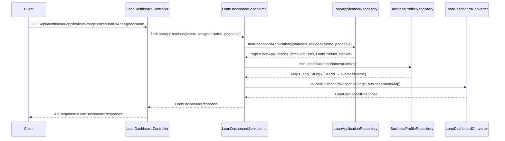
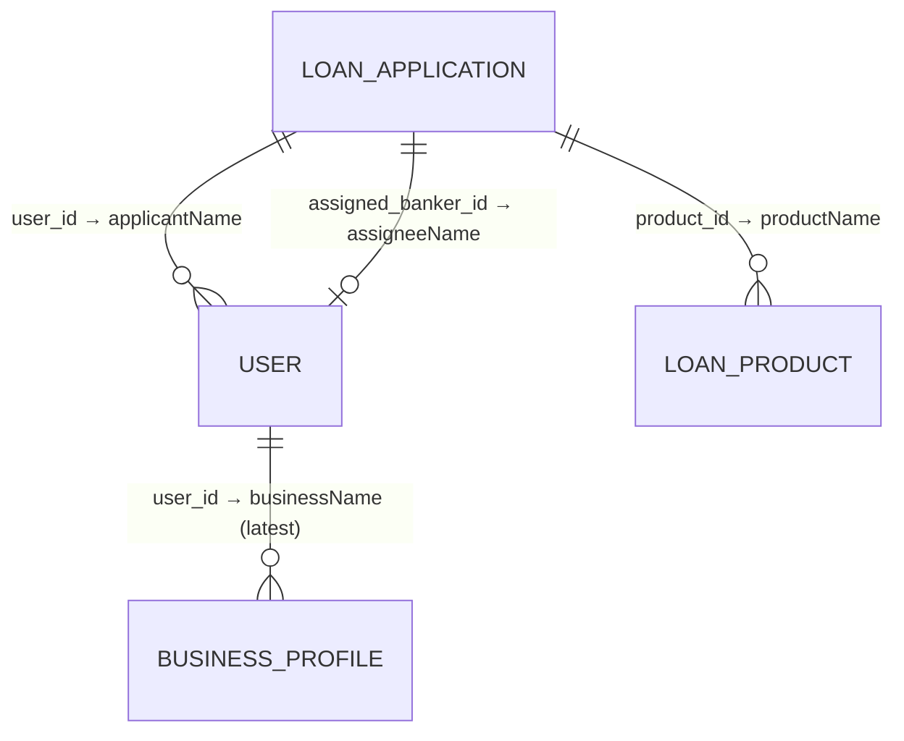

# Design Document: Loan Dashboard

## Overview

은행원(BANK_ADMIN)이 대출 신청 현황을 조회할 수 있는 대시보드 API를 설계한다. 이 API는 심사 단계에 진입한 대출 신청 건(SYSTEM_APPROVED, SYSTEM_HOLD, MANAGER_REVIEW, APPROVED, REJECTED)을 페이징 조회하며, 상태 필터와 담당자명 필터를 지원한다.

기존 프로젝트 컨벤션(ControllerDocs 인터페이스 패턴, Service interface + Impl, Converter 패턴, ApiResponse 공통 응답)을 준수하며, JPA fetch join을 활용하여 N+1 문제를 방지한다.

### 설계 결정 사항

| 결정 | 선택 | 근거 |
|------|------|------|
| 쿼리 방식 | `@Query` JPQL | 동적 필터 조합(status + assigneeName) + 다중 JOIN + 페이징을 깔끔하게 처리 가능 |
| N+1 방지 | JOIN FETCH (User, LoanProduct) | 목록 조회 시 연관 엔티티를 한 번의 쿼리로 로딩 |
| BusinessProfile 조회 | JPQL JOIN으로 함께 조회 | NOT NULL이므로 반드시 존재. 별도 쿼리 없이 한 번에 처리 |
| 페이징 | Spring Data JPA Pageable + countQuery 분리 | fetch join 사용 시 count 쿼리를 별도 지정해야 정확한 페이징 가능 |
| 응답 래핑 | DTO로 감싸서 반환 | List 직접 반환 금지 컨벤션 준수 |
| Converter 패턴 | static 메서드 기반 Converter 클래스 | 프로젝트 컨벤션 준수 |

## Architecture



### 레이어 구조

```
sofit-admin/domain/loan/
├── controller/
│   ├── LoanDashboardController.java
│   └── LoanDashboardControllerDocs.java
├── converter/
│   └── LoanDashboardConverter.java
├── dto/
│   └── response/
│       ├── LoanDashboardResponse.java
│       └── LoanApplicationItemResponse.java
├── exception/
│   ├── LoanDashboardSuccessCode.java
│   └── LoanDashboardErrorCode.java
├── repository/
│   └── LoanApplicationRepository.java (또는 기존 확장)
└── service/
    ├── LoanDashboardService.java
    └── LoanDashboardServiceImpl.java
```

## Components and Interfaces

### Controller Layer

**LoanDashboardControllerDocs** (interface)
- Swagger 어노테이션 분리용 인터페이스

**LoanDashboardController**
- `GET /api/admin/loan-applications`
- 파라미터: `page` (default 0), `size` (default 10), `status` (optional), `assigneeName` (optional)
- `LoanDashboardControllerDocs` implements

### Service Layer

**LoanDashboardService** (interface)
```java
LoanDashboardResponse findLoanApplications(ApplicationStatus status, String assigneeName, Pageable pageable);
```

**LoanDashboardServiceImpl**
- status가 null이면 5개 상태 전체 조회
- assigneeName이 null 또는 빈 문자열이면 전체 조회
- BusinessProfile은 조회된 userIds로 일괄 조회 후 Map으로 변환

### Repository Layer

**LoanApplicationRepository** (sofit-common 기존 Repository에 JPQL 메서드 추가)

status 필터만 적용 (assigneeName 미지정):
```java
@Query(value = "SELECT la FROM LoanApplication la " +
       "JOIN FETCH la.user u " +
       "JOIN FETCH la.product p " +
       "JOIN User banker ON banker.userId = la.assignedBankerId " +
       "JOIN BusinessProfile bp ON bp.user = la.user " +
       "WHERE la.status IN :statuses " +
       "ORDER BY la.appliedAt DESC",
       countQuery = "SELECT COUNT(la) FROM LoanApplication la WHERE la.status IN :statuses")
Page<LoanApplication> findDashboardApplications(
    @Param("statuses") List<ApplicationStatus> statuses, Pageable pageable);
```

status + assigneeName 필터 적용:
```java
@Query(value = "SELECT la FROM LoanApplication la " +
       "JOIN FETCH la.user u " +
       "JOIN FETCH la.product p " +
       "JOIN User banker ON banker.userId = la.assignedBankerId " +
       "JOIN BusinessProfile bp ON bp.user = la.user " +
       "WHERE la.status IN :statuses AND banker.name = :assigneeName " +
       "ORDER BY la.appliedAt DESC",
       countQuery = "SELECT COUNT(la) FROM LoanApplication la " +
       "JOIN User banker ON banker.userId = la.assignedBankerId " +
       "WHERE la.status IN :statuses AND banker.name = :assigneeName")
Page<LoanApplication> findDashboardApplicationsByAssigneeName(
    @Param("statuses") List<ApplicationStatus> statuses,
    @Param("assigneeName") String assigneeName,
    Pageable pageable);
```

**참고**: BusinessProfile은 JOIN으로 함께 로딩하되, businessName 접근은 Service에서 별도 조회하거나 JPQL Projection으로 처리. assignedBankerId가 NOT NULL이므로 INNER JOIN 사용.

**BusinessProfileRepository** (sofit-common 기존 Repository 활용)
- 기존 메서드 `findByUser_UserId(Long userId)` 활용
- 페이지 내 userIds로 일괄 조회: `findByUser_UserIdIn(List<Long> userIds)` 메서드 추가

### Converter Layer

**LoanDashboardConverter** (static 메서드 기반)
- `toLoanDashboardResponse(Page<LoanApplication> page, Map<Long, String> businessNameMap, Map<Long, String> bankerNameMap)` → `LoanDashboardResponse`
- `toLoanApplicationItemResponse(LoanApplication app, String businessName, String assigneeName)` → `LoanApplicationItemResponse`
  - `applicantName`: `app.getUser().getName()` (JOIN FETCH로 이미 로딩됨)
  - `businessName`: businessNameMap에서 userId로 조회
  - `productName`: `app.getProduct().getProductName()` (JOIN FETCH로 이미 로딩됨)
  - `assigneeName`: bankerNameMap에서 assignedBankerId로 조회

### Exception Layer

**LoanDashboardSuccessCode**
- `LOAN_DASHBOARD_OK` (HttpStatus.OK, "LOAN2001", "대출 신청 목록 조회에 성공했습니다.")

**LoanDashboardErrorCode**
- `INVALID_STATUS_FILTER` (HttpStatus.BAD_REQUEST, "LOAN4001", "유효하지 않은 심사 상태입니다.")

## Data Models

### Request Parameters

| 파라미터 | 타입 | 필수 | 기본값 | 설명 |
|----------|------|------|--------|------|
| page | Integer | N | 0 | 페이지 번호 (0-based) |
| size | Integer | N | 10 | 페이지 크기 |
| status | String | N | null | 심사 상태 필터 (SYSTEM_APPROVED, SYSTEM_HOLD, MANAGER_REVIEW, APPROVED, REJECTED) |
| assigneeName | String | N | null | 담당자명 필터 (exact match, 1~50자) |

### Response DTOs

**LoanDashboardResponse** (record)
```java
public record LoanDashboardResponse(
    long totalCount,
    int totalPages,
    int currentPage,
    int size,
    List<LoanApplicationItemResponse> applications
) {}
```

**LoanApplicationItemResponse** (record)
```java
public record LoanApplicationItemResponse(
    Long applicationId,
    LocalDateTime appliedAt,
    String applicantName,
    String businessName,
    String productName,
    ApplicationStatus status,
    Long assignedBankerId,
    String assigneeName
) {}
```

### 조인 관계 다이어그램



### 허용 상태 목록 (Dashboard 조회 대상)

```java
private static final List<ApplicationStatus> DASHBOARD_STATUSES = List.of(
    ApplicationStatus.SYSTEM_APPROVED,
    ApplicationStatus.SYSTEM_HOLD,
    ApplicationStatus.MANAGER_REVIEW,
    ApplicationStatus.APPROVED,
    ApplicationStatus.REJECTED
);
```

## Correctness Properties

*A property is a characteristic or behavior that should hold true across all valid executions of a system—essentially, a formal statement about what the system should do. Properties serve as the bridge between human-readable specifications and machine-verifiable correctness guarantees.*

### Property 1: 상태 필터링 및 정렬 보장

*For any* 유효한 상태 필터 값(SYSTEM_APPROVED, SYSTEM_HOLD, MANAGER_REVIEW, APPROVED, REJECTED 중 하나 또는 미지정)과 임의의 LoanApplication 데이터셋에 대해, 조회 결과의 모든 항목은 허용된 상태만 포함하고, 지정된 상태 필터가 있으면 해당 상태만 포함하며, appliedAt 기준 내림차순으로 정렬되어야 한다.

**Validates: Requirements 1.1, 2.1, 2.2**

### Property 2: Converter 매핑 정확성

*For any* 유효한 LoanApplication 엔티티(연관된 User, LoanProduct, 담당 은행원 User 포함)에 대해, Converter를 통해 변환된 LoanApplicationItemResponse의 각 필드(applicationId, appliedAt, applicantName, productName, assigneeName)는 원본 엔티티의 대응 필드와 정확히 일치해야 한다.

**Validates: Requirements 1.4, 4.1, 4.3, 4.4**

### Property 3: 최신 BusinessProfile 선택

*For any* User에 대해 1건 이상의 BusinessProfile이 존재할 때, 반환되는 businessName은 해당 User의 BusinessProfile 중 가장 최근에 생성된(createdAt 기준) 레코드의 businessName과 일치해야 한다.

**Validates: Requirements 4.2**

### Property 4: 담당자명 exact match 필터링

*For any* 유효한 담당자명 문자열(1~50자)로 필터링할 때, 반환된 모든 항목의 assigneeName은 해당 필터 값과 정확히 일치해야 한다.

**Validates: Requirements 3.1**

### Property 5: 잘못된 상태 값 에러 처리

*For any* 허용된 5개 상태 값(SYSTEM_APPROVED, SYSTEM_HOLD, MANAGER_REVIEW, APPROVED, REJECTED)이 아닌 임의의 문자열이 status 파라미터로 전달되면, API는 isSuccess=false, code=COMMON4000을 포함한 에러 응답을 반환해야 한다.

**Validates: Requirements 2.3, 5.3**

## Error Handling

| 상황 | 에러 코드 | HTTP Status | 메시지 |
|------|-----------|-------------|--------|
| 잘못된 status 파라미터 | COMMON4000 | 400 | "잘못된 요청입니다." |
| 유효하지 않은 심사 상태 값 | LOAN4001 | 400 | "유효하지 않은 심사 상태입니다." |
| 서버 내부 오류 | COMMON5000 | 500 | "서버 에러, 관리자에게 문의 바랍니다." |

### 에러 처리 전략

1. **status 파라미터 검증**: Controller에서 String으로 받아 수동 변환. 유효하지 않은 값이면 `BaseException(LoanDashboardErrorCode.INVALID_STATUS_FILTER)` throw
2. **assigneeName 길이 검증**: `@Size(max=50)` Bean Validation 또는 Service 레이어에서 검증
3. **공통 예외 처리**: `GlobalExceptionHandler`에서 `BaseException`, `MethodArgumentNotValidException` 등 일괄 처리
4. **NOT NULL 보장**: businessName, assignedBankerId, assigneeName은 모두 NOT NULL — null 체크 불필요

## Testing Strategy

### 단위 테스트 (JUnit 5 + Mockito)

1. **Service 레이어 테스트**
   - status 필터 적용/미적용 시 Repository 호출 파라미터 검증
   - assigneeName 필터 적용/미적용 시 동작 검증
   - BusinessProfile Map 생성 로직 검증
   - 빈 결과 시 응답 구조 검증

2. **Converter 테스트**
   - Entity → DTO 변환 정확성
   - null 필드 처리 (assigneeName, businessName)
   - 페이징 메타데이터 변환 정확성

3. **Controller 테스트 (MockMvc)**
   - 정상 요청 시 200 응답 및 공통 포맷 검증
   - 잘못된 status 파라미터 시 400 에러 응답
   - 기본값 적용 검증 (page=0, size=10)

### 속성 기반 테스트 (Property-Based Testing)

- **라이브러리**: jqwik (JUnit 5 호환 PBT 라이브러리)
- **최소 반복 횟수**: 100회
- **태그 형식**: `Feature: loan-dashboard, Property {number}: {property_text}`

각 Correctness Property에 대해 하나의 속성 기반 테스트를 구현한다:

| Property | 테스트 대상 | 생성 전략 |
|----------|------------|-----------|
| Property 1 | Service 레이어 (Mock Repository) | 임의의 ApplicationStatus + LoanApplication 목록 생성 |
| Property 2 | Converter | 임의의 LoanApplication + User + LoanProduct 조합 생성 |
| Property 3 | BusinessProfile 선택 로직 | 임의의 User에 대해 여러 BusinessProfile(다양한 createdAt) 생성 |
| Property 4 | Service 레이어 (Mock Repository) | 임의의 담당자명 문자열 + LoanApplication 목록 생성 |
| Property 5 | Controller 레이어 (MockMvc) | 허용되지 않은 임의의 문자열 생성 |

### 통합 테스트

- Repository 레이어: `@DataJpaTest`로 JPQL 쿼리 정확성 검증
- 전체 흐름: `@SpringBootTest` + `@AutoConfigureMockMvc`로 E2E 검증
