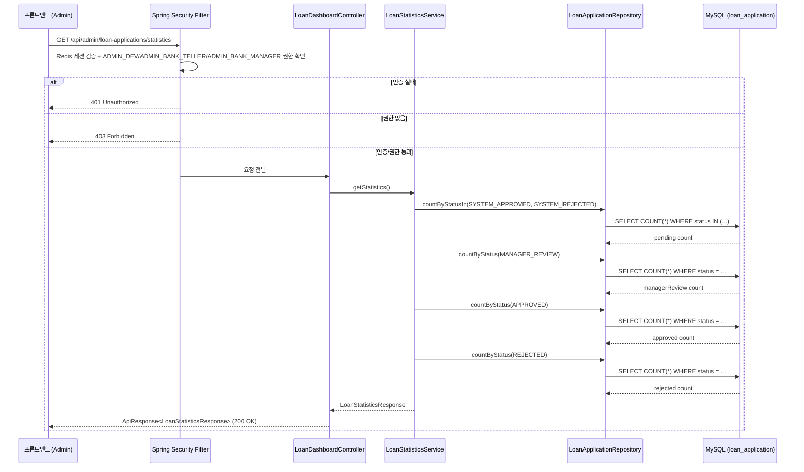

# Design Document: 대출 현황 통계 API

## Overview

SoFit 은행원용 관리자 시스템(sofit-admin)에서 대출 신청 건의 상태별 통계를 조회하는 API를 구현한다. 기존 `LoanDashboardController`에 통계 엔드포인트를 추가하여, 관리자(ADMIN_DEV, ADMIN_BANK_TELLER, ADMIN_BANK_MANAGER)가 대시보드에서 현재 심사 파이프라인의 전체 현황(대기, 지점장 리뷰, 승인, 거절 건수)을 한눈에 파악할 수 있도록 한다.

이 기능은 단순 읽기 전용 집계 API로, 별도의 상태 변경이나 복잡한 비즈니스 로직 없이 DB에서 상태별 COUNT를 수행하여 반환한다.

## Architecture



### 설계 결정 사항

1. **별도 Service 분리**: 기존 `LoanDashboardService`에 메서드를 추가하지 않고, `LoanStatisticsService` 인터페이스와 구현체를 별도로 생성한다. 이유: 단일 책임 원칙(SRP) 준수 및 기존 서비스의 복잡도 증가 방지.

2. **단일 JPQL 쿼리 vs 개별 COUNT 쿼리**: 단일 JPQL로 GROUP BY를 사용하여 한 번에 집계하는 방식을 채택한다. DB 왕복 횟수를 줄여 성능을 최적화한다.

3. **기존 Repository 활용**: `LoanApplicationRepository`(sofit-common)에 통계 전용 쿼리 메서드를 추가한다.

## Components and Interfaces

### 1. Controller Layer

**파일**: `sofit-admin/.../domain/loan/controller/LoanDashboardController.java` (기존 파일에 메서드 추가)

```java
@GetMapping("/statistics")
public ApiResponse<LoanStatisticsResponse> getStatistics() {
    LoanStatisticsResponse response = loanStatisticsService.getStatistics();
    return ApiResponse.onSuccess(LoanDashboardSuccessCode.LOAN_STATISTICS_OK, response);
}
```

**파일**: `sofit-admin/.../domain/loan/controller/LoanDashboardControllerDocs.java` (기존 파일에 메서드 추가)

```java
@Operation(summary = "대출 현황 통계 조회", description = "상태별 대출 신청 건수 통계를 조회합니다.")
ApiResponse<LoanStatisticsResponse> getStatistics();
```

### 2. Service Layer

**파일**: `sofit-admin/.../domain/loan/service/LoanStatisticsService.java` (신규)

```java
public interface LoanStatisticsService {
    LoanStatisticsResponse getStatistics();
}
```

**파일**: `sofit-admin/.../domain/loan/service/LoanStatisticsServiceImpl.java` (신규)

```java
@Service
@RequiredArgsConstructor
@Transactional(readOnly = true)
public class LoanStatisticsServiceImpl implements LoanStatisticsService {
    private final LoanApplicationRepository loanApplicationRepository;

    @Override
    public LoanStatisticsResponse getStatistics() {
        List<StatusCountProjection> counts = loanApplicationRepository.countByStatuses(STATISTICS_STATUSES);
        return LoanStatisticsConverter.toLoanStatisticsResponse(counts);
    }
}
```

### 3. Repository Layer

**파일**: `sofit-common/.../repository/LoanApplicationRepository.java` (기존 파일에 메서드 추가)

```java
@Query("SELECT la.status AS status, COUNT(la) AS count " +
       "FROM LoanApplication la " +
       "WHERE la.status IN :statuses " +
       "GROUP BY la.status")
List<StatusCountProjection> countByStatuses(@Param("statuses") List<ApplicationStatus> statuses);
```

### 4. Projection Interface

**파일**: `sofit-common/.../repository/projection/StatusCountProjection.java` (신규)

```java
public interface StatusCountProjection {
    ApplicationStatus getStatus();
    Long getCount();
}
```

### 5. Converter Layer

**파일**: `sofit-admin/.../domain/loan/converter/LoanStatisticsConverter.java` (신규)

```java
public class LoanStatisticsConverter {
    public static LoanStatisticsResponse toLoanStatisticsResponse(List<StatusCountProjection> counts) {
        // StatusCountProjection 목록을 Map으로 변환 후 각 필드 산출
    }
}
```

### 6. DTO Layer

**파일**: `sofit-admin/.../domain/loan/dto/response/LoanStatisticsResponse.java` (신규)

```java
public record LoanStatisticsResponse(
    int pending,
    int managerReview,
    int approved,
    int rejected
) {}
```

### 7. Success Code

**파일**: `sofit-admin/.../domain/loan/exception/LoanDashboardSuccessCode.java` (기존 enum에 값 추가)

```java
LOAN_STATISTICS_OK(HttpStatus.OK, "COMMON2000", "성공입니다.")
```

## Data Models

### LoanStatisticsResponse (Response DTO)

| 필드 | 타입 | 설명 |
|------|------|------|
| pending | int | SYSTEM_APPROVED + SYSTEM_REJECTED 상태 건수 합 |
| managerReview | int | MANAGER_REVIEW 상태 건수 |
| approved | int | APPROVED 상태 건수 |
| rejected | int | REJECTED 상태 건수 |

### StatusCountProjection (JPA Projection)

| 필드 | 타입 | 설명 |
|------|------|------|
| status | ApplicationStatus | 대출 신청 상태 |
| count | Long | 해당 상태의 건수 |

### 집계 매핑 규칙

| 응답 필드 | 매핑 상태 |
|-----------|-----------|
| pending | SYSTEM_APPROVED + SYSTEM_REJECTED |
| managerReview | MANAGER_REVIEW |
| approved | APPROVED |
| rejected | REJECTED |

## Correctness Properties

*A property is a characteristic or behavior that should hold true across all valid executions of a system — essentially, a formal statement about what the system should do. Properties serve as the bridge between human-readable specifications and machine-verifiable correctness guarantees.*

### Property 1: 통계 집계 정확성

*For any* LoanApplication 목록(각 항목이 임의의 ApplicationStatus를 가짐)에 대해, 통계 집계 결과는 다음을 만족해야 한다:
- `pending` == 목록에서 status가 SYSTEM_APPROVED인 건수 + status가 SYSTEM_REJECTED인 건수
- `managerReview` == 목록에서 status가 MANAGER_REVIEW인 건수
- `approved` == 목록에서 status가 APPROVED인 건수
- `rejected` == 목록에서 status가 REJECTED인 건수

**Validates: Requirements 1.2, 1.3, 1.4, 1.5, 1.7, 4.2, 4.4**

## Error Handling

| 상황 | HTTP 상태 | 에러 코드 | 메시지 | 처리 방식 |
|------|-----------|-----------|--------|-----------|
| 인증되지 않은 사용자 | 401 | COMMON4001 | 인증이 필요합니다. | Spring Security 필터에서 자동 처리 |
| 허용 역할(ADMIN_DEV, ADMIN_BANK_TELLER, ADMIN_BANK_MANAGER) 아님 | 403 | COMMON4003 | 권한이 없습니다. | Spring Security 필터에서 자동 처리 |
| Redis 세션 만료 | 401 | COMMON4001 | 인증이 필요합니다. | 세션 필터에서 자동 처리 |
| 예상치 못한 서버 오류 | 500 | COMMON5000 | 서버 에러, 관리자에게 문의 바랍니다. | GlobalExceptionHandler에서 처리 |

### 트랜잭션 관리

- Service 메서드에 `@Transactional(readOnly = true)` 적용
- 읽기 전용 API이므로 데이터 변경 없음 → 롤백 시나리오 해당 없음
- readOnly 설정으로 JPA dirty checking 비활성화하여 성능 최적화

## Testing Strategy

### 단위 테스트 (JUnit 5 + Mockito)

1. **LoanStatisticsServiceImpl 테스트**
   - Repository Mock을 사용하여 다양한 상태 분포에 대한 집계 결과 검증
   - 빈 결과(모든 상태 0건) 시나리오
   - 일부 상태만 존재하는 시나리오

2. **LoanStatisticsConverter 테스트**
   - StatusCountProjection 목록 → LoanStatisticsResponse 변환 정확성
   - 빈 목록 입력 시 모든 필드 0 반환 확인
   - null 안전성 확인

### Property-Based 테스트 (jqwik)

- **라이브러리**: jqwik (JUnit 5 기반 Java PBT 라이브러리)
- **최소 반복 횟수**: 100회
- **대상**: `LoanStatisticsConverter.toLoanStatisticsResponse()` 메서드
- **태그**: `Feature: loan-statistics, Property 1: 통계 집계 정확성`
- **전략**: 임의의 ApplicationStatus 분포를 가진 StatusCountProjection 목록을 생성하고, Converter의 출력이 기대 집계 값과 일치하는지 검증

### 통합 테스트 (SpringBootTest)

1. **인증/권한 테스트**
   - 인증 없이 접근 시 401 응답
   - 허용 역할(ADMIN_DEV, ADMIN_BANK_TELLER, ADMIN_BANK_MANAGER)이 아닌 역할로 접근 시 403 응답
   - ADMIN_DEV 역할로 정상 접근 시 200 응답
   - ADMIN_BANK_TELLER 역할로 정상 접근 시 200 응답
   - ADMIN_BANK_MANAGER 역할로 정상 접근 시 200 응답

2. **API 응답 형식 테스트**
   - Content-Type: application/json 확인
   - ApiResponse 구조(isSuccess, code, message, result) 확인
   - result 필드의 4개 항목 존재 확인
