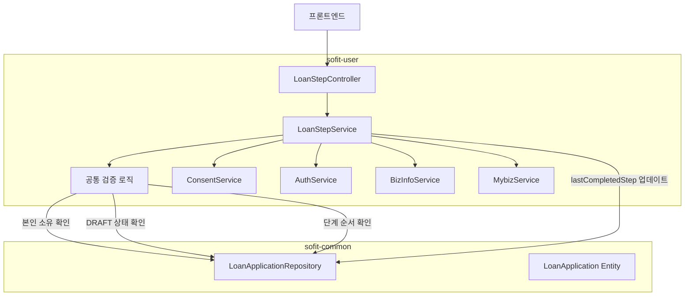

# Design Document: 대출 신청 단계별 래퍼 API (Step 2~6)

## Overview

대출 신청 플로우에서 Step 1(신청 생성)과 Step 7(최종 제출) 사이의 중간 단계(Step 2~6)를 처리하는 래퍼 API를 설계한다. 각 래퍼 API는 범용 서비스(ConsentService, AuthService, BizInfoService, MybizService)를 내부적으로 호출하고, 성공 시 `lastCompletedStep`을 업데이트하는 역할을 담당한다.

**핵심 설계 원칙:**
- 범용 서비스는 대출 신청 컨텍스트를 알 필요 없이 독립적으로 동작
- 래퍼 API(LoanStepService)가 대출 플로우의 단계 관리를 책임
- 범용 서비스 호출 + lastCompletedStep 업데이트를 하나의 트랜잭션으로 처리
- 단계 순서 검증을 통해 플로우 무결성 보장

## Architecture



**계층 구조:**
- `LoanStepController`: HTTP 요청 수신, SecurityUtil로 userId 추출, LoanStepService 호출
- `LoanStepService` (interface + Impl): 공통 검증 로직 + 범용 서비스 호출 + lastCompletedStep 업데이트
- 범용 서비스들 (ConsentService, AuthService, BizInfoService, MybizService): 대출 컨텍스트 무관한 독립 서비스

## Components and Interfaces

### Controller Layer

**LoanStepController** (`/api/loan-applications/{applicationId}/steps/...`)

| 엔드포인트 | HTTP | 설명 |
|---|---|---|
| `/api/loan-applications/{applicationId}/steps/consent` | POST | Step 2: 대출 약관 동의 |
| `/api/loan-applications/{applicationId}/steps/auth` | POST | Step 3: 본인인증 (PIN) |
| `/api/loan-applications/{applicationId}/steps/biz-info` | POST | Step 4: 사업자 정보 확인 |
| `/api/loan-applications/{applicationId}/steps/mydata` | POST | Step 5: 마이데이터 수집 |
| `/api/loan-applications/{applicationId}/steps/mybiz` | POST | Step 6: 마이비즈데이터 연동 |

**LoanStepControllerDocs**: Swagger 어노테이션 분리 인터페이스

### Service Layer

**LoanStepService** (interface):
```java
public interface LoanStepService {
    LoanStepResponse processConsent(Long userId, Long applicationId, ConsentStepRequest request);
    LoanStepResponse processAuth(Long userId, Long applicationId, AuthStepRequest request);
    BizInfoStepResponse processBizInfo(Long userId, Long applicationId, BizInfoStepRequest request);
    LoanStepResponse processMydata(Long userId, Long applicationId, MydataStepRequest request);
    LoanStepResponse processMybiz(Long userId, Long applicationId, MybizStepRequest request);
}
```

**LoanStepServiceImpl**: 각 메서드에서 공통 검증 → 범용 서비스 호출 → lastCompletedStep 업데이트 수행

**범용 서비스 인터페이스:**
- `ConsentService`: 약관 동의 처리 (대출 약관 + 마이데이터 약관 모두 처리)
- `AuthService`: 금융인증서 PIN 기반 본인인증
- `BizInfoService`: 사업자등록번호 기반 사업자 정보 조회
- `MybizService`: 사업자등록번호 기반 마이비즈데이터 수집

### Converter Layer

**LoanStepConverter**: Entity → Response DTO 변환
- `toStepResponse(LoanApplication)` → `LoanStepResponse`
- `toBizInfoStepResponse(LoanApplication, BizInfoResult)` → `BizInfoStepResponse`

### Request/Response DTOs

**Request DTOs (class 사용 - Bean Validation 적용):**

```java
// Step 2: 대출 약관 동의
public class ConsentStepRequest {
    @NotEmpty
    private List<ConsentItem> consentItems;  // 약관 동의 항목 목록
}

// Step 3: 본인인증
public class AuthStepRequest {
    @NotBlank
    @Pattern(regexp = "^\\d{6}$")
    private String pin;  // 6자리 숫자 PIN
}

// Step 4: 사업자 정보 확인
public class BizInfoStepRequest {
    @NotBlank
    @Pattern(regexp = "^\\d{10}$")
    private String bizNo;  // 10자리 사업자등록번호
}

// Step 5: 마이데이터 수집
public class MydataStepRequest {
    @NotEmpty
    private List<ConsentItem> consentItems;  // 마이데이터 약관 동의 항목
}

// Step 6: 마이비즈데이터 연동
public class MybizStepRequest {
    @NotBlank
    @Pattern(regexp = "^\\d{10}$")
    private String bizNo;  // 10자리 사업자등록번호
}
```

**Response DTOs (record 사용 - 불변 데이터):**

```java
// 공통 단계 완료 응답
public record LoanStepResponse(
    Long applicationId,
    String completedStep  // LastCompletedStep enum name
) {}

// Step 4 전용 응답 (사업자 정보 포함)
public record BizInfoStepResponse(
    Long applicationId,
    String completedStep,
    BizInfo bizInfo
) {
    public record BizInfo(
        String businessName,       // 상호명
        String representativeName, // 대표자명
        String businessCategory,   // 업종
        String openDate            // 개업일
    ) {}
}
```

## Data Models

### 기존 엔티티 활용

**LoanApplication** (변경 없음):
- `lastCompletedStep` 필드를 `updateLastCompletedStep(LastCompletedStep)` 메서드로 업데이트
- 이미 존재하는 비즈니스 메서드 활용

**LastCompletedStep** enum (변경 없음):
```
CONSENT_DONE → AUTH_DONE → BIZ_INFO_DONE → DATA_COLLECTED → MYBIZ_CONNECTED
```

### 단계 순서 검증 매핑

| 현재 단계 (Step) | 요구되는 lastCompletedStep | 업데이트할 lastCompletedStep |
|---|---|---|
| Step 2 (약관 동의) | null | CONSENT_DONE |
| Step 3 (본인인증) | CONSENT_DONE | AUTH_DONE |
| Step 4 (사업자 정보) | AUTH_DONE | BIZ_INFO_DONE |
| Step 5 (마이데이터) | BIZ_INFO_DONE | DATA_COLLECTED |
| Step 6 (마이비즈) | DATA_COLLECTED | MYBIZ_CONNECTED |

### 에러 코드 추가 (LoanErrorCode)

| 코드 | HTTP Status | 메시지 |
|---|---|---|
| STEP_ORDER_VIOLATION | 400 | 이전 단계를 먼저 완료해야 합니다. |
| REQUIRED_CONSENT_MISSING | 400 | 필수 약관에 모두 동의해야 합니다. |
| INVALID_PIN_FORMAT | 400 | PIN은 6자리 숫자여야 합니다. |
| INVALID_BIZ_NO_FORMAT | 400 | 사업자등록번호는 10자리 숫자여야 합니다. |
| PIN_AUTH_FAILED | 401 | PIN 인증에 실패했습니다. |
| APPLICATION_NOT_OWNED | 403 | 본인의 대출 신청만 처리할 수 있습니다. |
| BIZ_INFO_NOT_FOUND | 404 | 해당 사업자등록번호로 사업자 정보를 찾을 수 없습니다. |
| EXTERNAL_SERVICE_ERROR | 500 | 외부 서비스 호출에 실패했습니다. |
| MYBIZ_SERVICE_ERROR | 502 | 마이비즈데이터 서비스 연동에 실패했습니다. |

### 성공 코드 추가 (LoanSuccessCode)

| 코드 | HTTP Status | 메시지 |
|---|---|---|
| LOAN_STEP_CONSENT_OK | 200 | 대출 약관 동의가 완료되었습니다. |
| LOAN_STEP_AUTH_OK | 200 | 본인인증이 완료되었습니다. |
| LOAN_STEP_BIZ_INFO_OK | 200 | 사업자 정보 확인이 완료되었습니다. |
| LOAN_STEP_MYDATA_OK | 200 | 마이데이터 수집이 완료되었습니다. |
| LOAN_STEP_MYBIZ_OK | 200 | 마이비즈데이터 연동이 완료되었습니다. |


## Correctness Properties

*A property is a characteristic or behavior that should hold true across all valid executions of a system—essentially, a formal statement about what the system should do. Properties serve as the bridge between human-readable specifications and machine-verifiable correctness guarantees.*

### Property 1: 단계 완료 시 올바른 lastCompletedStep 업데이트

*For any* 유효한 DRAFT 상태의 LoanApplication과 올바른 이전 단계가 완료된 상태에서, 해당 단계의 범용 서비스 호출이 성공하면, lastCompletedStep은 해당 단계에 대응하는 값(CONSENT_DONE, AUTH_DONE, BIZ_INFO_DONE, DATA_COLLECTED, MYBIZ_CONNECTED)으로 정확히 업데이트되어야 한다.

**Validates: Requirements 1.2, 2.2, 3.2, 4.3, 5.2**

### Property 2: 단계 순서 위반 시 거부

*For any* LoanApplication과 요청된 단계에 대해, 해당 단계의 요구되는 이전 lastCompletedStep과 실제 lastCompletedStep이 일치하지 않으면, 시스템은 400 에러를 반환하고 lastCompletedStep을 변경하지 않아야 한다.

**Validates: Requirements 1.7, 2.8, 3.7, 4.7, 5.7, 6.8**

### Property 3: DRAFT 상태가 아닌 신청에 대한 거부

*For any* LoanApplication의 status가 DRAFT가 아닌 경우(SUBMITTED, APPROVED, REJECTED 등), 모든 단계 처리 요청에 대해 시스템은 400 에러를 반환하고 lastCompletedStep을 변경하지 않아야 한다.

**Validates: Requirements 1.5, 2.5, 3.5, 4.6, 5.5**

### Property 4: 존재하지 않는 applicationId에 대한 404 반환

*For any* 존재하지 않는 applicationId에 대해, 모든 단계 처리 요청은 404 에러를 반환해야 한다.

**Validates: Requirements 1.4, 2.4, 3.4, 4.5, 5.4**

### Property 5: 유효하지 않은 입력 형식 거부

*For any* 유효하지 않은 형식의 입력(6자리 숫자가 아닌 PIN, 10자리 숫자가 아닌 bizNo, 필수 약관이 누락된 동의 목록)에 대해, 시스템은 400 에러를 반환하고 lastCompletedStep을 변경하지 않아야 한다.

**Validates: Requirements 1.6, 2.6, 3.6, 4.8, 5.6**

### Property 6: 서비스 실패 시 트랜잭션 롤백 (상태 미변경)

*For any* 단계 처리 중 범용 서비스 호출이 실패하면, 해당 LoanApplication의 lastCompletedStep은 호출 이전 상태를 유지해야 한다 (트랜잭션 롤백).

**Validates: Requirements 1.8, 6.1**

### Property 7: 본인 소유 확인 실패 시 403 반환

*For any* userId와 applicationId 조합에서, 해당 LoanApplication의 소유자(user.userId)와 요청자의 userId가 일치하지 않으면, 시스템은 403 에러를 반환하고 단계 처리를 수행하지 않아야 한다.

**Validates: Requirements 6.4**

## Error Handling

### 공통 검증 순서 (모든 단계에 동일 적용)

각 단계의 `LoanStepServiceImpl` 메서드는 다음 순서로 검증을 수행한다:

1. **LoanApplication 존재 확인** → 없으면 `APPLICATION_NOT_FOUND` (404)
2. **본인 소유 확인** (userId 매칭) → 불일치 시 `APPLICATION_NOT_OWNED` (403)
3. **DRAFT 상태 확인** → DRAFT가 아니면 `APPLICATION_NOT_DRAFT` (400)
4. **단계 순서 확인** (lastCompletedStep 검증) → 위반 시 `STEP_ORDER_VIOLATION` (400)
5. **입력값 검증** (Bean Validation + 비즈니스 검증) → 실패 시 해당 에러 코드 (400)
6. **범용 서비스 호출** → 실패 시 서비스별 에러 코드 반환

### 트랜잭션 처리

- `@Transactional`을 `LoanStepServiceImpl`의 각 메서드에 적용
- 범용 서비스 호출 실패 시 예외가 발생하면 Spring의 트랜잭션 롤백 메커니즘에 의해 자동 롤백
- `BaseException`은 `RuntimeException`을 상속하므로 기본적으로 롤백 대상

### 에러 응답 형식

기존 `GlobalExceptionHandler`와 `ApiResponse.onFailure()` 패턴을 그대로 활용:

```json
{
  "isSuccess": false,
  "code": "LOAN4003",
  "message": "이전 단계를 먼저 완료해야 합니다."
}
```

## Testing Strategy

### 단위 테스트 (JUnit 5 + Mockito)

**LoanStepServiceImpl 테스트:**
- 각 단계별 정상 처리 시나리오 (범용 서비스 mock)
- 공통 검증 로직 실패 시나리오 (404, 403, 400 에러)
- 범용 서비스 호출 실패 시 트랜잭션 롤백 확인
- 단계 순서 위반 시나리오

**LoanStepConverter 테스트:**
- Entity → Response DTO 변환 정확성

### Property-Based 테스트 (jqwik)

이 프로젝트는 Java + Spring Boot 기반이므로 **jqwik** 라이브러리를 사용하여 property-based testing을 수행한다.

**설정:**
- 최소 100회 반복 실행
- 각 테스트에 설계 문서의 Property 번호를 태그로 명시
- 태그 형식: `Feature: loan-step-wrapper-api, Property {number}: {property_text}`

**테스트 대상 Property:**
- Property 1: 단계 완료 시 올바른 lastCompletedStep 업데이트
- Property 2: 단계 순서 위반 시 거부
- Property 3: DRAFT 상태가 아닌 신청에 대한 거부
- Property 4: 존재하지 않는 applicationId에 대한 404 반환
- Property 5: 유효하지 않은 입력 형식 거부
- Property 6: 서비스 실패 시 트랜잭션 롤백
- Property 7: 본인 소유 확인 실패 시 403 반환

**Generator 전략:**
- `ApplicationStatus` enum에서 DRAFT를 제외한 값 생성 (Property 3)
- `LastCompletedStep` enum에서 올바르지 않은 값 생성 (Property 2)
- 6자리 숫자가 아닌 임의의 문자열 생성 (Property 5 - PIN)
- 10자리 숫자가 아닌 임의의 문자열 생성 (Property 5 - bizNo)
- 필수 약관의 진부분집합 생성 (Property 5 - consent)

### 통합 테스트

- `@SpringBootTest` + `@Transactional`로 실제 DB 연동 테스트
- 각 단계의 정상 플로우 E2E 테스트 (Step 2 → 3 → 4 → 5 → 6 순차 실행)
- MockMvc를 활용한 Controller 레이어 테스트
