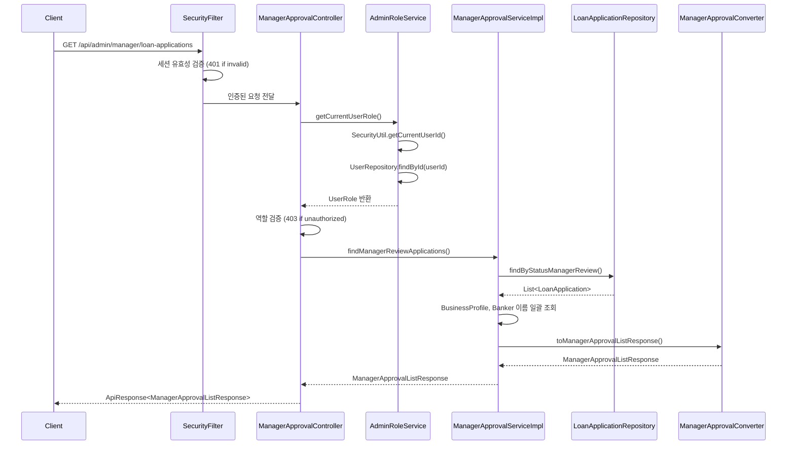
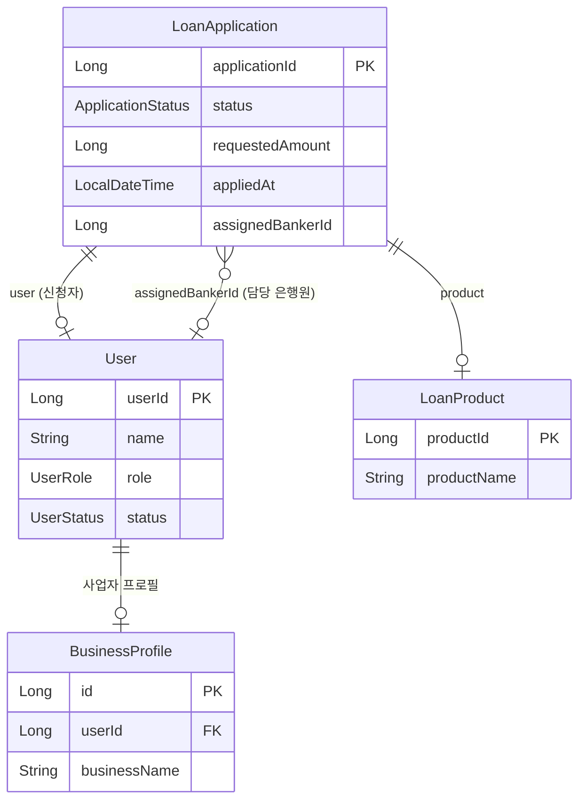

# Design Document: 지점장 결재 조회 API

## Overview

지점장 결재 조회 API는 `GET /api/admin/manager/loan-applications` 엔드포인트를 통해 `MANAGER_REVIEW` 상태의 대출 신청 건 목록을 조회하는 기능이다. ADMIN_BANK_MANAGER 또는 ADMIN_DEV 역할을 가진 사용자만 접근 가능하며, 결과는 신청일(appliedAt) 기준 오름차순으로 정렬된다.

### 설계 결정 사항

1. **패키지 배치**: `domain/loan/` 하위에 manager 전용 컴포넌트를 배치한다. 대출 도메인에 속하지만 URL prefix가 다르므로(`/api/admin/manager/`) 별도 Controller를 생성하되, 같은 loan 패키지 내에 위치시킨다.
2. **역할 조회 유틸리티**: SecurityUtil + UserRepository 조합의 재사용 가능한 서비스(`AdminRoleService`)를 `global/util/` 패키지에 생성한다. SecurityUtil은 static 유틸리티이므로 DB 접근이 불가하고, 역할 조회는 DB 접근이 필요하기 때문이다.
3. **Repository 쿼리**: 기존 `LoanApplicationRepository`에 MANAGER_REVIEW 상태 전용 조회 메서드를 추가한다. JOIN FETCH로 N+1 문제를 방지한다.

## Architecture



## Components and Interfaces

### 1. AdminRoleService (신규 - global/util/)

역할 조회를 위한 재사용 가능한 서비스. SecurityUtil과 UserRepository를 조합하여 현재 로그인한 사용자의 역할을 반환한다.

```java
@Service
@RequiredArgsConstructor
public class AdminRoleService {
    private final UserRepository userRepository;

    /**
     * 현재 인증된 사용자의 역할을 반환한다.
     * @throws BaseException SESSION_EXPIRED - 인증 정보 없음
     * @throws BaseException USER_NOT_FOUND - 사용자 미존재 또는 INACTIVE
     */
    public UserRole getCurrentUserRole() { ... }
}
```

### 2. ManagerApprovalController (신규 - domain/loan/controller/)

```java
@RestController
@RequestMapping("/api/admin/manager")
@RequiredArgsConstructor
public class ManagerApprovalController implements ManagerApprovalControllerDocs {
    private final ManagerApprovalService managerApprovalService;
    private final AdminRoleService adminRoleService;

    @GetMapping("/loan-applications")
    public ApiResponse<ManagerApprovalListResponse> findManagerApprovalList() { ... }
}
```

### 3. ManagerApprovalControllerDocs (신규 - domain/loan/controller/)

Swagger 어노테이션을 분리한 인터페이스.

```java
@Tag(name = "지점장 결재")
public interface ManagerApprovalControllerDocs {
    @Operation(summary = "지점장 결재 대기 목록 조회")
    ApiResponse<ManagerApprovalListResponse> findManagerApprovalList();
}
```

### 4. ManagerApprovalService / ManagerApprovalServiceImpl (신규 - domain/loan/service/)

```java
public interface ManagerApprovalService {
    ManagerApprovalListResponse findManagerReviewApplications();
}

@Service
@RequiredArgsConstructor
@Transactional(readOnly = true)
public class ManagerApprovalServiceImpl implements ManagerApprovalService {
    private final LoanApplicationRepository loanApplicationRepository;
    private final BusinessProfileRepository businessProfileRepository;
    private final UserRepository userRepository;

    @Override
    public ManagerApprovalListResponse findManagerReviewApplications() { ... }
}
```

### 5. ManagerApprovalConverter (신규 - domain/loan/converter/)

```java
public class ManagerApprovalConverter {
    public static ManagerApprovalListResponse toManagerApprovalListResponse(
            List<LoanApplication> applications,
            Map<Long, String> businessNameMap,
            Map<Long, String> bankerNameMap) { ... }

    public static ManagerApprovalItemResponse toManagerApprovalItemResponse(
            LoanApplication app,
            String businessName,
            String bankerName) { ... }
}
```

### 6. ManagerApprovalSuccessCode (신규 - domain/loan/exception/)

```java
@Getter
@AllArgsConstructor
public enum ManagerApprovalSuccessCode implements BaseSuccessCode {
    MANAGER_APPROVAL_LIST_OK(HttpStatus.OK, "COMMON2000", "성공입니다.");
    // ...
}
```

### 7. LoanApplicationRepository (기존 - 메서드 추가)

```java
// 지점장 결재 대기 목록 조회: MANAGER_REVIEW 상태, appliedAt 오름차순
@Query("SELECT la FROM LoanApplication la " +
       "JOIN FETCH la.user u " +
       "JOIN FETCH la.product p " +
       "WHERE la.status = :status " +
       "ORDER BY la.appliedAt ASC")
List<LoanApplication> findByStatusWithUserAndProduct(
        @Param("status") ApplicationStatus status);
```

## Data Models

### Request

없음 (GET 요청, 파라미터 없음)

### Response DTO

```java
// 목록 래퍼 DTO
public record ManagerApprovalListResponse(
    List<ManagerApprovalItemResponse> applications
) {}

// 개별 항목 DTO
public record ManagerApprovalItemResponse(
    Long id,                    // LoanApplication.applicationId
    String applicationDate,     // appliedAt → "yyyy-MM-dd" (null 가능)
    String applicantName,       // LoanApplication.user.name
    String businessName,        // BusinessProfile.businessName (null 가능)
    String productName,         // LoanProduct.productName
    String requestedByName,     // assignedBankerId → User.name (null 가능)
    Long requestedAmount        // LoanApplication.requestedAmount (null 가능)
) {}
```

### 엔티티 관계 다이어그램



## Correctness Properties

*A property is a characteristic or behavior that should hold true across all valid executions of a system—essentially, a formal statement about what the system should do. Properties serve as the bridge between human-readable specifications and machine-verifiable correctness guarantees.*

### Property 1: MANAGER_REVIEW 필터링 및 정렬 불변성

*For any* LoanApplication 목록(다양한 status를 포함)에 대해, 서비스 메서드의 결과는 반드시 status가 MANAGER_REVIEW인 건만 포함하며, appliedAt 기준 오름차순(non-decreasing)으로 정렬되어 있어야 한다.

**Validates: Requirements 1.1**

### Property 2: Converter 매핑 정확성

*For any* LoanApplication 엔티티(user, product 연관 포함)와 businessName, bankerName 값(null 포함)에 대해, ManagerApprovalConverter의 변환 결과는 다음을 만족해야 한다:
- `id`는 원본 `applicationId`와 동일
- `applicationDate`는 `appliedAt`이 null이면 null, 아니면 "yyyy-MM-dd" 형식 문자열
- `applicantName`은 원본 `user.name`과 동일
- `businessName`은 전달된 businessName 값과 동일 (null 포함)
- `productName`은 원본 `product.productName`과 동일
- `requestedByName`은 전달된 bankerName 값과 동일 (null 포함)
- `requestedAmount`는 원본 `requestedAmount`와 동일 (null 포함)

**Validates: Requirements 1.2, 3.1, 3.2, 3.3, 3.4, 3.5, 3.6, 3.7, 3.8, 3.9, 3.10, 3.11**

## Error Handling

| 상황 | HTTP Status | Error Code | Message |
|------|-------------|------------|---------|
| 세션 없음 / 만료 | 401 | COMMON4001 | 인증이 필요합니다. |
| 권한 없는 역할 (USER, ADMIN_BANK_TELLER) | 403 | COMMON4003 | 권한이 없습니다. |
| userId에 해당하는 사용자 미존재 / INACTIVE | 401 | AUTH4001 | 사용자를 찾을 수 없습니다. |
| 서버 내부 오류 (DB 예외 등) | 500 | COMMON5000 | 서버 에러, 관리자에게 문의 바랍니다. |

### 에러 처리 흐름

1. **인증 검증 (Spring Security Filter)**: 세션 유효성을 먼저 확인. 실패 시 401 반환.
2. **역할 검증 (Controller)**: AdminRoleService로 역할 조회 후, 허용 역할이 아니면 403 반환.
3. **비즈니스 로직 예외**: GlobalExceptionHandler에서 BaseException을 캐치하여 적절한 에러 응답 반환.
4. **미처리 예외**: GlobalExceptionHandler에서 500 응답 반환.

### 검증 순서

```
요청 수신 → 인증 검증(401) → 역할 검증(403) → 비즈니스 로직 실행 → 성공 응답
```

## Testing Strategy

### 단위 테스트 (JUnit 5 + Mockito)

| 대상 | 테스트 내용 |
|------|------------|
| AdminRoleService | 정상 역할 반환, 미인증 예외, 사용자 미존재 예외, INACTIVE 사용자 예외 |
| ManagerApprovalController | 허용 역할 정상 처리, 비허용 역할 403, 미인증 401 |
| ManagerApprovalServiceImpl | 빈 결과 시 빈 리스트 반환, DB 예외 시 전파 |
| ManagerApprovalConverter | null 필드 처리 (appliedAt, assignedBankerId, businessName, requestedAmount) |

### 프로퍼티 기반 테스트 (JUnit 5 + jqwik)

- **라이브러리**: jqwik (Java용 PBT 라이브러리)
- **최소 반복 횟수**: 100회
- **태그 형식**: `Feature: manager-approval-list, Property {number}: {property_text}`

| Property | 대상 | 생성기 |
|----------|------|--------|
| Property 1 | Service 필터링/정렬 로직 | 다양한 ApplicationStatus를 가진 LoanApplication 리스트 생성 |
| Property 2 | Converter 매핑 로직 | 임의의 LoanApplication + nullable 필드 조합 생성 |

### 통합 테스트

| 대상 | 테스트 내용 |
|------|------------|
| API 엔드포인트 | MockMvc를 사용한 전체 요청-응답 흐름 검증 (인증/권한/정상 응답) |
