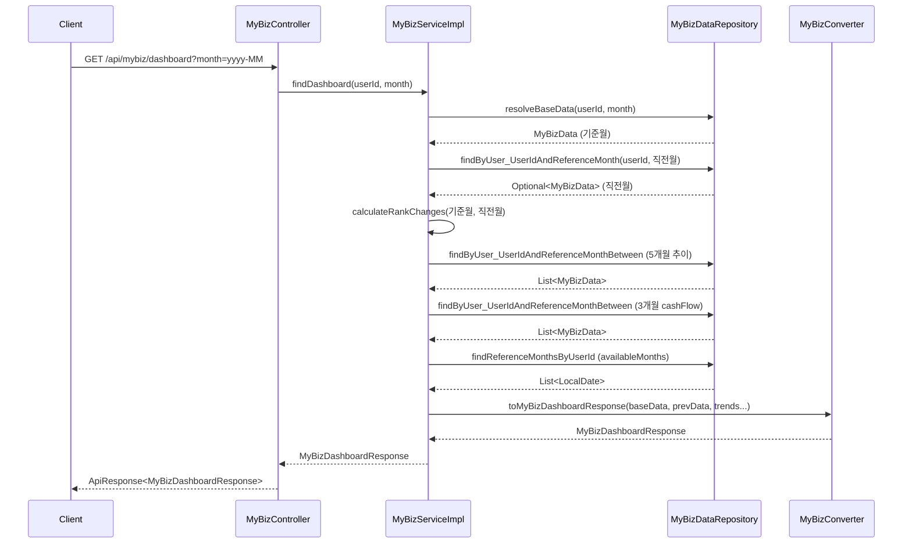

# Design Document: MyBiz Dashboard DTO Extension

## Overview

My Biz 대시보드 API의 응답 DTO(`MyBizDashboardResponse`)를 4개 탭 구조에 맞게 확장하는 설계이다.
기존 API 엔드포인트(`GET /api/mybiz/dashboard`)와 호출 방식은 유지하면서, 신규 필드 추가 및 업종 비교 순위 변동(rankChange) 계산 로직을 포함한다.

### 핵심 변경사항
- `MyBizDashboardResponse` record에 1번 탭/3번 탭 신규 필드 추가
- `IndustryCompareResponse` 중첩 record에 순위 변동(rankChange) 3개 필드 추가
- `MyBizServiceImpl`에 직전 월 데이터 조회 및 rankChange 계산 로직 추가
- `MyBizConverter`에 신규 필드 매핑 및 rankChange 파라미터 전달 로직 추가

### 설계 결정 사항
1. **단일 API 유지**: 4개 탭 데이터를 하나의 응답으로 반환. 탭 전환은 프론트엔드 처리
2. **nullable 전략**: 직전 월 데이터 부재 시 rankChange는 null 반환 (0과 null 구분)
3. **기존 필드 보존**: 기존 필드의 이름/타입/계산 로직 일체 변경 없음
4. **추가 DB 쿼리 1회**: 직전 월 데이터 조회를 위한 쿼리 1회 추가 (기존 Repository 메서드 재사용)

## Architecture

### 컴포넌트 관계도



### 레이어별 변경 범위

| 레이어 | 파일 | 변경 유형 |
|--------|------|-----------|
| DTO | `MyBizDashboardResponse.java` | 필드 추가 (record 재정의) |
| Service | `MyBizServiceImpl.java` | 직전 월 조회 + rankChange 계산 로직 추가 |
| Converter | `MyBizConverter.java` | 신규 필드 매핑 + rankChange 파라미터 수용 |
| Repository | `MyBizDataRepository.java` | 변경 없음 (기존 메서드 재사용) |
| Controller | `MyBizController.java` | 변경 없음 |

## Components and Interfaces

### MyBizDashboardResponse (확장 후)

```java
public record MyBizDashboardResponse(
        // === 공통 ===
        String referenceMonth,
        List<String> availableMonths,

        // === 1번 탭: 매출 ===
        Long monthlyRevenue,
        BigDecimal monthlyRevenueGrowthRate,
        Long prevMonthRevenue,                    // 신규
        Integer monthlyTransactionCount,          // 신규
        BigDecimal avgTransactionAmount,          // 신규
        List<RevenueTrendResponse> revenueTrend,

        // === 2번 탭: 수익/현금흐름 ===
        Long cashFlow,
        Long estimatedProfit,
        List<CashFlowTrendResponse> cashFlowTrend,

        // === 3번 탭: 고객/온라인 ===
        BigDecimal reviewRating,
        Integer reviewCount,
        BigDecimal onlineReorderRate,
        Integer deliveryOrderCount,
        BigDecimal onlineReplyRate,               // 신규
        Integer onlineInfoUpdateCount,            // 신규
        BigDecimal positiveReviewRatio,           // 신규
        BigDecimal deliveryRating,                // 신규
        Long deliverySalesAmount,                 // 신규
        Boolean hasOnlineReservation,             // 신규
        Boolean hasSns,                           // 신규
        List<RatingTrendResponse> ratingTrend,

        // === 4번 탭: 업종 비교 ===
        IndustryCompareResponse industryCompare
) {
    public record IndustryCompareResponse(
            String industryName,
            BigDecimal industrySalesRank,
            BigDecimal industryProfitRank,
            BigDecimal industryStabilityRank,
            BigDecimal industrySalesRankChange,      // 신규 (nullable)
            BigDecimal industryProfitRankChange,     // 신규 (nullable)
            BigDecimal industryStabilityRankChange   // 신규 (nullable)
    ) {}

    // 기존 중첩 record 유지
    public record RevenueTrendResponse(String referenceMonth, Long monthlyRevenue) {}
    public record CashFlowTrendResponse(String referenceMonth, Long monthlyInflow, Long monthlyOutflow) {}
    public record RatingTrendResponse(String referenceMonth, BigDecimal reviewRating) {}
}
```

### MyBizServiceImpl 변경사항

```java
@Override
public MyBizDashboardResponse findDashboard(Long userId, String month) {
    // 1. 기준월 데이터 조회 (기존)
    MyBizData baseData = resolveBaseData(userId, month);
    LocalDate referenceMonth = baseData.getReferenceMonth();

    // 2. 직전 월 데이터 조회 (신규)
    Optional<MyBizData> prevMonthData = myBizDataRepository
            .findByUser_UserIdAndReferenceMonth(userId, referenceMonth.minusMonths(1));

    // 3. rankChange 계산 (신규)
    BigDecimal salesRankChange = calculateRankChange(
            baseData.getIndustrySalesRank(),
            prevMonthData.map(MyBizData::getIndustrySalesRank).orElse(null));
    BigDecimal profitRankChange = calculateRankChange(
            baseData.getIndustryProfitRank(),
            prevMonthData.map(MyBizData::getIndustryProfitRank).orElse(null));
    BigDecimal stabilityRankChange = calculateRankChange(
            baseData.getIndustryStabilityRank(),
            prevMonthData.map(MyBizData::getIndustryStabilityRank).orElse(null));

    // 4~6. 기존 추이/월목록 조회 (기존)
    // ...

    // 7. Converter 호출 (rankChange 파라미터 추가)
    return MyBizConverter.toMyBizDashboardResponse(
            baseData, fiveMonthTrendData, cashFlowTrendData, availableMonths,
            salesRankChange, profitRankChange, stabilityRankChange);
}

private BigDecimal calculateRankChange(BigDecimal currentRank, BigDecimal prevRank) {
    if (currentRank == null || prevRank == null) {
        return null;
    }
    return currentRank.subtract(prevRank);
}
```

### MyBizConverter 변경사항

`toMyBizDashboardResponse` 메서드 시그니처에 rankChange 3개 파라미터 추가:

```java
public static MyBizDashboardResponse toMyBizDashboardResponse(
        MyBizData baseData,
        List<MyBizData> fiveMonthTrendData,
        List<MyBizData> cashFlowTrendData,
        List<LocalDate> availableMonths,
        BigDecimal salesRankChange,        // 신규
        BigDecimal profitRankChange,       // 신규
        BigDecimal stabilityRankChange     // 신규
) { ... }
```

## Data Models

### MyBizData 엔티티 (변경 없음)

이미 모든 신규 DTO 필드에 대응하는 컬럼이 `MyBizData` 엔티티에 존재한다:

| DTO 신규 필드 | 엔티티 필드 | 타입 | 비고 |
|---------------|-------------|------|------|
| `prevMonthRevenue` | `prevMonthRevenue` | Long | 이미 존재 |
| `monthlyTransactionCount` | `monthlyTransactionCount` | Integer | 이미 존재 |
| `avgTransactionAmount` | `avgTransactionAmount` | BigDecimal | 이미 존재 |
| `onlineReplyRate` | `onlineReplyRate` | BigDecimal | 이미 존재 |
| `onlineInfoUpdateCount` | `onlineInfoUpdateCount` | Integer | 이미 존재 |
| `positiveReviewRatio` | `positiveReviewRatio` | BigDecimal | 이미 존재 |
| `deliveryRating` | `deliveryRating` | BigDecimal | 이미 존재 |
| `deliverySalesAmount` | `deliverySalesAmount` | Long | 이미 존재 |
| `hasOnlineReservation` | `hasOnlineReservation` | Boolean | 이미 존재 |
| `hasSns` | `hasSns` | Boolean | 이미 존재 |

### IndustryCompareResponse rankChange 필드 (계산값)

| 필드 | 타입 | 산출 공식 | null 조건 |
|------|------|-----------|-----------|
| `industrySalesRankChange` | BigDecimal (nullable) | 기준월 industrySalesRank - 직전월 industrySalesRank | 직전월 데이터 없음 OR 양쪽 rank 중 하나 null |
| `industryProfitRankChange` | BigDecimal (nullable) | 기준월 industryProfitRank - 직전월 industryProfitRank | 직전월 데이터 없음 OR 양쪽 rank 중 하나 null |
| `industryStabilityRankChange` | BigDecimal (nullable) | 기준월 industryStabilityRank - 직전월 industryStabilityRank | 직전월 데이터 없음 OR 양쪽 rank 중 하나 null |

### DB 스키마 변경

- **없음**. 모든 신규 DTO 필드는 이미 `my_biz_data` 테이블에 존재하는 컬럼을 매핑.
- rankChange 필드는 서비스 레이어 계산값이므로 별도 컬럼 불필요.


## Correctness Properties

*A property is a characteristic or behavior that should hold true across all valid executions of a system—essentially, a formal statement about what the system should do. Properties serve as the bridge between human-readable specifications and machine-verifiable correctness guarantees.*

### Property 1: rankChange 계산 정확성

*For any* 두 BigDecimal 값 currentRank와 prevRank에 대해, 둘 다 non-null이면 `calculateRankChange(currentRank, prevRank)`는 `currentRank - prevRank`를 반환해야 하고, 둘 중 하나라도 null이면 null을 반환해야 한다.

**Validates: Requirements 2.2, 2.4, 4.2**

### Property 2: 직전 월 데이터 부재 시 rankChange null 보장

*For any* 기준월 MyBizData와 직전 월 데이터가 존재하지 않는(Optional.empty()) 상황에서, 변환된 MyBizDashboardResponse의 `industryCompare.industrySalesRankChange`, `industryCompare.industryProfitRankChange`, `industryCompare.industryStabilityRankChange` 필드는 모두 null이어야 하며, 나머지 대시보드 필드는 정상 매핑되어야 한다.

**Validates: Requirements 1.6, 2.3, 4.3, 5.5**

### Property 3: Converter 신규 필드 1:1 매핑

*For any* 유효한 MyBizData 엔티티에 대해, MyBizConverter를 통해 변환된 MyBizDashboardResponse의 신규 필드(prevMonthRevenue, monthlyTransactionCount, avgTransactionAmount, onlineReplyRate, onlineInfoUpdateCount, positiveReviewRatio, deliveryRating, deliverySalesAmount, hasOnlineReservation, hasSns)는 엔티티의 동일 이름 필드 값과 정확히 일치해야 하며, 엔티티 필드가 null이면 DTO 필드도 null이어야 한다.

**Validates: Requirements 3.1, 3.2, 3.3, 5.4**

### Property 4: 기존 필드 값 산출 로직 보존

*For any* 유효한 MyBizData 엔티티와 추이 데이터 목록에 대해, 변환된 MyBizDashboardResponse의 기존 필드(monthlyRevenue, monthlyRevenueGrowthRate, cashFlow, estimatedProfit, reviewRating, reviewCount, onlineReorderRate, deliveryOrderCount, revenueTrend, cashFlowTrend, ratingTrend)의 값은 DTO 확장 전 Converter 로직과 동일한 결과를 산출해야 한다.

**Validates: Requirements 5.3**

## Error Handling

### 에러 시나리오

| 시나리오 | 처리 방식 | 응답 |
|----------|-----------|------|
| 기준월 MyBizData 없음 | BaseException(MY_BIZ_DATA_NOT_FOUND) 발생 | 404 |
| 직전 월 MyBizData 없음 | 정상 처리, rankChange만 null | 200 정상 응답 |
| month 파라미터 형식 오류 | BaseException(BAD_REQUEST) 발생 | 400 |
| 엔티티 신규 필드 null | DTO에 null 전파 | 200 정상 응답 (null 포함) |

### 설계 원칙

- 직전 월 데이터 부재는 에러가 아닌 정상 케이스로 처리 (null 반환)
- 기존 에러 핸들링 로직(resolveBaseData 내 검증)은 변경하지 않음
- 신규 로직에서 추가 예외는 발생하지 않음 (Optional 패턴으로 안전 처리)

## Testing Strategy

### 단위 테스트 (JUnit 5 + Mockito)

1. **MyBizServiceImpl 테스트**
   - 직전 월 데이터 존재 시 rankChange 계산 정확성 검증
   - 직전 월 데이터 미존재 시 rankChange null 검증
   - 기존 findDashboard 동작 보존 검증 (Mock Repository)

2. **MyBizConverter 테스트**
   - 신규 필드 1:1 매핑 정확성 검증
   - rankChange 파라미터 전달 검증
   - 엔티티 필드 null 시 DTO 필드 null 검증
   - 기존 필드 변환 로직 보존 검증

### Property-Based Testing (jqwik)

PBT 라이브러리: **jqwik** (JUnit 5 플랫폼 호환, Java용 PBT 프레임워크)

- 최소 100 iterations per property
- 각 property test에 설계 문서 property 참조 태그 포함
- 태그 형식: `Feature: mybiz-dashboard-dto-extension, Property {number}: {property_text}`

**Property Test 대상:**
- Property 1: `calculateRankChange` 순수 함수 테스트 (임의의 BigDecimal 쌍)
- Property 2: 직전 월 Optional.empty() 조건에서 rankChange null + 나머지 정상
- Property 3: 임의의 MyBizData → Converter → 신규 필드 일치 검증
- Property 4: 임의의 MyBizData → Converter → 기존 필드 보존 검증

### 통합 테스트

- API 엔드포인트 호출 시 기존 응답 구조(래퍼 포함) 유지 확인
- 신규 필드가 JSON 응답에 포함되는지 확인
- 직전 월 데이터 유무에 따른 전체 응답 차이 확인
