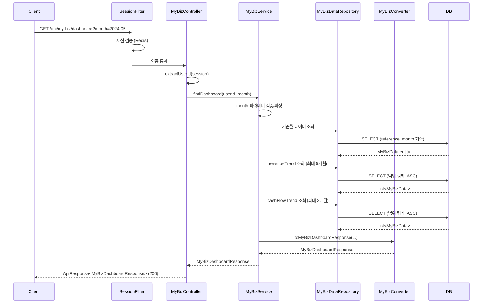

# Design Document: MyBiz Dashboard API

## Overview

소상공인 사용자의 My Biz Data 대시보드를 조회하는 REST API(`GET /api/my-biz/dashboard`)를 설계한다. 세션 기반 인증으로 사용자를 식별하고, 월별 매출·현금흐름·업종 비교·트렌드 데이터를 단일 응답으로 반환한다.

이 API는 기존 SoFit 프로젝트의 레이어드 아키텍처(Controller → Service → Repository)와 Converter 패턴을 따르며, sofit-common 모듈에 Entity/Repository를, sofit-user 모듈에 나머지 비즈니스 로직을 배치한다.

## Architecture



### 모듈 배치

| 모듈 | 클래스 | 역할 |
|------|--------|------|
| sofit-common | `MyBizData` (Entity) | my_biz_data 테이블 매핑 |
| sofit-common | `MyBizDataRepository` | JPA Repository |
| sofit-user | `MyBizController` | 엔드포인트, 세션 처리 |
| sofit-user | `MyBizControllerDocs` | Swagger 어노테이션 인터페이스 |
| sofit-user | `MyBizService` / `MyBizServiceImpl` | 비즈니스 로직 |
| sofit-user | `MyBizConverter` | Entity → DTO 변환 |
| sofit-user | `MyBizDashboardResponse` (DTO) | 응답 DTO (record) |
| sofit-user | `MyBizErrorCode` | 도메인 에러 코드 |
| sofit-user | `MyBizSuccessCode` | 도메인 성공 코드 |

## Components and Interfaces

### MyBizController

```java
@RestController
@RequestMapping("/api/my-biz")
@RequiredArgsConstructor
public class MyBizController implements MyBizControllerDocs {

    private final MyBizService myBizService;

    @GetMapping("/dashboard")
    public ApiResponse<MyBizDashboardResponse> findDashboard(
            HttpServletRequest request,
            @RequestParam(value = "month", required = false) String month) {
        HttpSession session = request.getSession(false);
        Long userId = extractUserId(session);
        MyBizDashboardResponse response = myBizService.findDashboard(userId, month);
        return ApiResponse.onSuccess(MyBizSuccessCode.DASHBOARD_OK, response);
    }

    private Long extractUserId(HttpSession session) {
        Object userIdAttr = session.getAttribute("userId");
        return (userIdAttr instanceof Long) ? (Long) userIdAttr : Long.valueOf(userIdAttr.toString());
    }
}
```

### MyBizService (Interface)

```java
public interface MyBizService {
    MyBizDashboardResponse findDashboard(Long userId, String month);
}
```

### MyBizServiceImpl

핵심 비즈니스 로직:
1. `month` 파라미터 검증 (null/빈 문자열 → 최신, 유효한 yyyy-MM → 파싱, 그 외 → 400 에러)
2. 기준월 데이터 조회 (미존재 시 404)
3. revenueTrend 조회 (기준월 포함 이전 5개월, 오름차순)
4. cashFlowTrend 조회 (기준월 포함 이전 3개월, 오름차순)
5. Converter로 DTO 변환 후 반환

### MyBizConverter

```java
public class MyBizConverter {
    private MyBizConverter() {}

    public static MyBizDashboardResponse toMyBizDashboardResponse(
            MyBizData baseData,
            List<MyBizData> revenueTrendData,
            List<MyBizData> cashFlowTrendData) { ... }
}
```

### MyBizControllerDocs

```java
@Tag(name = "My Biz Data", description = "소상공인 My Biz Data 대시보드 조회 API")
public interface MyBizControllerDocs {

    @Operation(summary = "My Biz 대시보드 조회",
               description = "로그인한 사용자의 My Biz Data 대시보드를 조회합니다. month 파라미터로 특정 기준월을 지정할 수 있습니다.")
    @ApiResponses(value = {
        @ApiResponse(responseCode = "200", description = "조회 성공"),
        @ApiResponse(responseCode = "401", description = "인증 실패"),
        @ApiResponse(responseCode = "404", description = "My Biz Data 미존재")
    })
    ApiResponse<MyBizDashboardResponse> findDashboard(
            HttpServletRequest request,
            @Parameter(description = "조회 기준월 (yyyy-MM 형식)", required = false, example = "2024-05")
            String month);
}
```

### MyBizDataRepository

```java
public interface MyBizDataRepository extends JpaRepository<MyBizData, Long> {

    // 사용자의 최신 reference_month 데이터 조회
    Optional<MyBizData> findFirstByUser_UserIdOrderByReferenceMonthDesc(Long userId);

    // 사용자의 특정 reference_month 데이터 조회
    Optional<MyBizData> findByUser_UserIdAndReferenceMonth(Long userId, LocalDate referenceMonth);

    // revenueTrend: 기준월 포함 이전 최대 5개월 (오름차순)
    List<MyBizData> findByUser_UserIdAndReferenceMonthBetweenOrderByReferenceMonthAsc(
            Long userId, LocalDate startMonth, LocalDate endMonth);
}
```

> cashFlowTrend도 동일한 `findByUser_UserIdAndReferenceMonthBetweenOrderByReferenceMonthAsc` 메서드를 사용하되, startMonth 계산만 다르게 한다 (5개월 vs 3개월).

## Data Models

### MyBizData Entity (sofit-common)

```java
@Entity
@Table(name = "my_biz_data")
@Getter
@NoArgsConstructor(access = AccessLevel.PROTECTED)
public class MyBizData extends BaseEntity {

    @Id
    @GeneratedValue(strategy = GenerationType.IDENTITY)
    @Column(name = "biz_data_id")
    private Long bizDataId;

    @ManyToOne(fetch = FetchType.LAZY)
    @JoinColumn(name = "user_id", nullable = false)
    private User user;

    @Column(name = "business_number", nullable = false, length = 10)
    private String businessNumber;

    @Column(name = "industry_code", length = 10)
    private String industryCode;

    @Column(name = "district_code", length = 10)
    private String districtCode;

    @Column(name = "reference_month", nullable = false)
    private LocalDate referenceMonth;

    @Column(name = "monthly_revenue")
    private Long monthlyRevenue;

    @Column(name = "prev_month_revenue")
    private Long prevMonthRevenue;

    @Column(name = "monthly_revenue_growth_rate", precision = 5, scale = 2)
    private BigDecimal monthlyRevenueGrowthRate;

    @Column(name = "monthly_inflow")
    private Long monthlyInflow;

    @Column(name = "monthly_outflow")
    private Long monthlyOutflow;

    @Column(name = "estimated_profit")
    private Long estimatedProfit;

    @Column(name = "cash_flow")
    private Long cashFlow;

    @Column(name = "delivery_order_count")
    private Integer deliveryOrderCount;

    @Column(name = "online_reorder_rate", precision = 5, scale = 2)
    private BigDecimal onlineReorderRate;

    @Column(name = "review_rating", precision = 2, scale = 1)
    private BigDecimal reviewRating;

    @Column(name = "review_count")
    private Integer reviewCount;

    @Column(name = "industry_sales_rank", precision = 5, scale = 2)
    private BigDecimal industrySalesRank;

    @Column(name = "industry_profit_rank", precision = 5, scale = 2)
    private BigDecimal industryProfitRank;

    @Column(name = "industry_stability_rank", precision = 5, scale = 2)
    private BigDecimal industryStabilityRank;

    @Column(name = "generated_at")
    private LocalDateTime generatedAt;
}
```

### MyBizDashboardResponse (DTO - record)

```java
public record MyBizDashboardResponse(
    String referenceMonth,
    Long monthlyRevenue,
    BigDecimal monthlyRevenueGrowthRate,
    Long cashFlow,
    Long estimatedProfit,
    IndustryCompareResponse industryCompare,
    List<RevenueTrendResponse> revenueTrend,
    List<CashFlowTrendResponse> cashFlowTrend,
    BigDecimal naverRating,
    Integer reviewCount,
    BigDecimal deliveryReorderRate,
    Integer deliveryOrderCount
) {
    public record IndustryCompareResponse(
        BigDecimal industrySalesRank,
        BigDecimal industryProfitRank,
        BigDecimal industryStabilityRank
    ) {}

    public record RevenueTrendResponse(
        String referenceMonth,
        Long monthlyRevenue
    ) {}

    public record CashFlowTrendResponse(
        String referenceMonth,
        Long monthlyInflow,
        Long monthlyOutflow
    ) {}
}
```

### MyBizErrorCode

```java
@Getter
@AllArgsConstructor
public enum MyBizErrorCode implements BaseErrorCode {
    MY_BIZ_DATA_NOT_FOUND(HttpStatus.NOT_FOUND, "MYBIZ4041", "My Biz Data가 존재하지 않습니다.");

    private final HttpStatus httpStatus;
    private final String code;
    private final String message;
}
```

### MyBizSuccessCode

```java
@Getter
@AllArgsConstructor
public enum MyBizSuccessCode implements BaseSuccessCode {
    DASHBOARD_OK(HttpStatus.OK, "MYBIZ2001", "성공입니다.");

    private final HttpStatus httpStatus;
    private final String code;
    private final String message;
}
```

## Correctness Properties

*A property is a characteristic or behavior that should hold true across all valid executions of a system—essentially, a formal statement about what the system should do. Properties serve as the bridge between human-readable specifications and machine-verifiable correctness guarantees.*

### Property 1: Converter 변환 완전성 (Round-trip field preservation)

*For any* valid MyBizData 엔티티(기준 데이터 + revenueTrend 리스트 + cashFlowTrend 리스트), MyBizConverter로 변환한 MyBizDashboardResponse는 모든 필수 필드(referenceMonth, monthlyRevenue, monthlyRevenueGrowthRate, cashFlow, estimatedProfit, industryCompare, revenueTrend, cashFlowTrend, naverRating, reviewCount, deliveryReorderRate, deliveryOrderCount)가 null이 아니어야 하며, referenceMonth는 yyyy-MM 정규식에 매칭되어야 한다.

**Validates: Requirements 1.2, 1.3, 1.4, 3.3, 4.3**

### Property 2: 기본 조회 시 최신 데이터 선택

*For any* 사용자의 MyBizData 목록(1개 이상), month 파라미터 없이 조회할 때 반환되는 데이터의 referenceMonth는 해당 사용자 데이터 중 가장 큰(최신) reference_month와 일치해야 한다.

**Validates: Requirements 2.1**

### Property 3: 잘못된 month 형식 거부

*For any* `^\d{4}-(0[1-9]|1[0-2])$` 정규식에 매칭되지 않는 비어있지 않은 문자열을 month 파라미터로 전달하면, 서비스는 항상 COMMON4000(400) 에러를 발생시켜야 한다.

**Validates: Requirements 2.3**

### Property 4: revenueTrend 범위 및 정렬 불변식

*For any* 사용자의 MyBizData 목록과 기준월에 대해, revenueTrend는 (1) 크기가 0~5 범위이고, (2) 모든 항목의 referenceMonth가 기준월 포함 이전 5개월 범위 내에 있으며, (3) referenceMonth 오름차순으로 정렬되어 있어야 한다.

**Validates: Requirements 3.1, 3.2, 3.4, 3.5**

### Property 5: cashFlowTrend 범위 및 정렬 불변식

*For any* 사용자의 MyBizData 목록과 기준월에 대해, cashFlowTrend는 (1) 크기가 0~3 범위이고, (2) 모든 항목의 referenceMonth가 기준월 포함 이전 3개월 범위 내에 있으며, (3) referenceMonth 오름차순으로 정렬되어 있어야 한다.

**Validates: Requirements 4.1, 4.2, 4.4, 4.5**

## Error Handling

| 상황 | HTTP Status | Error Code | 메시지 |
|------|-------------|------------|--------|
| 세션 미존재/만료 | 401 | COMMON4001 | 인증이 필요합니다. |
| month 형식 오류 | 400 | COMMON4000 | 잘못된 요청입니다. |
| MyBizData 미존재 | 404 | MYBIZ4041 | My Biz Data가 존재하지 않습니다. |
| 서버 내부 오류 | 500 | COMMON5000 | 서버 에러, 관리자에게 문의 바랍니다. |

### 에러 처리 흐름

1. **인증 실패**: 기존 세션 검증 필터(global/filter)에서 처리. Controller 도달 전 차단.
2. **month 형식 검증**: `MyBizServiceImpl`에서 정규식 검증 후 `BaseException(GeneralErrorCode.BAD_REQUEST)` throw.
3. **데이터 미존재**: Repository 조회 결과가 empty일 때 `BaseException(MyBizErrorCode.MY_BIZ_DATA_NOT_FOUND)` throw.
4. **공통 예외 처리**: `GlobalExceptionHandler`에서 `BaseException`을 catch하여 `ApiResponse.onFailure()` 반환.

## Testing Strategy

### 단위 테스트 (JUnit 5 + Mockito)

| 대상 | 테스트 항목 |
|------|------------|
| MyBizServiceImpl | month=null → 최신 데이터 반환 |
| MyBizServiceImpl | month="2024-05" → 해당 월 데이터 반환 |
| MyBizServiceImpl | month="" → 최신 데이터 반환 (빈 문자열 처리) |
| MyBizServiceImpl | 데이터 미존재 → MY_BIZ_DATA_NOT_FOUND 예외 |
| MyBizServiceImpl | 잘못된 month 형식 → BAD_REQUEST 예외 |
| MyBizConverter | Entity → DTO 변환 정확성 |
| MyBizController | 세션에서 userId 추출 및 서비스 호출 |

### 프로퍼티 기반 테스트 (JUnit 5 + jqwik)

- **라이브러리**: [jqwik](https://jqwik.net/) (Java용 PBT 라이브러리)
- **최소 반복 횟수**: 100회
- **태그 형식**: `Feature: mybiz-dashboard, Property {number}: {title}`

| Property | 테스트 내용 |
|----------|------------|
| Property 1 | 랜덤 MyBizData 생성 → Converter 변환 → 필수 필드 존재 + yyyy-MM 형식 확인 |
| Property 2 | 랜덤 데이터 목록 생성 → month=null 조회 → MAX referenceMonth 일치 확인 |
| Property 3 | 잘못된 형식 문자열 생성 → 검증 로직 → 항상 거부 확인 |
| Property 4 | 랜덤 데이터 목록 + 기준월 → revenueTrend 크기/범위/정렬 확인 |
| Property 5 | 랜덤 데이터 목록 + 기준월 → cashFlowTrend 크기/범위/정렬 확인 |

### 통합 테스트

| 테스트 항목 | 검증 내용 |
|------------|----------|
| 인증 성공 + 데이터 존재 | HTTP 200, COMMON2000 코드, 전체 응답 구조 |
| 세션 없이 요청 | HTTP 401, COMMON4001 |
| 데이터 미존재 | HTTP 404, MYBIZ4041 |
