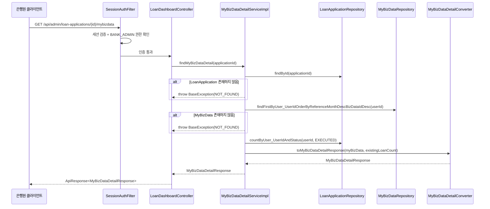
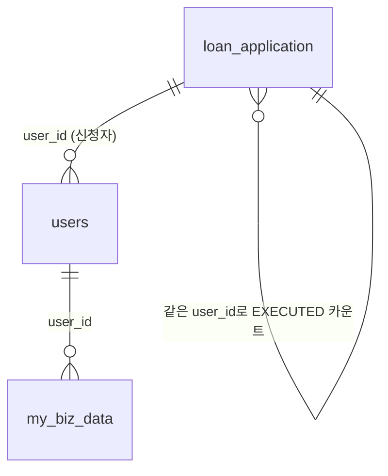

# Design Document: 대출 신청 상세보기 My Biz Data 탭 조회 API

## Overview

은행원(BANK_ADMIN)이 대출 신청 상세보기 화면의 My Biz Data 탭에서 신청자의 사업 데이터를 조회하는 REST API를 설계한다. 기존 `LoanDashboardController`에 새 엔드포인트(`GET /api/admin/loan-applications/{applicationId}/mybizdata`)를 추가하고, 비즈니스 로직은 별도의 `MyBizDataDetailService`로 분리하여 책임을 명확히 한다.

이 API는 applicationId로 신청자를 식별한 후, 해당 신청자의 최신 MyBizData 1건과 보유 대출 건수(EXECUTED 상태)를 조합하여 12개 필드로 구성된 응답을 반환한다.

### 설계 결정 사항

| 결정 | 근거 |
|------|------|
| Controller는 기존 `LoanDashboardController`에 추가 | 동일 리소스(`/api/admin/loan-applications`) 하위 엔드포인트이므로 REST 관점에서 자연스러움 |
| Service는 새로운 인터페이스+Impl로 분리 | 대시보드 목록 조회, 정보 탭 조회와 책임이 다르므로 SRP 준수 |
| Converter는 새로운 클래스로 분리 | MyBizData → DTO 변환 로직이 기존 Converter와 무관한 DTO를 다룸 |
| Response DTO는 flat record로 구성 | 단일 섹션(My Biz Data)만 반환하므로 중첩 없이 flat 구조가 적합 |
| MyBizData 최신 1건 조회 시 reference_month DESC + biz_data_id DESC | 동일 월에 여러 건이 존재할 수 있으므로 biz_data_id로 2차 정렬하여 결정적 결과 보장 |
| BigDecimal 원본 값을 변환 없이 그대로 전달 | 데이터 변환(Double 변환, 반올림 등)은 프론트엔드의 책임이므로 백엔드는 원본 데이터를 전달 |

## Architecture



### 레이어 구조

```
com.sofit.admin.domain.loan/
├── controller/
│   ├── LoanDashboardController.java        ← 엔드포인트 추가
│   └── LoanDashboardControllerDocs.java    ← Swagger 문서 추가
├── converter/
│   └── MyBizDataDetailConverter.java       ← 신규 생성
├── dto/response/
│   └── MyBizDataDetailResponse.java        ← 신규 생성
├── exception/
│   └── LoanDashboardSuccessCode.java       ← 성공 코드 추가
└── service/
    ├── MyBizDataDetailService.java         ← 신규 생성 (인터페이스)
    └── MyBizDataDetailServiceImpl.java     ← 신규 생성 (구현체)
```

## Components and Interfaces

### 1. Controller 확장

**파일**: `LoanDashboardController.java` (기존 파일에 메서드 추가)

```java
@GetMapping("/{applicationId}/mybizdata")
@Override
public ApiResponse<MyBizDataDetailResponse> findMyBizDataDetail(
        @PathVariable Long applicationId) {
    MyBizDataDetailResponse response = myBizDataDetailService.findMyBizDataDetail(applicationId);
    return ApiResponse.onSuccess(LoanDashboardSuccessCode.MY_BIZ_DATA_DETAIL_OK, response);
}
```

**파일**: `LoanDashboardControllerDocs.java` (기존 파일에 메서드 추가)

```java
@Operation(
    summary = "대출 신청 상세 조회 (My Biz Data 탭)",
    description = "대출 신청 건의 My Biz Data 탭 데이터를 조회합니다. 신청자의 연 소득, 보유 대출 건수, 월 매출액, 현금 흐름, 업종 순위 등 사업 현황 데이터를 포함합니다."
)
@ApiResponses(value = {
    @io.swagger.v3.oas.annotations.responses.ApiResponse(responseCode = "200", description = "My Biz Data 탭 조회 성공"),
    @io.swagger.v3.oas.annotations.responses.ApiResponse(responseCode = "404", description = "대출 신청 건 또는 My Biz Data를 찾을 수 없음")
})
ApiResponse<MyBizDataDetailResponse> findMyBizDataDetail(
    @Parameter(description = "대출 신청 ID", example = "1") Long applicationId
);
```

### 2. Service 인터페이스

**파일**: `MyBizDataDetailService.java` (신규)

```java
package com.sofit.admin.domain.loan.service;

import com.sofit.admin.domain.loan.dto.response.MyBizDataDetailResponse;

public interface MyBizDataDetailService {
    MyBizDataDetailResponse findMyBizDataDetail(Long applicationId);
}
```

### 3. Service 구현체

**파일**: `MyBizDataDetailServiceImpl.java` (신규)

```java
package com.sofit.admin.domain.loan.service;

import com.sofit.admin.domain.loan.converter.MyBizDataDetailConverter;
import com.sofit.admin.domain.loan.dto.response.MyBizDataDetailResponse;
import com.sofit.common.apiPayload.BaseException;
import com.sofit.common.apiPayload.code.GeneralErrorCode;
import com.sofit.common.entity.loan.LoanApplication;
import com.sofit.common.entity.loan.enums.ApplicationStatus;
import com.sofit.common.entity.mybiz.MyBizData;
import com.sofit.common.repository.LoanApplicationRepository;
import com.sofit.common.repository.MyBizDataRepository;
import lombok.RequiredArgsConstructor;
import org.springframework.stereotype.Service;
import org.springframework.transaction.annotation.Transactional;

@Service
@RequiredArgsConstructor
@Transactional(readOnly = true)
public class MyBizDataDetailServiceImpl implements MyBizDataDetailService {

    private final LoanApplicationRepository loanApplicationRepository;
    private final MyBizDataRepository myBizDataRepository;

    @Override
    public MyBizDataDetailResponse findMyBizDataDetail(Long applicationId) {
        // 1. LoanApplication 조회 → user_id 획득
        LoanApplication app = loanApplicationRepository.findById(applicationId)
                .orElseThrow(() -> new BaseException(GeneralErrorCode.NOT_FOUND));

        Long userId = app.getUser().getUserId();

        // 2. MyBizData 최신 1건 조회 (reference_month DESC, biz_data_id DESC)
        MyBizData myBizData = myBizDataRepository
                .findFirstByUser_UserIdOrderByReferenceMonthDescBizDataIdDesc(userId)
                .orElseThrow(() -> new BaseException(GeneralErrorCode.NOT_FOUND));

        // 3. 보유 대출 건수 산출 (status = EXECUTED)
        int existingLoanCount = loanApplicationRepository
                .countByUser_UserIdAndStatus(userId, ApplicationStatus.EXECUTED);

        // 4. Converter로 DTO 변환
        return MyBizDataDetailConverter.toMyBizDataDetailResponse(myBizData, existingLoanCount);
    }
}
```

### 4. Converter

**파일**: `MyBizDataDetailConverter.java` (신규)

```java
package com.sofit.admin.domain.loan.converter;

import com.sofit.admin.domain.loan.dto.response.MyBizDataDetailResponse;
import com.sofit.common.entity.mybiz.MyBizData;

public class MyBizDataDetailConverter {

    private MyBizDataDetailConverter() {}

    public static MyBizDataDetailResponse toMyBizDataDetailResponse(
            MyBizData myBizData, int existingLoanCount) {

        return new MyBizDataDetailResponse(
                myBizData.getAnnualIncome(),
                existingLoanCount,
                myBizData.getMonthlyRevenue(),
                myBizData.getMonthlyRevenueGrowthRate(),
                myBizData.getCashFlow(),
                myBizData.getAccountBalance(),
                myBizData.getBusinessAgeMonths(),
                myBizData.getVatFilingStatus() != null ? myBizData.getVatFilingStatus().name() : null,
                myBizData.getTaxOverdue(),
                myBizData.getInsurancePaymentStatus() != null ? myBizData.getInsurancePaymentStatus().name() : null,
                myBizData.getIndustrySalesRank(),
                myBizData.getIndustryProfitRank()
        );
    }
}
```

### 5. SuccessCode 추가

**파일**: `LoanDashboardSuccessCode.java` (기존 파일에 enum 값 추가)

```java
MY_BIZ_DATA_DETAIL_OK(HttpStatus.OK, "LOAN2004", "My Biz Data 탭 조회에 성공했습니다.");
```

### 6. Repository 메서드 추가

**파일**: `MyBizDataRepository.java` (기존 파일에 메서드 추가)

```java
// 사용자의 최신 MyBizData 조회 (reference_month DESC, biz_data_id DESC)
Optional<MyBizData> findFirstByUser_UserIdOrderByReferenceMonthDescBizDataIdDesc(Long userId);
```

**파일**: `LoanApplicationRepository.java` (기존 파일에 메서드 추가)

```java
// 특정 사용자의 EXECUTED 상태 대출 건수 카운트
int countByUser_UserIdAndStatus(Long userId, ApplicationStatus status);
```

## Data Models

### Response DTO

**파일**: `MyBizDataDetailResponse.java` (신규)

```java
package com.sofit.admin.domain.loan.dto.response;

import java.math.BigDecimal;

public record MyBizDataDetailResponse(
        Long annualIncome,
        Integer existingLoanCount,
        Long monthlyRevenue,
        BigDecimal monthlyRevenueGrowthRate,
        Long cashFlow,
        Long accountBalance,
        Integer businessAgeMonths,
        String vatFilingStatus,
        Boolean taxOverdue,
        String insurancePaymentStatus,
        BigDecimal industrySalesRank,
        BigDecimal industryProfitRank
) {}
```

### 엔티티-DTO 매핑 관계

| 응답 필드 | 소스 | 타입 | 변환 로직 |
|-----------|------|------|-----------|
| annualIncome | MyBizData.annualIncome | Long | 그대로 |
| existingLoanCount | LoanApplication COUNT(status=EXECUTED) | Integer | Repository 카운트 쿼리 결과 |
| monthlyRevenue | MyBizData.monthlyRevenue | Long | 그대로 |
| monthlyRevenueGrowthRate | MyBizData.monthlyRevenueGrowthRate | BigDecimal | 그대로 |
| cashFlow | MyBizData.cashFlow | Long | 그대로 |
| accountBalance | MyBizData.accountBalance | Long | 그대로 |
| businessAgeMonths | MyBizData.businessAgeMonths | Integer | 그대로 |
| vatFilingStatus | MyBizData.vatFilingStatus | String | VatFilingStatus.name() |
| taxOverdue | MyBizData.taxOverdue | Boolean | 그대로 |
| insurancePaymentStatus | MyBizData.insurancePaymentStatus | String | InsurancePaymentStatus.name() |
| industrySalesRank | MyBizData.industrySalesRank | BigDecimal | 그대로 |
| industryProfitRank | MyBizData.industryProfitRank | BigDecimal | 그대로 |

### 관련 테이블 관계



## Correctness Properties

*A property is a characteristic or behavior that should hold true across all valid executions of a system—essentially, a formal statement about what the system should do. Properties serve as the bridge between human-readable specifications and machine-verifiable correctness guarantees.*

### Property 1: Converter 필드 매핑 정확성

*For any* 유효한 MyBizData 엔티티(null 가능 필드 포함)와 0 이상의 정수 existingLoanCount에 대해, `MyBizDataDetailConverter.toMyBizDataDetailResponse(myBizData, existingLoanCount)`의 결과는 다음을 만족해야 한다:
- `annualIncome`이 원본 엔티티의 `annualIncome`과 동일
- `existingLoanCount`가 전달된 existingLoanCount 인자와 동일
- `monthlyRevenue`가 원본 엔티티의 `monthlyRevenue`와 동일
- `monthlyRevenueGrowthRate`가 원본 엔티티의 `monthlyRevenueGrowthRate` BigDecimal 값과 동일 (null이면 null)
- `cashFlow`가 원본 엔티티의 `cashFlow`와 동일
- `accountBalance`가 원본 엔티티의 `accountBalance`와 동일
- `businessAgeMonths`가 원본 엔티티의 `businessAgeMonths`와 동일
- `vatFilingStatus`가 원본 엔티티의 `vatFilingStatus.name()`과 동일 (null이면 null)
- `taxOverdue`가 원본 엔티티의 `taxOverdue`와 동일
- `insurancePaymentStatus`가 원본 엔티티의 `insurancePaymentStatus.name()`과 동일 (null이면 null)
- `industrySalesRank`가 원본 엔티티의 `industrySalesRank` BigDecimal 값과 동일 (null이면 null)
- `industryProfitRank`가 원본 엔티티의 `industryProfitRank` BigDecimal 값과 동일 (null이면 null)

**Validates: Requirements 2.1, 2.2, 2.3, 2.4, 2.5, 4.2**

## Error Handling

| 상황 | HTTP 상태 | 에러 코드 | 메시지 | 처리 위치 |
|------|-----------|-----------|--------|-----------|
| 세션 없음/만료 | 401 | COMMON4001 | 인증이 필요합니다. | SessionAuthFilter (Spring Security) |
| BANK_ADMIN 권한 없음 | 403 | COMMON4003 | 권한이 없습니다. | Spring Security |
| applicationId 형식 오류 | 400 | COMMON4000 | 잘못된 요청입니다. | GlobalExceptionHandler (MethodArgumentTypeMismatchException) |
| LoanApplication 미존재 | 404 | COMMON4004 | 요청한 리소스를 찾을 수 없습니다. | MyBizDataDetailServiceImpl |
| MyBizData 미존재 | 404 | COMMON4004 | 요청한 리소스를 찾을 수 없습니다. | MyBizDataDetailServiceImpl |
| 서버 내부 오류 | 500 | COMMON5000 | 서버 에러, 관리자에게 문의 바랍니다. | GlobalExceptionHandler |

### 에러 처리 흐름

1. **인증/권한**: Spring Security 필터 체인에서 비즈니스 로직 진입 전에 처리 (401 → 403 순서)
2. **Path Variable 타입 오류**: Spring MVC의 타입 변환 실패 → `GlobalExceptionHandler`에서 400 응답으로 일괄 처리
3. **비즈니스 예외**: `BaseException(GeneralErrorCode.NOT_FOUND)` throw → `GlobalExceptionHandler`에서 `ApiResponse.onFailure()` 반환

### 에러 처리 우선순위

```
인증 검증 (401) → 권한 검증 (403) → applicationId 형식 검증 (400) → 리소스 존재 여부 검증 (404)
```

## Testing Strategy

### 단위 테스트 (JUnit 5 + Mockito)

| 테스트 대상 | 테스트 항목 |
|------------|------------|
| MyBizDataDetailServiceImpl | applicationId로 정상 조회 시 12개 필드 포함 응답 반환 |
| MyBizDataDetailServiceImpl | 존재하지 않는 applicationId → BaseException(NOT_FOUND) |
| MyBizDataDetailServiceImpl | MyBizData 미존재 → BaseException(NOT_FOUND) |
| MyBizDataDetailServiceImpl | EXECUTED 상태 0건 → existingLoanCount = 0 |
| MyBizDataDetailServiceImpl | 현재 applicationId가 EXECUTED일 때 카운트에 포함 |
| MyBizDataDetailConverter | 정상 MyBizData → 12개 필드 변환 정확성 |
| MyBizDataDetailConverter | null 필드 → null 유지 |
| MyBizDataDetailConverter | BigDecimal 원본 값 그대로 전달 확인 |

### Property-Based 테스트 (JUnit 5 + jqwik)

Property-based testing 라이브러리로 **jqwik**을 사용한다. 각 property 테스트는 최소 100회 반복 실행한다.

| Property | 테스트 내용 |
|----------|------------|
| Property 1 | 임의의 MyBizData(null 가능 필드 포함)와 existingLoanCount에 대해 toMyBizDataDetailResponse 변환 결과가 원본 필드와 일치 (BigDecimal 필드는 원본 값 그대로 전달 확인) |

각 property 테스트에는 다음 형식의 태그를 주석으로 포함한다:
```
// Feature: mybiz-data-detail, Property {number}: {property_text}
```

### 통합 테스트 (MockMvc)

| 테스트 항목 | 검증 내용 |
|------------|-----------|
| 정상 조회 E2E | 인증된 BANK_ADMIN으로 유효한 applicationId 요청 → 200 + 전체 응답 구조 확인 |
| 인증 실패 | 세션 없이 요청 → 401 |
| 권한 부족 | USER 역할로 요청 → 403 |
| 잘못된 applicationId 형식 | 문자열 applicationId → 400 |
| 존재하지 않는 applicationId | 없는 ID → 404 |
| MyBizData 미존재 | 유효한 applicationId이나 MyBizData 없음 → 404 |
