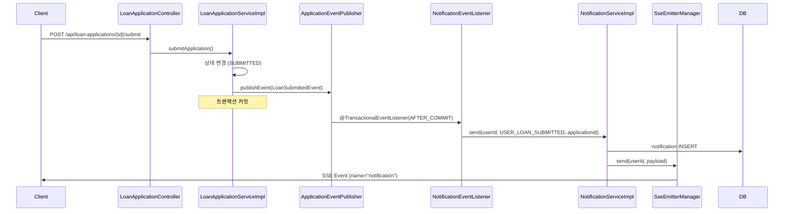
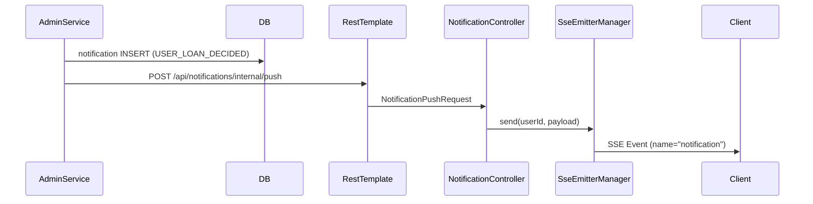
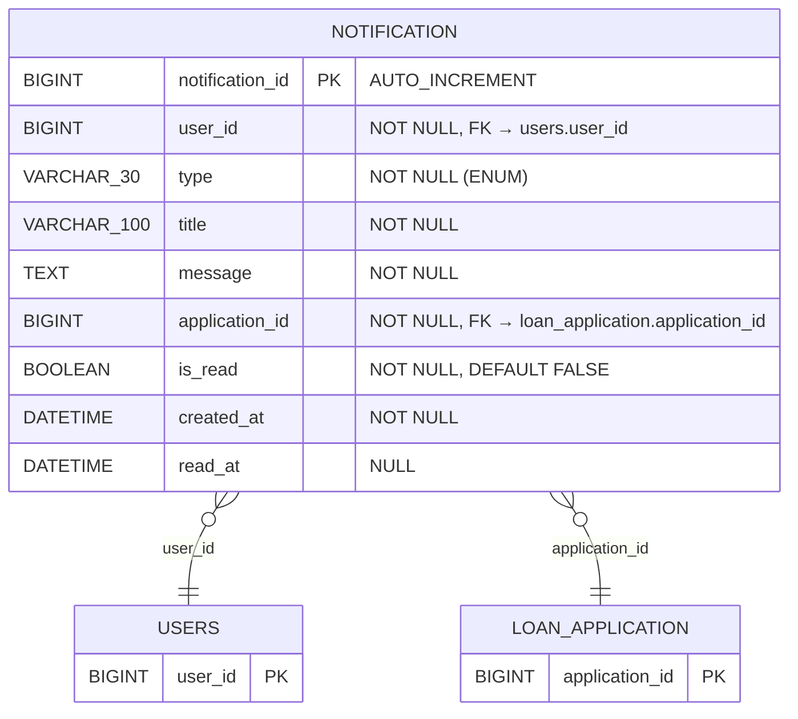

# Design Document: 알림 서비스 SSE (Notification SSE)

## Overview

사용자에게 대출 프로세스의 주요 단계를 실시간으로 알려주는 알림 서비스를 SSE(Server-Sent Events) 방식으로 구현한다.
SSE는 서버 → 클라이언트 단방향 푸시에 적합하며, WebSocket 대비 구현 복잡도가 낮고 브라우저 자동 재연결을 지원한다.

### 핵심 설계 결정

1. **SSE 단방향 푸시**: 알림은 서버→클라이언트 단방향이므로 WebSocket 대신 SSE 채택
2. **SseEmitterManager**: ConcurrentHashMap으로 userId별 SseEmitter를 관리하여 O(1) 조회/전송
3. **@TransactionalEventListener(AFTER_COMMIT)**: 트랜잭션 커밋 확정 후에만 알림 발송하여 롤백 시 유령 알림 방지
4. **내부 HTTP 호출**: sofit-admin과 sofit-user는 JVM이 분리되어 있으므로, admin에서 SSE 전송을 위해 user 서버에 HTTP 호출
5. **RestTemplate 사용**: 가이드에 따라 FeignClient가 아닌 RestTemplate으로 내부 HTTP 호출
6. **NotificationType enum 기반 확장**: enum 값 추가만으로 새 알림 유형 지원, 기존 코드 수정 불필요

## Architecture

### 시스템 구성도

```mermaid
graph TB
    subgraph Client["클라이언트 (React)"]
        APP[사용자 앱]
    end

    subgraph SofitUser["sofit-user JVM"]
        NC[NotificationController]
        NS[NotificationServiceImpl]
        SEM[SseEmitterManager]
        EL[@TransactionalEventListener]
        LAS[LoanApplicationServiceImpl]
    end

    subgraph SofitAdmin["sofit-admin JVM"]
        ADS[AdminDecisionService]
        RT[RestTemplate]
    end

    subgraph SharedDB["공유 DB (MySQL)"]
        NT[(notification 테이블)]
        LA[(loan_application 테이블)]
    end

    APP -->|"GET /api/notifications/subscribe"| NC
    APP -->|"GET /api/notifications/unread"| NC
    APP -->|"PATCH /api/notifications/{id}/read"| NC
    NC --> NS
    NC --> SEM
    NS --> NT
    LAS -->|"ApplicationEvent 발행"| EL
    EL --> NS
    NS --> SEM
    SEM -->|"SSE Event"| APP
    ADS --> NT
    ADS --> RT
    RT -->|"POST /api/notifications/internal/push"| NC
    NC --> SEM
```

### 알림 발송 시퀀스 (대출 신청 완료 — sofit-user 내부)



### 알림 발송 시퀀스 (심사 완료 — sofit-admin → sofit-user)



### 모듈 배치

| 컴포넌트 | 모듈 | 패키지 |
|---------|------|--------|
| Notification (엔티티) | sofit-common | `com.sofit.common.entity.notification` |
| NotificationType (enum) | sofit-common | `com.sofit.common.entity.notification.enums` |
| NotificationPushRequest (DTO) | sofit-common | `com.sofit.common.dto.notification` |
| NotificationRepository | sofit-common | `com.sofit.common.repository` |
| NotificationController | sofit-user | `com.sofit.user.domain.notification.controller` |
| NotificationControllerDocs | sofit-user | `com.sofit.user.domain.notification.controller` |
| NotificationService (interface) | sofit-user | `com.sofit.user.domain.notification.service` |
| NotificationServiceImpl | sofit-user | `com.sofit.user.domain.notification.service` |
| SseEmitterManager | sofit-user | `com.sofit.user.domain.notification.service` |
| NotificationEventListener | sofit-user | `com.sofit.user.domain.notification.service` |
| LoanSubmittedEvent | sofit-user | `com.sofit.user.domain.notification.event` |
| NotificationConverter | sofit-user | `com.sofit.user.domain.notification.converter` |
| NotificationErrorCode | sofit-user | `com.sofit.user.domain.notification.exception` |
| NotificationSuccessCode | sofit-user | `com.sofit.user.domain.notification.exception` |
| NotificationResponse (DTO) | sofit-user | `com.sofit.user.domain.notification.dto.response` |
| NotificationPushClient | sofit-admin | `com.sofit.admin.domain.loan.client` |

## Components and Interfaces

### 1. SseEmitterManager

SSE 연결을 관리하는 핵심 컴포넌트. ConcurrentHashMap으로 userId별 SseEmitter를 저장하고, 구독/전송/정리를 담당한다.

```java
package com.sofit.user.domain.notification.service;

@Component
public class SseEmitterManager {

    private final Map<Long, SseEmitter> emitters = new ConcurrentHashMap<>();
    private static final long TIMEOUT = 30 * 60 * 1000L; // 30분

    /**
     * SSE 구독: userId에 대한 SseEmitter를 생성하고 Map에 저장.
     * 동일 userId로 재구독 시 기존 emitter를 덮어쓴다.
     */
    public SseEmitter subscribe(Long userId) {
        SseEmitter emitter = new SseEmitter(TIMEOUT);
        emitters.put(userId, emitter);

        emitter.onCompletion(() -> emitters.remove(userId));
        emitter.onTimeout(() -> emitters.remove(userId));
        emitter.onError(e -> emitters.remove(userId));

        // 연결 직후 더미 이벤트 전송 (503 방지)
        try {
            emitter.send(SseEmitter.event().name("connect").data("connected"));
        } catch (IOException e) {
            emitters.remove(userId);
        }

        return emitter;
    }

    /**
     * SSE 이벤트 전송: 해당 userId의 emitter가 있으면 전송, 없으면(오프라인) 무시.
     */
    public void send(Long userId, NotificationPushRequest payload) {
        SseEmitter emitter = emitters.get(userId);
        if (emitter == null) return;

        try {
            emitter.send(SseEmitter.event().name("notification").data(payload));
        } catch (IOException e) {
            emitters.remove(userId);
        }
    }
}
```

### 2. NotificationService (Interface)

```java
package com.sofit.user.domain.notification.service;

public interface NotificationService {

    /** 알림 생성 + DB 저장 + SSE 전송 (sofit-user 내부 발송용) */
    void send(Long userId, NotificationType type, Long applicationId);

    /** sofit-admin으로부터 SSE 푸시 수신 (DB 저장 없이 전송만) */
    void push(NotificationPushRequest request);

    /** 미읽음 알림 조회 (최대 100건, 생성일시 내림차순) */
    NotificationListResponse getUnread(Long userId);

    /** 알림 읽음 처리 (소유권 검증 포함) */
    void markAsRead(Long userId, Long notificationId);
}
```

### 3. NotificationServiceImpl

```java
package com.sofit.user.domain.notification.service;

@Service
@RequiredArgsConstructor
public class NotificationServiceImpl implements NotificationService {

    private final NotificationRepository notificationRepository;
    private final SseEmitterManager sseEmitterManager;

    @Override
    @Transactional
    public void send(Long userId, NotificationType type, Long applicationId) {
        Notification notification = Notification.builder()
            .userId(userId)
            .type(type)
            .applicationId(applicationId)
            .build();
        notificationRepository.save(notification);

        sseEmitterManager.send(userId, NotificationPushRequest.from(notification));
    }

    @Override
    public void push(NotificationPushRequest request) {
        sseEmitterManager.send(request.getUserId(), request);
    }

    @Override
    @Transactional(readOnly = true)
    public NotificationListResponse getUnread(Long userId) {
        List<Notification> notifications = notificationRepository
            .findTop100ByUserIdAndIsReadFalseOrderByCreatedAtDesc(userId);
        List<NotificationResponse> items = notifications.stream()
            .map(NotificationConverter::toResponse)
            .toList();
        return new NotificationListResponse(items);
    }

    @Override
    @Transactional
    public void markAsRead(Long userId, Long notificationId) {
        Notification notification = notificationRepository.findById(notificationId)
            .orElseThrow(() -> new BaseException(NotificationErrorCode.NOTIFICATION_NOT_FOUND));

        // 소유권 검증
        if (!notification.getUserId().equals(userId)) {
            throw new BaseException(NotificationErrorCode.NOTIFICATION_FORBIDDEN);
        }

        // 이미 읽음이면 read_at 갱신하지 않고 성공 반환
        if (!notification.getIsRead()) {
            notification.markAsRead(LocalDateTime.now());
        }
    }
}
```

### 4. NotificationEventListener

`@TransactionalEventListener(phase = AFTER_COMMIT)`을 사용하여 트랜잭션 커밋 확정 후에만 알림을 발송한다.

```java
package com.sofit.user.domain.notification.service;

@Component
@RequiredArgsConstructor
public class NotificationEventListener {

    private final NotificationService notificationService;

    @TransactionalEventListener(phase = TransactionPhase.AFTER_COMMIT)
    public void handleLoanSubmitted(LoanSubmittedEvent event) {
        notificationService.send(
            event.getUserId(),
            NotificationType.USER_LOAN_SUBMITTED,
            event.getApplicationId()
        );
    }
}
```

### 5. LoanSubmittedEvent

```java
package com.sofit.user.domain.notification.event;

@Getter
@AllArgsConstructor
public class LoanSubmittedEvent {
    private final Long userId;
    private final Long applicationId;
}
```

### 6. NotificationController

```java
package com.sofit.user.domain.notification.controller;

@RestController
@RequestMapping("/api/notifications")
@RequiredArgsConstructor
public class NotificationController implements NotificationControllerDocs {

    private final SseEmitterManager sseEmitterManager;
    private final NotificationService notificationService;

    // SSE 구독
    @GetMapping(value = "/subscribe", produces = MediaType.TEXT_EVENT_STREAM_VALUE)
    public SseEmitter subscribe(@AuthenticationPrincipal CustomUserDetails user) {
        return sseEmitterManager.subscribe(user.getUserId());
    }

    // 미읽음 알림 조회
    @GetMapping("/unread")
    public ApiResponse<NotificationListResponse> getUnread(
            @AuthenticationPrincipal CustomUserDetails user) {
        NotificationListResponse response = notificationService.getUnread(user.getUserId());
        return ApiResponse.onSuccess(NotificationSuccessCode.UNREAD_LIST_OK, response);
    }

    // 알림 읽음 처리
    @PatchMapping("/{notificationId}/read")
    public ApiResponse<Void> markAsRead(
            @AuthenticationPrincipal CustomUserDetails user,
            @PathVariable Long notificationId) {
        notificationService.markAsRead(user.getUserId(), notificationId);
        return ApiResponse.onSuccess(NotificationSuccessCode.MARK_READ_OK, null);
    }

    // 내부 알림 푸시 API (sofit-admin → sofit-user)
    @PostMapping("/internal/push")
    public ApiResponse<Void> push(@Valid @RequestBody NotificationPushRequest request) {
        notificationService.push(request);
        return ApiResponse.onSuccess(NotificationSuccessCode.PUSH_OK, null);
    }
}
```

### 7. NotificationControllerDocs

```java
package com.sofit.user.domain.notification.controller;

@Tag(name = "Notification", description = "알림 API")
public interface NotificationControllerDocs {

    @Operation(summary = "SSE 구독", description = "실시간 알림 수신을 위한 SSE 연결 수립")
    SseEmitter subscribe(CustomUserDetails user);

    @Operation(summary = "미읽음 알림 조회", description = "미읽음 알림 목록 조회 (최대 100건, 최신순)")
    ApiResponse<NotificationListResponse> getUnread(CustomUserDetails user);

    @Operation(summary = "알림 읽음 처리", description = "특정 알림을 읽음 상태로 변경")
    ApiResponse<Void> markAsRead(CustomUserDetails user, Long notificationId);

    @Operation(summary = "내부 알림 푸시", description = "sofit-admin에서 호출하는 내부 SSE 푸시 API")
    ApiResponse<Void> push(NotificationPushRequest request);
}
```

### 8. NotificationPushClient (sofit-admin)

sofit-admin에서 sofit-user로 알림 푸시를 요청하는 RestTemplate 기반 클라이언트.

```java
package com.sofit.admin.domain.loan.client;

@Component
@RequiredArgsConstructor
public class NotificationPushClient {

    private final RestTemplate restTemplate;

    @Value("${sofit.user.internal-url}")
    private String userServerUrl;

    /**
     * sofit-user 서버에 알림 SSE 푸시를 요청한다.
     * 실패 시 로그만 남기고 예외를 전파하지 않는다 (알림 실패가 심사 처리를 막으면 안 됨).
     */
    public void pushNotification(NotificationPushRequest request) {
        try {
            restTemplate.postForEntity(
                userServerUrl + "/api/notifications/internal/push",
                request,
                Void.class
            );
        } catch (Exception e) {
            log.warn("알림 푸시 실패: userId={}, type={}", request.getUserId(), request.getType(), e);
        }
    }
}
```

### 9. NotificationConverter

```java
package com.sofit.user.domain.notification.converter;

public class NotificationConverter {

    public static NotificationResponse toResponse(Notification notification) {
        return new NotificationResponse(
            notification.getNotificationId(),
            notification.getType(),
            notification.getTitle(),
            notification.getMessage(),
            notification.getApplicationId(),
            notification.getCreatedAt()
        );
    }
}
```

### 10. DTO 정의

**NotificationResponse (sofit-user)**
```java
package com.sofit.user.domain.notification.dto.response;

public record NotificationResponse(
    Long notificationId,
    NotificationType type,
    String title,
    String message,
    Long applicationId,
    LocalDateTime createdAt
) {}
```

**NotificationListResponse (sofit-user)**
```java
package com.sofit.user.domain.notification.dto.response;

public record NotificationListResponse(
    List<NotificationResponse> notifications
) {}
```

**NotificationPushRequest (sofit-common)**
```java
package com.sofit.common.dto.notification;

@Getter
@NoArgsConstructor
@AllArgsConstructor
@Builder
public class NotificationPushRequest {
    @NotNull
    private Long userId;
    @NotNull
    private Long notificationId;
    @NotNull
    private NotificationType type;
    private String title;
    private String message;
    @NotNull
    private Long applicationId;
    private LocalDateTime createdAt;

    public static NotificationPushRequest from(Notification notification) {
        return NotificationPushRequest.builder()
            .userId(notification.getUserId())
            .notificationId(notification.getNotificationId())
            .type(notification.getType())
            .title(notification.getTitle())
            .message(notification.getMessage())
            .applicationId(notification.getApplicationId())
            .createdAt(notification.getCreatedAt())
            .build();
    }
}
```

### 11. ErrorCode / SuccessCode

**NotificationErrorCode**
```java
package com.sofit.user.domain.notification.exception;

@Getter
@RequiredArgsConstructor
public enum NotificationErrorCode implements BaseErrorCode {
    NOTIFICATION_NOT_FOUND(HttpStatus.NOT_FOUND, "NOTI4004", "해당 알림을 찾을 수 없습니다."),
    NOTIFICATION_FORBIDDEN(HttpStatus.FORBIDDEN, "NOTI4003", "해당 알림에 대한 권한이 없습니다.");

    private final HttpStatus httpStatus;
    private final String code;
    private final String message;
}
```

**NotificationSuccessCode**
```java
package com.sofit.user.domain.notification.exception;

@Getter
@RequiredArgsConstructor
public enum NotificationSuccessCode implements BaseSuccessCode {
    UNREAD_LIST_OK("NOTI2000", "미읽음 알림 조회 성공"),
    MARK_READ_OK("NOTI2001", "알림 읽음 처리 성공"),
    PUSH_OK("NOTI2002", "알림 푸시 성공");

    private final String code;
    private final String message;
}
```

### 12. SecurityConfig 변경 (sofit-user)

```java
// 기존 authorizeHttpRequests에 추가
.requestMatchers("/api/notifications/internal/**").permitAll()
```

운영 환경에서는 IP 기반 접근 제한을 추가로 적용한다:
```java
.requestMatchers("/api/notifications/internal/**")
    .access(new WebExpressionAuthorizationManager(
        "hasIpAddress('${sofit.admin.internal-ip}')"
    ))
```

### 13. LoanApplicationServiceImpl 수정

`submitApplication()` 메서드에서 이벤트를 발행하여 트랜잭션 커밋 후 알림이 발송되도록 한다.

```java
// 기존 submitApplication() 메서드 끝에 추가
private final ApplicationEventPublisher eventPublisher;

// submit 처리 후 이벤트 발행
eventPublisher.publishEvent(new LoanSubmittedEvent(userId, applicationId));
```

### 14. application.yml 설정 추가

**sofit-user (application.yml)**
```yaml
# SSE 관련 설정은 SseEmitterManager에서 상수로 관리 (30분 타임아웃)
```

**sofit-admin (application.yml)**
```yaml
sofit:
  user:
    internal-url: http://localhost:8080  # sofit-user 서버 내부 URL
```

### 15. RestTemplate Bean 등록 (sofit-admin)

```java
package com.sofit.admin.global.config;

@Configuration
public class RestTemplateConfig {

    @Bean
    public RestTemplate restTemplate(RestTemplateBuilder builder) {
        return builder
            .setConnectTimeout(Duration.ofSeconds(5))
            .setReadTimeout(Duration.ofSeconds(10))
            .build();
    }
}
```

## Data Models

### Notification 엔티티

```java
package com.sofit.common.entity.notification;

@Entity
@Table(name = "notification", indexes = {
    @Index(name = "idx_notification_user_read", columnList = "user_id, is_read")
})
@Getter
@NoArgsConstructor(access = AccessLevel.PROTECTED)
public class Notification {

    @Id
    @GeneratedValue(strategy = GenerationType.IDENTITY)
    @Column(name = "notification_id")
    private Long notificationId;

    @Column(name = "user_id", nullable = false)
    private Long userId;

    @Enumerated(EnumType.STRING)
    @Column(name = "type", nullable = false, length = 30)
    private NotificationType type;

    @Column(name = "title", nullable = false, length = 100)
    private String title;

    @Column(name = "message", nullable = false, columnDefinition = "TEXT")
    private String message;

    @Column(name = "application_id", nullable = false)
    private Long applicationId;

    @Column(name = "is_read", nullable = false)
    private Boolean isRead = false;

    @Column(name = "created_at", nullable = false)
    private LocalDateTime createdAt;

    @Column(name = "read_at")
    private LocalDateTime readAt;

    @Builder
    public Notification(Long userId, NotificationType type, Long applicationId) {
        this.userId = userId;
        this.type = type;
        this.title = type.getTitle();
        this.message = type.getMessage();
        this.applicationId = applicationId;
        this.isRead = false;
        this.createdAt = LocalDateTime.now();
    }

    public void markAsRead(LocalDateTime readAt) {
        this.isRead = true;
        this.readAt = readAt;
    }
}
```

### NotificationType enum

```java
package com.sofit.common.entity.notification.enums;

@Getter
@RequiredArgsConstructor
public enum NotificationType {
    USER_LOAN_SUBMITTED("대출 신청 완료", "대출 신청이 정상적으로 접수되었습니다"),
    USER_LOAN_DECIDED("대출 심사 완료", "신청하신 대출 심사가 완료되었습니다"),
    USER_LOAN_EXECUTED("대출 실행 완료", "대출이 정상적으로 실행되었습니다");

    private final String title;
    private final String message;
}
```

### NotificationRepository

```java
package com.sofit.common.repository;

public interface NotificationRepository extends JpaRepository<Notification, Long> {

    List<Notification> findTop100ByUserIdAndIsReadFalseOrderByCreatedAtDesc(Long userId);
}
```

### ERD



### DDL 마이그레이션

파일 경로: `sofit-common/src/main/resources/db/migration/create_notification.sql`

```sql
CREATE TABLE notification (
    notification_id BIGINT NOT NULL AUTO_INCREMENT,
    user_id         BIGINT NOT NULL,
    type            VARCHAR(30) NOT NULL,
    title           VARCHAR(100) NOT NULL,
    message         TEXT NOT NULL,
    application_id  BIGINT NOT NULL,
    is_read         BOOLEAN NOT NULL DEFAULT FALSE,
    created_at      DATETIME NOT NULL,
    read_at         DATETIME NULL,
    PRIMARY KEY (notification_id),
    INDEX idx_notification_user_read (user_id, is_read)
) ENGINE=InnoDB DEFAULT CHARSET=utf8mb4 COLLATE=utf8mb4_unicode_ci;
```

### API 엔드포인트 요약

| Method | Path | 인증 | 설명 |
|--------|------|------|------|
| GET | `/api/notifications/subscribe` | 필요 | SSE 구독 (text/event-stream) |
| GET | `/api/notifications/unread` | 필요 | 미읽음 알림 조회 |
| PATCH | `/api/notifications/{notificationId}/read` | 필요 | 알림 읽음 처리 |
| POST | `/api/notifications/internal/push` | 불필요 (IP 제한) | 내부 알림 푸시 |

## Correctness Properties

*A property is a characteristic or behavior that should hold true across all valid executions of a system — essentially, a formal statement about what the system should do. Properties serve as the bridge between human-readable specifications and machine-verifiable correctness guarantees.*

### Property 1: Subscribe 덮어쓰기 — Map에는 항상 최신 emitter만 존재

*For any* userId에 대해, subscribe()를 N번(N≥1) 호출하면 ConcurrentHashMap에는 항상 마지막으로 생성된 SseEmitter 하나만 저장되어야 하며, 반환된 SseEmitter와 Map에 저장된 SseEmitter는 동일한 객체여야 한다.

**Validates: Requirements 1.1, 1.4**

### Property 2: 오프라인 시 SSE 전송 안전 건너뜀

*For any* userId에 대해, ConcurrentHashMap에 해당 userId의 SseEmitter가 존재하지 않을 때 send()를 호출하면 예외가 발생하지 않고 정상 종료되어야 한다.

**Validates: Requirements 2.3, 5.2**

### Property 3: Notification 생성 시 type 기반 필드 매핑

*For any* NotificationType과 임의의 userId, applicationId에 대해, Notification을 생성하면 title은 type.getTitle()과 동일하고, message는 type.getMessage()와 동일하며, isRead는 false이고, createdAt은 null이 아니어야 한다.

**Validates: Requirements 2.1, 7.3**

### Property 4: 미읽음 알림 조회 조건 — 미읽음만, 내림차순, 최대 100건

*For any* userId와 해당 userId에 속하는 임의의 Notification 집합(읽음/미읽음 혼합)에 대해, getUnread() 결과는 isRead=false인 알림만 포함하고, createdAt 내림차순으로 정렬되어 있으며, 최대 100건을 초과하지 않아야 한다.

**Validates: Requirements 3.1, 3.2**

### Property 5: 읽음 처리 상태 전환

*For any* isRead=false인 Notification에 대해, markAsRead()를 호출하면 isRead는 true로, readAt은 null이 아닌 값으로 변경되어야 한다.

**Validates: Requirements 4.1**

### Property 6: 읽음 처리 멱등성

*For any* 이미 isRead=true인 Notification에 대해, markAsRead()를 재호출하면 readAt 값은 변경되지 않아야 한다.

**Validates: Requirements 4.4**

### Property 7: 소유권 검증 — 타인의 알림 읽음 처리 거부

*For any* 두 개의 서로 다른 userId(A, B)에 대해, userId A가 소유한 Notification에 대해 userId B가 markAsRead()를 호출하면 FORBIDDEN 예외가 발생하고 해당 Notification의 상태는 변경되지 않아야 한다.

**Validates: Requirements 4.3**

### Property 8: NotificationType enum 불변 조건

*For any* NotificationType enum 값에 대해, getTitle()은 null이 아니고 비어있지 않으며 100자 이하여야 하고, getMessage()는 null이 아니고 비어있지 않아야 한다.

**Validates: Requirements 6.3, 7.1**

## Error Handling

| 상황 | 예외 | HTTP 상태 | 에러 코드 | 메시지 |
|------|------|-----------|-----------|--------|
| 존재하지 않는 notificationId | BaseException | 404 | NOTI4004 | 해당 알림을 찾을 수 없습니다. |
| 타인의 알림 읽음 처리 시도 | BaseException | 403 | NOTI4003 | 해당 알림에 대한 권한이 없습니다. |
| 인증되지 않은 사용자 접근 | Spring Security | 401 | COMMON4001 | 인증이 필요합니다. |
| 내부 푸시 API 필수 필드 누락 | MethodArgumentNotValidException | 400 | COMMON4000 | 잘못된 요청입니다. |
| SSE 전송 중 IOException | 내부 처리 (예외 전파 안 함) | - | - | emitter 제거 후 무시 |
| sofit-admin → sofit-user HTTP 호출 실패 | 내부 처리 (로그만 남김) | - | - | 알림 푸시 실패 로그 |

### 에러 처리 원칙

1. **SSE 전송 실패는 예외를 전파하지 않는다**: 알림 전송 실패가 비즈니스 로직(대출 신청 등)을 중단시키면 안 된다.
2. **sofit-admin → sofit-user HTTP 호출 실패도 예외를 전파하지 않는다**: 심사 완료 처리가 알림 전송 실패로 롤백되면 안 된다. DB에는 이미 알림이 저장되어 있으므로 사용자가 앱 재진입 시 미읽음 조회로 확인 가능하다.
3. **소유권 검증 실패는 즉시 예외를 발생시킨다**: 보안 관련 위반은 명확하게 거부한다.

## Testing Strategy

### Property-Based Testing (PBT)

- **라이브러리**: JUnit 5 + jqwik 1.9.2 (이미 build.gradle에 포함)
- **최소 반복 횟수**: 100회
- **태그 형식**: `Feature: notification-sse, Property {number}: {property_text}`

각 correctness property에 대해 하나의 property-based test를 작성한다:

| Property | 테스트 대상 | 생성 전략 |
|----------|------------|-----------|
| Property 1 | SseEmitterManager.subscribe() | 임의의 Long userId + 임의의 호출 횟수(1~10) |
| Property 2 | SseEmitterManager.send() | Map에 없는 임의의 Long userId + 임의의 NotificationPushRequest |
| Property 3 | Notification 생성자 | 임의의 NotificationType + 임의의 Long userId/applicationId |
| Property 4 | NotificationRepository 조회 | 임의의 Notification 리스트(0~200건, 읽음/미읽음 혼합) |
| Property 5 | Notification.markAsRead() | 임의의 미읽음 Notification + 임의의 LocalDateTime |
| Property 6 | Notification.markAsRead() 멱등성 | 임의의 이미 읽음 Notification |
| Property 7 | NotificationServiceImpl.markAsRead() | 임의의 두 userId + Notification |
| Property 8 | NotificationType enum | 모든 enum 값 순회 |

### Unit Tests (Example-Based)

| 테스트 케이스 | 검증 내용 |
|--------------|-----------|
| SSE 구독 성공 | subscribe 호출 시 SseEmitter 반환 |
| 미읽음 알림 0건 조회 | 빈 리스트 반환 |
| 존재하지 않는 notificationId 읽음 처리 | NOTIFICATION_NOT_FOUND 예외 |
| 내부 푸시 API 필수 필드 누락 | 400 Bad Request |
| 인증 없이 SSE 구독 시도 | 401 Unauthorized |
| 인증 없이 미읽음 조회 시도 | 401 Unauthorized |
| 오프라인 상태에서 내부 푸시 호출 | 200 OK (전송 생략) |

### Integration Tests

| 테스트 케이스 | 검증 내용 |
|--------------|-----------|
| 대출 신청 submit 후 알림 생성 | @TransactionalEventListener 동작 확인 |
| 트랜잭션 롤백 시 알림 미생성 | 롤백 시 이벤트 리스너 미실행 확인 |
| SSE 연결 후 알림 수신 | MockMvc로 SSE 스트림 검증 |
| 내부 푸시 API 호출 후 SSE 전송 | 전체 흐름 통합 검증 |
| notification 테이블 CRUD | JPA 매핑 및 인덱스 동작 확인 |
