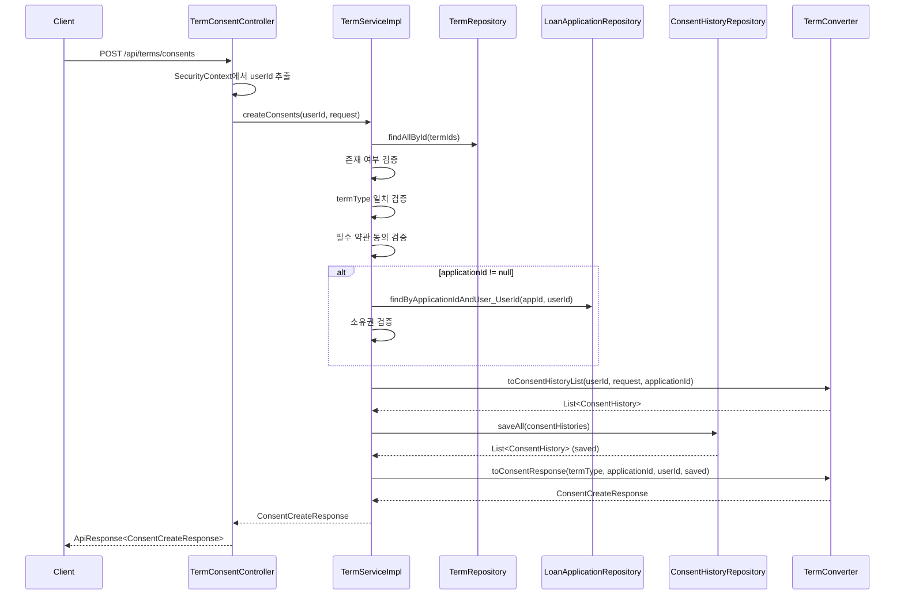

# Design Document: Term Consent API

## Overview

약관 동의 API(`POST /api/terms/consents`)는 소상공인 고객이 약관에 동의한 이력을 서버에 저장하는 기능을 제공합니다. 회원가입, My Biz Data 수집, 대출 신청 등 다양한 플로우에서 약관 동의가 필요하며, 이 API는 해당 동의 이력을 ConsentHistory 엔티티로 영속화합니다.

주요 설계 결정:
- **ConsentHistory는 @ManyToOne 관계를 사용하지 않음**: userId, termId, applicationId를 Long 필드로만 참조하여 엔티티 간 결합도를 낮춤
- **BaseEntity 미상속**: createdBy, updatedAt이 불필요하므로 @CreatedDate만 직접 적용
- **일괄 저장**: 여러 약관 동의를 하나의 트랜잭션으로 처리하여 원자성 보장
- **검증 순서 고정**: 존재 여부 → termType 일치 → 필수 약관 동의 → applicationId 소유권 순서로 검증

## Architecture



### 모듈 배치

| 구성 요소 | 모듈 | 패키지 경로 |
|-----------|------|-------------|
| ConsentHistory 엔티티 | sofit-common | `com.sofit.common.entity.term` |
| Term 엔티티 | sofit-common | `com.sofit.common.entity.term` |
| TermRepository | sofit-common | `com.sofit.common.repository` |
| ConsentHistoryRepository | sofit-common | `com.sofit.common.repository` |
| TermConsentController | sofit-user | `com.sofit.user.domain.terms.controller` |
| TermConsentControllerDocs | sofit-user | `com.sofit.user.domain.terms.controller` |
| TermService / TermServiceImpl | sofit-user | `com.sofit.user.domain.terms.service` |
| TermConverter | sofit-user | `com.sofit.user.domain.terms.converter` |
| Request/Response DTO | sofit-user | `com.sofit.user.domain.terms.dto.request/response` |
| TermSuccessCode / TermErrorCode | sofit-user | `com.sofit.user.domain.terms.exception` |

## Components and Interfaces

### Controller Layer

```java
@RestController
@RequestMapping("/api/terms")
@RequiredArgsConstructor
public class TermConsentController implements TermConsentControllerDocs {
    private final TermService termService;

    @PostMapping("/consents")
    public ApiResponse<ConsentCreateResponse> createConsents(
            @Valid @RequestBody ConsentCreateRequest request) {
        Long userId = (Long) SecurityContextHolder.getContext()
                .getAuthentication().getPrincipal();
        ConsentCreateResponse response = termService.createConsents(userId, request);
        return ApiResponse.onSuccess(TermSuccessCode.CONSENT_OK, response);
    }
}
```

### Service Layer

```java
public interface TermService {
    ConsentCreateResponse createConsents(Long userId, ConsentCreateRequest request);
}

@Service
@RequiredArgsConstructor
@Transactional(readOnly = true)
public class TermServiceImpl implements TermService {
    private final TermRepository termRepository;
    private final ConsentHistoryRepository consentHistoryRepository;
    private final LoanApplicationRepository loanApplicationRepository;

    @Override
    @Transactional
    public ConsentCreateResponse createConsents(Long userId, ConsentCreateRequest request) {
        // 1. 약관 존재 여부 검증
        // 2. termType 일치 검증
        // 3. 필수 약관 동의 검증
        // 4. applicationId 소유권 검증 (nullable)
        // 5. ConsentHistory 일괄 저장
        // 6. 응답 변환
    }
}
```

### Converter Layer

```java
public class TermConverter {
    private TermConverter() {}

    public static List<ConsentHistory> toConsentHistoryList(
            Long userId, ConsentCreateRequest request, Long applicationId);

    public static ConsentCreateResponse toConsentResponse(
            TermType termType, Long applicationId, Long userId,
            List<ConsentHistory> savedHistories);
}
```

### Repository Layer

```java
public interface TermRepository extends JpaRepository<Term, Long> {
    // findAllById는 JpaRepository에서 기본 제공
}

public interface ConsentHistoryRepository extends JpaRepository<ConsentHistory, Long> {
    // saveAll은 JpaRepository에서 기본 제공
}
```

## Data Models

### ConsentHistory 엔티티

```java
@Entity
@Table(name = "consent_history")
@Getter
@NoArgsConstructor(access = AccessLevel.PROTECTED)
@EntityListeners(AuditingEntityListener.class)
public class ConsentHistory {

    @Id
    @GeneratedValue(strategy = GenerationType.IDENTITY)
    @Column(name = "consent_id")
    private Long consentId;

    @Column(name = "user_id", nullable = false)
    private Long userId;

    @Column(name = "term_id", nullable = false)
    private Long termId;

    @Column(name = "application_id")
    private Long applicationId;

    @Column(name = "is_consented", nullable = false)
    private Boolean isConsented;

    @CreatedDate
    @Column(name = "consented_at", nullable = false, updatable = false)
    private LocalDateTime consentedAt;
}
```

### Request DTO

```java
public class ConsentCreateRequest {

    @NotNull
    private TermType termType;

    private Long applicationId;  // nullable

    @NotEmpty
    @Valid
    private List<ConsentItem> consents;

    public static class ConsentItem {
        @NotNull
        private Long termId;

        @NotNull
        private Boolean isConsented;
    }
}
```

### Response DTO

```java
public record ConsentCreateResponse(
    TermType termType,
    Long applicationId,
    Long userId,
    List<ConsentItemResponse> consents
) {
    public record ConsentItemResponse(
        Long termId,
        Boolean isConsented,
        LocalDateTime consentedAt
    ) {}
}
```

### SuccessCode / ErrorCode

```java
public enum TermSuccessCode implements BaseSuccessCode {
    CONSENT_OK(HttpStatus.OK, "TERM2001", "약관 동의가 완료되었습니다.");
}

public enum TermErrorCode implements BaseErrorCode {
    TERM_NOT_FOUND(HttpStatus.NOT_FOUND, "TERM4041", "존재하지 않는 약관입니다."),
    TERM_TYPE_MISMATCH(HttpStatus.BAD_REQUEST, "TERM4001", "약관 유형이 일치하지 않습니다."),
    REQUIRED_TERM_NOT_CONSENTED(HttpStatus.BAD_REQUEST, "TERM4002", "필수 약관에 동의하지 않았습니다.");
}
```

## Correctness Properties

*A property is a characteristic or behavior that should hold true across all valid executions of a system—essentially, a formal statement about what the system should do. Properties serve as the bridge between human-readable specifications and machine-verifiable correctness guarantees.*

### Property 1: 유효 요청에 대한 응답 구조 보존

*For any* 유효한 약관 동의 요청(존재하는 termId, 일치하는 termType, 필수 약관 모두 동의)에 대해, 응답은 항상 요청의 termType, applicationId, 인증된 userId를 포함하며, consents 배열의 각 항목은 요청된 termId, isConsented, 그리고 non-null인 consentedAt을 포함해야 한다.

**Validates: Requirements 2.2, 7.3**

### Property 2: 존재하지 않는 약관 거부

*For any* termId 목록에서 하나 이상의 termId가 데이터베이스에 존재하지 않는 경우, 시스템은 항상 TERM_NOT_FOUND 예외(HTTP 404, 코드 "TERM4041")를 발생시키고 어떠한 ConsentHistory도 저장하지 않아야 한다.

**Validates: Requirements 3.1**

### Property 3: termType 일치 검증

*For any* 약관 동의 요청에서, 요청된 termIds로 조회된 약관들의 termType이 모두 요청의 termType과 일치하면 검증을 통과하고, 하나라도 불일치하면 TERM_TYPE_MISMATCH 예외(HTTP 400, 코드 "TERM4001")를 발생시켜야 한다.

**Validates: Requirements 4.1, 4.2**

### Property 4: 필수 약관 동의 검증

*For any* 약관 동의 요청에서, isRequired가 true인 약관에 대해 isConsented가 false인 항목이 하나라도 있으면 REQUIRED_TERM_NOT_CONSENTED 예외(HTTP 400, 코드 "TERM4002")를 발생시키고, isRequired가 false인 약관에 대해서는 isConsented가 false여도 정상 처리해야 한다.

**Validates: Requirements 5.1, 5.2**

### Property 5: ConsentHistory 저장 무결성

*For any* 모든 검증을 통과한 유효한 약관 동의 요청에 대해, 저장된 각 ConsentHistory의 userId는 SecurityContext에서 추출한 userId와 일치하고, termId와 isConsented는 요청의 해당 항목과 일치하며, applicationId는 요청에 포함된 값(또는 null)과 일치해야 한다.

**Validates: Requirements 6.1, 7.1**

### Property 6: applicationId 소유권 검증

*For any* applicationId가 non-null인 약관 동의 요청에서, 해당 applicationId와 현재 userId로 LoanApplication을 조회하여 존재하고 소유권이 확인되면 정상 처리하고, 존재하지 않거나 소유가 아니면 예외를 발생시켜야 한다.

**Validates: Requirements 8.1, 8.2, 8.4**

### Property 7: 유효하지 않은 입력 거부

*For any* 필수 필드(termType, consents)가 누락되거나 consents가 비어있는 요청에 대해, 시스템은 항상 HTTP 400 상태코드를 반환하고 어떠한 ConsentHistory도 저장하지 않아야 한다.

**Validates: Requirements 2.4, 3.3**

## Error Handling

### 예외 처리 전략

| 예외 상황 | ErrorCode | HTTP Status | 코드 | 메시지 |
|-----------|-----------|-------------|------|--------|
| 약관이 존재하지 않음 | TERM_NOT_FOUND | 404 | TERM4041 | 존재하지 않는 약관입니다. |
| 약관 유형 불일치 | TERM_TYPE_MISMATCH | 400 | TERM4001 | 약관 유형이 일치하지 않습니다. |
| 필수 약관 미동의 | REQUIRED_TERM_NOT_CONSENTED | 400 | TERM4002 | 필수 약관에 동의하지 않았습니다. |
| 인증 정보 없음 | COMMON4001 (공통) | 401 | COMMON4001 | 인증이 필요합니다. |
| LoanApplication 미존재/소유권 불일치 | APPLICATION_NOT_FOUND (Loan 도메인) | 404 | LOAN4042 | 존재하지 않는 대출 신청입니다. |
| 요청 본문 유효성 실패 | (Bean Validation) | 400 | - | 필드별 유효성 검증 메시지 |

### 검증 순서와 예외 우선순위

검증은 아래 순서로 수행되며, 먼저 실패하는 단계에서 즉시 예외를 발생시킵니다:

1. **Bean Validation** (Controller 진입 전): @NotNull, @NotEmpty 검증 → 400
2. **약관 존재 여부** (Service): findAllById 결과 크기 비교 → TERM_NOT_FOUND (404)
3. **termType 일치** (Service): 조회된 약관들의 termType 비교 → TERM_TYPE_MISMATCH (400)
4. **필수 약관 동의** (Service): isRequired=true인 약관의 동의 여부 → REQUIRED_TERM_NOT_CONSENTED (400)
5. **applicationId 소유권** (Service): LoanApplication 조회 → APPLICATION_NOT_FOUND (404)

### 예외 전파 방식

- 모든 비즈니스 예외는 `throw new BaseException(ErrorCode)` 형태로 발생
- GlobalExceptionHandler에서 BaseException을 캐치하여 `ApiResponse.onFailure(errorCode)` 형태로 응답
- @Transactional에 의해 예외 발생 시 자동 롤백

## Testing Strategy

### 단위 테스트 (JUnit 5 + Mockito)

| 테스트 대상 | 테스트 내용 |
|------------|------------|
| TermServiceImpl | 존재하지 않는 termId → TERM_NOT_FOUND 예외 |
| TermServiceImpl | termType 불일치 → TERM_TYPE_MISMATCH 예외 |
| TermServiceImpl | 필수 약관 미동의 → REQUIRED_TERM_NOT_CONSENTED 예외 |
| TermServiceImpl | applicationId 소유권 실패 → APPLICATION_NOT_FOUND 예외 |
| TermServiceImpl | applicationId null → 검증 건너뛰기 |
| TermServiceImpl | 모든 검증 통과 → saveAll 호출 및 응답 반환 |
| TermConverter | ConsentHistory → ConsentCreateResponse 변환 정확성 |
| TermConverter | Request → ConsentHistory 리스트 변환 정확성 |

### Property-Based 테스트 (jqwik)

Property-based testing 라이브러리로 **jqwik** (JUnit 5 기반 Java PBT 라이브러리)을 사용합니다.

| Property | 테스트 내용 | 최소 반복 |
|----------|------------|-----------|
| Property 1 | 유효 요청 → 응답 구조 보존 | 100회 |
| Property 2 | 존재하지 않는 termId → 예외 | 100회 |
| Property 3 | termType 일치/불일치 → 통과/예외 | 100회 |
| Property 4 | 필수/선택 약관 동의 여부 → 예외/정상 | 100회 |
| Property 5 | 유효 요청 → ConsentHistory 저장 무결성 | 100회 |
| Property 6 | applicationId 소유권 검증 | 100회 |
| Property 7 | 유효하지 않은 입력 → 400 | 100회 |

각 property test는 다음 태그 형식으로 주석을 포함합니다:
```
// Feature: term-consent-api, Property {number}: {property_text}
```

### 통합 테스트

| 테스트 대상 | 테스트 내용 |
|------------|------------|
| TermConsentController | 정상 요청 → 200 + TERM2001 응답 |
| TermConsentController | 유효성 실패 → 400 응답 |
| @Transactional 롤백 | saveAll 중 예외 → 전체 롤백 확인 |

