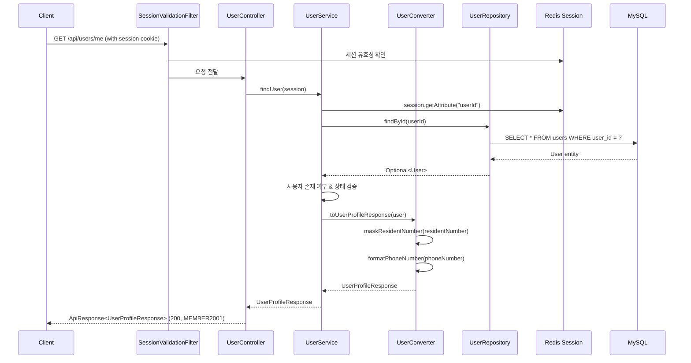

# Design Document: 회원 정보 조회 (User Profile Inquiry)

## Overview

로그인한 사용자가 자신의 프로필 정보를 조회하는 `GET /api/users/me` API를 설계한다. 세션 기반 인증을 통해 사용자를 식별하고, User 엔티티에서 이름, 아이디, 전화번호, 주민번호를 조회하여 포맷팅/마스킹 처리 후 응답한다.

기존 프로젝트의 도메인형 패키지 구조와 ControllerDocs 인터페이스 패턴, Converter 기반 Entity→DTO 변환 규칙을 따른다.

## Architecture



### 레이어 구조

```
Controller (UserController)
    ↓ implements UserControllerDocs (Swagger 분리)
    ↓ 
Service (UserService interface → UserServiceImpl)
    ↓
Converter (UserConverter) — Entity → DTO 변환, 마스킹/포맷팅 처리
    ↓
Repository (UserRepository) — 공통 모듈에 위치
```

## Components and Interfaces

### 1. UserControllerDocs (인터페이스)

- **위치**: `com.sofit.user.domain.user.controller`
- **역할**: Swagger 어노테이션 정의
- **어노테이션**: `@Tag`, `@Operation`, `@ApiResponses`

### 2. UserController

- **위치**: `com.sofit.user.domain.user.controller`
- **역할**: HTTP 요청 수신, 서비스 호출, 응답 반환
- **구현**: `UserControllerDocs` implements
- **엔드포인트**: `GET /api/users/me`
- **의존성**: `UserService`

```java
@RestController
@RequestMapping("/api/users")
@RequiredArgsConstructor
public class UserController implements UserControllerDocs {
    private final UserService userService;

    @GetMapping("/me")
    public ApiResponse<UserProfileResponse> findUser(HttpSession session) {
        UserProfileResponse response = userService.findUser(session);
        return ApiResponse.onSuccess(UserSuccessCode.USER_PROFILE_OK, response);
    }
}
```

### 3. UserService (인터페이스) / UserServiceImpl (구현체)

- **위치**: `com.sofit.user.domain.user.service`
- **역할**: 비즈니스 로직 (세션에서 userId 추출, 사용자 조회, 상태 검증)
- **의존성**: `UserRepository`, `UserConverter`

```java
public interface UserService {
    UserProfileResponse findUser(HttpSession session);
}
```

### 4. UserConverter

- **위치**: `com.sofit.user.domain.user.converter`
- **역할**: User 엔티티 → UserProfileResponse 변환
- **핵심 로직**:
  - `maskResidentNumber(String)`: 주민번호 마스킹
  - `formatPhoneNumber(String)`: 전화번호 하이픈 포맷팅
  - `toUserProfileResponse(User)`: 엔티티 → DTO 변환

### 5. UserProfileResponse (record)

- **위치**: `com.sofit.user.domain.user.dto.response`
- **역할**: 프로필 조회 응답 DTO

```java
public record UserProfileResponse(
    String name,
    String username,
    String phoneNumber,
    String residentNumber
) {}
```

### 6. UserSuccessCode (enum)

- **위치**: `com.sofit.user.domain.user.exception`
- **역할**: 회원 도메인 성공 코드 정의

### 7. UserErrorCode (enum)

- **위치**: `com.sofit.user.domain.user.exception`
- **역할**: 회원 도메인 에러 코드 정의 (AUTH4031 등)

## Data Models

### User 엔티티 (기존, sofit-common)

| 필드 | 타입 | 설명 |
|------|------|------|
| userId | Long | PK, auto increment |
| loginId | String(50) | 로그인 아이디 (unique) |
| passwordHash | String(255) | 비밀번호 해시 |
| name | String(50) | 이름 |
| phoneNumber | String(15) | 전화번호 (하이픈 없이 저장) |
| residentNumber | String(7) | 주민번호 앞 7자리 |
| role | UserRole | USER, ADMIN_BANK_TELLER 등 |
| status | UserStatus | ACTIVE, INACTIVE |
| inactivatedAt | LocalDateTime | 탈퇴 시각 |

### UserProfileResponse (신규)

| 필드 | 타입 | 설명 |
|------|------|------|
| name | String | 사용자 이름 |
| username | String | 로그인 아이디 |
| phoneNumber | String | 하이픈 포함 전화번호 (예: 010-1234-5678) |
| residentNumber | String | 마스킹된 주민번호 (예: 900101-1******) |

### 세션 데이터 (Redis)

| 키 | 타입 | 설명 |
|----|------|------|
| userId | Long | 로그인한 사용자의 PK |
| loginTime | LocalDateTime | 로그인 시각 (절대 만료 체크용) |

## Correctness Properties

*A property is a characteristic or behavior that should hold true across all valid executions of a system—essentially, a formal statement about what the system should do. Properties serve as the bridge between human-readable specifications and machine-verifiable correctness guarantees.*

### Property 1: 주민번호 마스킹 형식 보존

*For any* 유효한 주민번호 문자열(7자리 이상), 마스킹 결과는 항상 `NNNNNN-N******` 형식(총 14자)이며, 앞 7자리(하이픈 제외)는 원본과 동일하고 뒤 6자리는 모두 `*`이다.

**Validates: Requirements 2.1, 2.2**

### Property 2: 유효한 전화번호 포맷팅

*For any* 10자리 또는 11자리 숫자 문자열, 포맷팅 결과는 하이픈이 올바른 위치에 삽입되며(11자리: `NNN-NNNN-NNNN`, 10자리: `NN-NNNN-NNNN`), 하이픈을 제거하면 원본 문자열과 동일하다.

**Validates: Requirements 3.1, 3.2, 3.3**

### Property 3: 유효하지 않은 길이의 전화번호 원본 보존

*For any* 10자리 또는 11자리가 아닌 문자열(null과 빈 문자열 제외), 포맷팅 결과는 원본 문자열과 동일하다.

**Validates: Requirements 3.5**

## Error Handling

### 에러 시나리오 및 응답

| 시나리오 | HTTP 상태 | 에러 코드 | 메시지 | 처리 위치 |
|----------|-----------|-----------|--------|-----------|
| 세션 없음/만료 | 401 | COMMON4001 | 인증이 필요합니다. | SessionValidationFilter / Spring Security |
| 사용자 미존재 | 404 | COMMON4004 | 요청한 리소스를 찾을 수 없습니다. | UserServiceImpl |
| 탈퇴 계정 | 403 | AUTH4031 | 탈퇴한 계정입니다. | UserServiceImpl |

### 에러 처리 흐름

1. **세션 검증 실패**: `SessionValidationFilter`에서 세션 절대 만료 체크. Spring Security에서 세션 미존재 시 401 반환.
2. **사용자 미존재**: `UserServiceImpl`에서 `UserRepository.findById()` 결과가 empty일 때 `BaseException(GeneralErrorCode.NOT_FOUND)` throw.
3. **탈퇴 계정**: `UserServiceImpl`에서 `user.getStatus() == INACTIVE` 확인 시 `BaseException(UserErrorCode.INACTIVE_USER)` throw.

### Null/빈 값 처리 (Converter)

- 주민번호가 null 또는 빈 문자열 → 빈 문자열 반환
- 주민번호가 1~6자리 → 원본 + "-" + "******" 반환
- 전화번호가 null 또는 빈 문자열 → 빈 문자열 반환
- 전화번호가 10/11자리가 아닌 경우 → 원본 그대로 반환

## Testing Strategy

### 단위 테스트 (JUnit 5 + Mockito)

1. **UserConverter 테스트**
   - 주민번호 마스킹: 정상 케이스, null, 빈 문자열, 짧은 문자열
   - 전화번호 포맷팅: 11자리, 10자리, null, 빈 문자열, 비정상 길이
   - Entity → DTO 변환 통합 확인

2. **UserServiceImpl 테스트**
   - 정상 조회 (ACTIVE 사용자)
   - 사용자 미존재 시 예외 발생
   - INACTIVE 사용자 시 예외 발생
   - 세션에서 userId 추출 로직

3. **UserController 테스트**
   - MockMvc를 사용한 엔드포인트 테스트
   - 성공 응답 형식 확인
   - 인증 실패 시 401 응답

### 프로퍼티 기반 테스트 (JUnit 5 + jqwik)

프로퍼티 기반 테스트 라이브러리로 **jqwik**을 사용한다. 각 프로퍼티 테스트는 최소 100회 반복 실행한다.

1. **Property 1**: 주민번호 마스킹 형식 보존
   - 생성기: 7~13자리 숫자 문자열 + null/빈 문자열/1~6자리 엣지 케이스
   - 검증: 결과 형식이 `^\d{6}-\d\*{6}$` 패턴 매칭, 앞 7자리 원본 보존
   - 태그: `Feature: user-profile-inquiry, Property 1: 주민번호 마스킹 형식 보존`

2. **Property 2**: 유효한 전화번호 포맷팅
   - 생성기: 10자리 또는 11자리 숫자 문자열
   - 검증: 하이픈 제거 시 원본과 동일 (라운드트립), 형식 패턴 매칭
   - 태그: `Feature: user-profile-inquiry, Property 2: 유효한 전화번호 포맷팅`

3. **Property 3**: 유효하지 않은 길이의 전화번호 원본 보존
   - 생성기: 길이가 10, 11이 아닌 임의의 문자열 (1~9자리, 12자리 이상)
   - 검증: 포맷팅 결과 == 원본
   - 태그: `Feature: user-profile-inquiry, Property 3: 유효하지 않은 길이의 전화번호 원본 보존`

### 통합 테스트

- Spring Boot 통합 테스트로 전체 플로우 검증 (세션 → 컨트롤러 → 서비스 → DB)
- 응답 시간 2초 이내 확인
